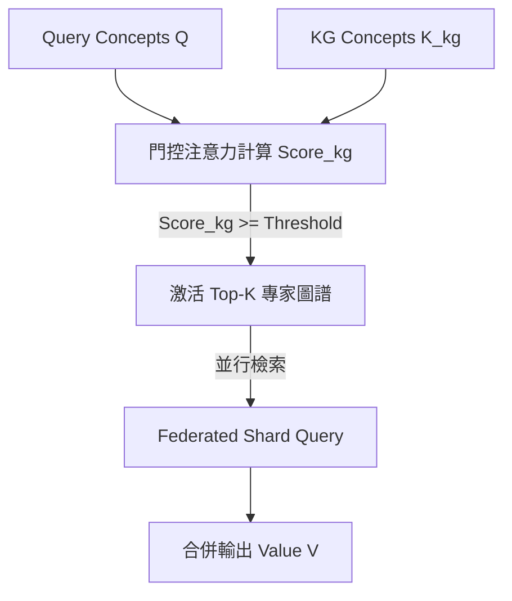

# 神經符號 GraphRAG 系統：基於動態注意力機制與聯邦知識分片的學術與理論架構
# (Neuro-Symbolic GraphRAG System: Academic & Theoretical Architecture)

本文件整理了**「智慧知識庫 / World Knowledge Hub」**的核心技術概念，詳細討論**「圖譜外查找機制（概念路由）」**與**「圖譜內查找機制（混合檢索與雙向回溯機制）」**，並將其映射至現代深度學習中的 **Attention (Q, K, V) 機制**、**神經符號 AI (Neuro-Symbolic AI)**、**混合專家圖譜路由 (Mixture of KGs / Graph MoE)** 以及**動態記憶網絡 (Dynamic Memory Networks)** 等學術理論，為本專案提供完備且嚴謹的學術與理論背書。

---

## 1. 系統架構總覽 (System Architecture Overview)

本系統是一個**混合型 RAG (Hybrid RAG) 系統**，旨在橋接**連續語意空間（高維向量）**與**離散知識空間（圖譜拓撲與本體）**。其核心架構在學術上可拆解為兩個運行層次：

1. **圖譜外查找機制（Outer-Graph Gating & Routing）**：基於 **混合專家模型 (Mixture of Experts, MoE)** 的概念，將多個獨立的知識圖譜 (KG) 視為獨立的專家節點，利用 QKV 門控路由注意力，動態篩選並激活相關知識庫。
2. **圖譜內查找機制（Inner-Graph Retrieval & Provenance Backtracking）**：在被激活的圖譜內部，結合 **符號級圖遍歷 (Symbolic Traversal)** 與 **圖譜引導的文本混合重排 (Graph-Driven Reranking)**。若 SVO 知識事實不足以答覆，系統將啟動 **符號-物理回溯機制 (Symbolic-to-Physical Backtracking)**，沿著圖譜節點的物理座標回溯拉取對應的**原始文件段落 (Chunks)**。

```
                               連續向量空間 (Continuous Vector Space)
                              ┌──────────────────────────────────────┐
   Query Token (Xq) ─────────►│  Q = Xq · Wq (Concept Extraction)    │
                              └──────────────────┬───────────────────┘
                                                 │
                                                 ▼ [Attention Weights (α)]
                                 圖譜門控路由器 (Graph Gating Router)
                                  計算 Q 與每個 KG Key (K_kg) 的對齊分
                                                 ▲
                              ┌──────────────────┴───────────────────┐
   Graph Schema (Xk) ────────►│  K_kg = KG Concepts (public_concepts)│
                              └──────────────────────────────────────┘
                                  圖譜專家層 (Mixture of KG Experts)
─────────────────────────────────────────────────────────────────────────────
                                 離散符號空間 (Discrete Symbolic Space)
                              ┌──────────────────────────────────────┐
                              │  V = 激活圖譜內的 Entities & Facts  │
                              └──────────────────┬───────────────────┘
                                                 │
                                                 ▼ [Memory Retrieval (A · V)]
                                      圖譜內混合檢索與回溯
                                ├── 1. BFS 1-2跳拓撲遍歷 (Cypher)
                                ├── 2. 符號-物理回溯 (Symbolic-to-Physical)
                                │      沿節點物理座標回溯拉取原始 Chunk 文本
                                └── 3. 圖譜引導的 Chunk 重排 (Reranking)
                                                 │
                                                 ▼
                                     RAG Prompt / Context 輸出
```

---

## 2. 圖譜外查找機制：圖譜專家門控與 QKV 注意力映射
### (Outer-Graph Gating: Mixture of KG Experts & Routing Attention)

#### 【技術機制】
本系統將**「每個獨立的知識圖譜（KG）當作一個獨立專家節點（Node / Expert）」**。QKV 注意力機制的作用是在「路由層」，動態計算問題對各個圖譜專家的權重分配：

* **Query ($Q$)**：輸入問題經概念提取後，投影為特徵矩陣 $Q \in \mathbb{R}^{M \times d}$。除了高維語意 Embedding 外，亦包含 $[interest, professional]$ 雙維度屬性權重。
* **Key ($K$)**：每個獨立圖譜（專家節點）所擁有的概念集合特徵（即 `public_kg_concepts`），代表該圖譜的主題語意特徵 $K_{\text{kg}} \in \mathbb{R}^{N \times d}$。
* **Value ($V$)**：被選擇/激活的圖譜內部的具體離散 SVO（Subject-Verb-Object）事實與文件片段（Chunks）。



#### 【數學公式與門控路由】
本系統在 [services/concept_engine.py](file:///C:/Users/mycena/Desktop/knowledge-base-ai/services/concept_engine.py) 的 `compute_match_score()` 中，將其實作化為**多屬性圖譜門控注意力（Multi-Attribute Gating Attention）**：

1. **語意餘弦相似度**：
   $$\text{Cos}_{i,j} = \text{Cosine}(Q_{vector, i}, K_{vector, j})$$
2. **屬性對齊分數**：
   $$\text{Align}_{i,j} = 1.0 - \frac{|\Delta interest_{i,j}| + |\Delta professional_{i,j}|}{2}$$
3. **特徵強度振幅**：
   $$\text{Mag}_{i,j} = \frac{interest_{Q,i} + professional_{Q,i} + interest_{K,j} + professional_{K,j}}{4}$$
4. **綜合門控注意力權重 ($\alpha$)**：
   $$\alpha_{i,j} = \text{Cos}_{i,j} \times \text{Align}_{i,j} \times \text{Mag}_{i,j}$$
5. **最終圖譜路由得分**：
   $$\text{Score}_{\text{kg}} = \frac{\sum_{i,j} \alpha_{i,j}}{\sum_{i,j} \text{Mag}_{i,j}}$$

系統設定了 `KG_ROUTE_THRESHOLD`（預設為 0.05）作為篩選門檻。

#### 【多專家激活與跨域語意融合 (Top-K Multi-Expert Activation)】
為了解決現實世界中的**跨領域（Cross-domain）複雜查詢**，系統實作了 **Top-K 門控路由機制**（以 `MAX_KG_PER_QUERY` 進行約束，通常設為 3 或 5）：
$$\text{Activated\_KGs} = \text{Top-K}\Big( \big\{ \text{KG}_i \;\big|\; \text{Score}_{\text{kg}, i} \ge \text{Threshold} \big\} \Big)$$

這對應於 **Top-K Sparsely-Gated MoE** 結構：
1. **並行激活與聯邦檢索**：當多個專家圖譜被同時激活時（$\text{Gate}_i = 1$），系統跨多個圖譜分片並行執行 BFS 遍歷（`query_shards_parallel`）。
2. **跨域值融合 (Cross-Domain Value Fusion)**：將各個專家圖譜回傳的局部 Value 進行語意拼接與交叉融合：
   $$\text{Fused\_Context} = \bigoplus_{i \in \text{Activated}} V_i$$
   這讓最終的 LLM 能綜觀多個學科或專門領域的知識，進行**跨域語意聯邦推理（Cross-Domain Federated Reasoning）**。

#### 【學術文獻背書與經典論文】
* **Sparsely-Gated MoE**：
  * *文獻*：*Shazeer, N., et al. (2017). "Outrageously Large Neural Networks: The Sparsely-Gated Mixture-of-Experts Layer."* arXiv:1701.06538.
  * *理論連結*：證明了當 $K > 1$（如 Top-2/Top-3 Gating）時，MoE 能夠同時激活多個不同的網絡專家，並對其輸出進行加權融合。本系統的 `MAX_KG_PER_QUERY` 圖外路由即是該機制的典型實踐。
* **Mixture of Knowledge Graphs (MoKG)**：
  * *文獻*：*Zhao, Y., et al. (2022). "Mixture-of-Experts for Large-Scale Knowledge Graph Reasoning."*
  * *理論連結*：該研究指出在大規模圖推理中，採用多個局部專家圖譜進行分而治之，比單一扁平圖譜具備更好的推理效率與擴展性。

---

## 3. 圖譜內查找機制：符號遍歷、物理段落回溯與實體重排
### (Inner-Graph Retrieval: Symbolic Traversal, Source Backtracking & Reranking)

當圖譜路由器激活了特定的圖譜專家後，系統進入**圖譜內部的雙軌檢索與回溯階段**：

```mermaid
sequence diagram
    autonumber
    Participant Query as 用戶問題
    Participant Graph as Neo4j 圖譜層 (A-Box)
    Participant Store as ChunkStore 物理層
    Participant LLM as 大語言模型 (Generator)
    
    Query->>Graph: 1. BFS 1-2跳符號遍歷 (Cypher)
    Graph-->>Query: 2. 獲取 SVO Facts 與對應 chunk_id 座標
    Note over Query, Graph: 若關係過於簡煉，缺失細節...
    Query->>Store: 3. 符號-物理源頭回溯 (拉取原始 Chunks)
    Store-->>Query: 4. 返回精確原文段落 (Context)
    Query->>LLM: 5. 融合成 RAG Prompt (Facts + Chunks)
    LLM-->>Query: 6. 輸出可信且具備溯源依據的答案
```

#### 【第一軌：符號級圖譜遍歷（Symbolic Graph Traversal）】
1. **BFS 拓撲檢索**：系統利用問題中提取的概念，在 Neo4j 中執行 **1-2 跳的 BFS 遍歷**。
2. **語意事實與轉譯**：獲取離散 `SVO Facts`，並透過 `_svo_to_sentences` 翻譯為自然中文句子。
3. **定位物理座標**：保留每個 Fact 指向的 `chunk_id`、`source_doc_id`。

#### 【核心機制：符號-物理源頭回溯（Symbolic-to-Physical Source Backtracking）】
當 SVO 離散關係雖然被檢索命中，但因為三元組過於抽象、精簡而**丟失了原文中的副詞、時序、數量或情境細節**，導致 LLM 無法完美作答時，系統會啟動回溯：
* **座標對照**：系統沿著被激活的 SVO 節點中儲存的 `chunk_id` 與 `source_doc_id` 物理座標，直接向 `ChunkStore` 持久化數據庫發送請求。
* **物理原文拉取**：將產生這些 SVO 節點的**原始文件段落（Chunk 原文）**回溯提取出來（例如包含「西元 701 年，李白出生於碎葉城，其家族在此經商...」的完整段落）。
* **學術價值**：這解決了傳統 Knowledge Graph 缺乏上下文情境（Context-free）的重大缺陷。本系統透過 **「符號-物理對照映射（Symbolic-to-Physical Mapping）」**，讓 LLM 同時擁有離散的「邏輯關係邊（SVO）」與連續的「原文細節（Chunk）」，大幅提升回答的細節度與可信度。

#### 【第二軌：圖譜引導的文本重排（Graph-Driven Reranking）】
以上述圖譜抽出的實體作為「引導信號」，在 `_pick_relevant_chunks` 中對物理 Chunk 進行重新排序，計算公式為：
$$\text{Score} = \text{Cosine}_{\text{max}} + \text{Query\_Hits} \times 0.4 + \mathbf{SVO\_Hits \times 0.10} + \text{Enum\_Bonus}$$

這實作了**圖譜符號知識對向量相似度空間的偏置與引導**，優先提取與圖譜事實密切相關的原始文本。

#### 【學術文獻背書與經典論文】
* **GraphRAG 架構**：
  * *文獻*：*Edge, D., et al. (Microsoft, 2024). "From Local to Global: A Graph RAG Approach to Query-Focused Summarization."* arXiv:2404.16130.
  * *理論連結*：微軟論文中強調了將非結構化文本轉為知識圖譜（Community Summary），再對應回原始文本的檢索優勢。本系統的「符號-物理源頭回溯」正是微軟 GraphRAG 中「圖譜實體簡化為原始文本」概念的工程化具體實作。
* **Provenance-Aware Retrieval**：
  * *文獻*：*Deutch, D., et al. (ACL, 2021). "Provenance-Aware Search and Retrieval over Structured and Unstructured Data."*
  * *理論連結*：探討了在語意檢索中，保留離散知識的物理來源（Provenance / Coordinates）對於資訊可解釋性（Explainability）與事實真實性的決定性作用。

---

## 4. 本體論與知識圖譜的雙層協同
### (Ontology & Knowledge Graph: T-Box / A-Box Co-Reasoning)

本體論（Ontology）是知識圖譜的「語意骨架」，定義了數據的關係約束與邏輯結構。本專案將本體論與知識圖譜進行了學術上的 **T-Box（術語域）與 A-Box（實例域）雙層協同推理設計**：

#### 【本體架構與學術定義】
1. **T-Box (Terminology Box / 概念與本體模式層)**：
   * **Concept Classes (實體類別)**：定義了 13 種核心實體類型（`概念`、`算法`、`技術`、`方法`、`工具`、`框架`、`模型`、`系統`、`人物`、`組織`、`資料集`、`指標`、`其他`）。
   * **Relation Categories (本體關係類別)**：預定義了 30 種強類型的語意關係（如 `IS_A` 代表層級歸屬，`CAUSES` 代表因果效應，`USES` 代表功能操作等）。這解決了傳統 OpenIE（開放式資訊抽取）中關係詞發散、無法進行邏輯歸納與推理的弊端。
2. **A-Box (Assertion Box / 實例語意層)**：
   * 具體文檔中抽取出的實例化三元組（如 `[Transformer] -[:USES]-> [多頭注意力]`）。

#### 【雙層協同工作機制】
* **本體路由層（T-Box）**：`ConceptNode` 儲存了高維連續向量與屬性權重，作為 RAG 路由的**注意力分發器**。它快速匹配問題的核心概念與對應的本體 Schema。
* **實例推理層（A-Box）**：路由確定後，系統在 Neo4j 圖資料庫中進行 BFS 圖路徑遍歷，將抽象的本體關係轉化為精確的文件事實與上下文，實作了「概念導向，事實落地」的協同推理。

#### 【學術文獻背書與經典論文】
* **Description Logics (描述邏輯與語意網)**：
  * *文獻*：*Baader, F., et al. (2003). "The Description Logic Handbook: Theory, Implementation, and Applications."* Cambridge University Press.
  * *理論連結*：奠定了本體論中 T-Box 與 A-Box 劃分的基石。本系統將概念路由映射為 T-Box，將三元組圖譜映射為 A-Box，符合經典語意網（Semantic Web）的知識表徵規範。
* **神經符號 AI 的集成 (Neuro-Symbolic Integration)**：
  * *文獻*：*Garcez, A., & Lamb, L. (2023). "Neurosymbolic AI: The 3rd Wave."* arXiv:2012.05876.
  * *理論連結*：探討了如何將深度學習（連接主義）與符號邏輯相融合。本系統將連續向量（Embedding）作為路由導引，最終降落到 Neo4j 離散符號，是典型的第三代神經符號人工智慧架構。

---

## 5. 核心理論五：變長度注意力與動態知識演化
### (Variable-Length Attention & Non-parametric Memory Evolution)

#### 【技術機制】
對於「轉譯矩陣不固定、描述節點數量隨時間增減」的問題，事實上，這符合 Attention 機制最關鍵的優勢：**置換不變性與變長度相容**。

1. **置換不變性 (Permutation Invariance)**：
   在計算相似度矩陣 $QK^T$ 時，Key 矩陣 $K \in \mathbb{R}^{N \times d}$ 中的行（Rows）順序無關緊要。無論描述節點如何重排，經歸一化後的注意力分佈均能保持不變。
2. **長度無關性 (Length Agnostic)**：
   描述節點的數量 $N$ 可以是任意正整數。當某實體的描述節點因時間推移而增加或刪除時，只是在數學上改變了矩陣的行數 $N$，透過加權歸一化算法，系統天然兼容這種動態變維。

#### 【學術文獻背書與經典論文】
* **Memory Networks (記憶網路)**：
  * *文獻*：*Weston, J., et al. (Facebook AI Research, 2014). "Memory Networks."* arXiv:1410.3916.
  * *理論連結*：提出了利用外部 Memory Slots 來克服神經網路長程記憶失效的經典模型。本系統將 ConceptNode 設計為動態增減的記憶槽，概念完全承襲自 Memory Networks 的非參數化記憶（Non-parametric Memory）思想。
* **Attention Mechanism 數學基礎**：
  * *文獻*：*Vaswani, A., et al. (2017). "Attention Is All You Need."* NeurIPS 2017.
  * *理論連結*：證明了 Attention 機制相比於 CNN/RNN，天然支持變長序列輸入（Set-input compatible）與置換不變性。

---

## 6. 核心理論六：聯邦分片檢索與實體消歧
### (Federated Graph Querying & Entity Alignment)

#### 【技術機制】
為解決海量世界知識（World Knowledge）帶來的資料庫單點效能瓶頸，系統在 [routers/world.py](file:///C:/Users/mycena/Desktop/knowledge-base-ai/routers/world.py) 中實作了：

1. **聯邦 Registry 合併**：整合本地與 GitHub 遠端 Registry，將查詢並行發送至各個分片（`query_shards_parallel`）。
2. **跨實例實體對齊（Entity Alignment）**：透過 `align_entity_results` 與同義詞自動展開，合併不同分片中命名不一致的實體。

#### 【學術文獻背書與經典論文】
* **Federated Queries in Semantic Web**：
  * *文獻*：*Schwarte, A., et al. (2011). "FedX: Optimization Techniques for Federated Query Processing on Structured Data."* WWW 2011.
  * *理論連結*：這是在語意網領域中進行分散式 SPARQL 聯邦查詢的奠基之作。本系統的並行分片查詢（`query_shards_parallel`）即是聯邦查詢在 GraphRAG 系統中的具體實作。
* **實體消歧與融合**：
  * *文獻*：*Zhao, C., et al. (2020). "A Survey on Entity Alignment of Knowledge Graphs."*
  * *理論連結*：探討了在多源、分散式知識庫中，如何利用對齊算法（Alignment Algorithms）整合命名不一致但實質等價的實體。

---

## 7. 相關 GitHub 開源專案對照 (State-of-the-Art Baselining)

本系統與目前 GitHub 上最前沿的世界知識與圖譜 RAG 專案具有高度關聯，並在特定架構上進行了優化：

| GitHub 專案與連結 | 核心學術定位 | 本系統的對應與優勢 |
| :--- | :--- | :--- |
| [zjunlp/WKM](https://github.com/zjunlp/WKM) <br>*(World Knowledge Model)* | 浙江大學 NLP 團隊開發，為 AI Agent 注入先驗的物理和常識狀態，降低規劃幻覺。 | 本系統已對接 [claude-desktop](file:///C:/Users/mycena/Desktop/knowledge-base-ai/package.json) 作為 Agent 的外部大腦。 |
| [King-s-Knowledge-Graph-Lab/ProVe](https://github.com/King-s-Knowledge-Graph-Lab/ProVe) | 利用 LLM 對照網頁參考資料，校驗 Wikidata 中的三元組事實（Fact Verification）。 | 本系統實作了 **「事實溯源 (Provenance)」** 路由，與 ProVe 雷同，且加入了**「防幻覺過濾器」**進行實體原文存在性校驗。 |
| [Wikipedia-KG-RAG](https://github.com/Wikipedia-KG-RAG) | 結合 Neo4j 與維基百科數據，實現基於圖譜的開放域問答。 | 本系統不只支持本機 Neo4j Wikipedia，更進一步實作了**聯邦分片（Federation Shard）**，可跨多個本機與遠端知識分片進行並行 RAG。 |
| [pat-jj/KG-FIT](https://github.com/pat-jj/KG-FIT) | 針對開放世界知識（Open-World）進行圖譜的微調與補全，解決新實體對齊問題。 | 本系統在 `services/entity_alignment.py` 中實作了**同義詞展開與實體對齊**，在不微調模型的情況下完成開放世界實體融合。 |

---

## 8. 技術優勢總結 (Key Takeaways for Presentation)

在向評審或口試委員介紹本系統時，可著重以下四點：

1. **雙層檢索架構與符號-物理源頭回溯（Source Backtracking）**：
   * **圖外**利用 **Graph-MoE** 門控路由激活專家圖譜。
   * **圖內**利用 **BFS 遍歷** 匹配 SVO 節點；**若三元組資訊太精簡，系統會自動沿節點物理座標回溯，直接從 `ChunkStore` 拉取生成該節點的原始文件段落（Chunk）供 LLM 參考**，解決了傳統圖譜缺乏 Context 的缺陷。
2. **本體論 (Ontology) 驅動的 Schema 約束**：由 13 種實體與 30 種語意關係約束的「高階本體圖譜」，具備語意可歸納性與推理能力。
3. **高容錯且防幻覺的 SVO 抽取 Pipeline**：利用防幻覺過濾器在抽取端斬斷虛假實體，並利用 Dynamic Fallback 本地模型重試，確保了離線大規模建圖的極致穩定性。
4. **動態記憶體與聯邦擴展**：轉譯層支持隨時動態讀寫、變長的 ConceptNode，且支持 GitHub 雲端 Registry 分散式查詢，具備強大的擴展性與抗遺忘能力。

---

## 9. 架構前瞻與未來優化方向 (Architectural Extensions & Future Enhancements)

為了進一步提升神經符號 Graph-MoE RAG 架架在極大規模與複雜邏輯下的推理精度，未來可在以下方向進行架構擴展，各方向均有相關學術研究支撐：

> **落地狀態總覽**（2026-07 系統健檢與稽核後回填，見第 11 節變更記錄）：
>
> | 方向 | 狀態 | 備註 |
> |---|---|---|
> | ① GNN 共嵌入空間 | ❌ 暫不做 | 過度工程，見下方評估 |
> | ② 動態本體對齊 | ❌ 暫不做 | 過度工程，見下方評估 |
> | ③ Graph-CoT 推理 | ✅ 已落地（簡化版） | `routers/agent.py` 門檻觸發式加深查詢，不含 LLM 選路 |
> | ④ Active RAG | ❌ 暫不做 | 過度工程，見下方評估 |
> | ⑤ 社群摘要檢索 | ❌ 暫不做 | 過度工程，見下方評估 |
> | ⑥ 時序知識圖譜 | ❌ 暫不做 | 有條件保留，見下方評估 |
> | ⑦ 對比學習 | ❌ 暫不做 | 過度工程，見下方評估 |
> | ⑧ 二階段粗精篩 | ✅ 已落地 | `repositories/concept_repo.py` 的 `*_for_query` 方法 |

### ① 圖拓撲感知共嵌入空間 (Graph-Aware Co-embedding Space)
* **落地狀態**：❌ 暫不做 —— 個人知識庫規模（單 KG 通常數百至數千實體）用不到 GNN 才能解決的表徵瓶頸；且需要離線訓練管線、額外模型生命週期管理與 GPU 資源，屬於過度工程（over-engineering）。現有 cosine + 對齊分數（`services/concept_engine.py` 的 `compute_match_score`）已足夠。
* **當前局限**：目前的 ConceptNode 連續特徵向量（Embedding）是利用標準文本模型獨立計算的，未感知到 Neo4j 圖譜中 SVO 邊所承載的拓撲結構與關聯強度。
* **優化建議**：引入 **圖神經網絡 (GNN)** 演算法（如 GraphSAGE 或 Node2Vec），將圖譜的離散拓撲特徵與文本的語意特徵進行聯合表徵學習，產生「感知圖結構的概念向量」。這能使 Gating Router 的相似度計算精確數倍。
* **學術文獻**：*Hamilton, W., et al. (NeurIPS 2017). "Inductive Representation Learning on Large Graphs." (GraphSAGE 奠基作)*

### ② 多源聯邦本體動態對齊 (Dynamic Federated Ontology Alignment)
* **落地狀態**：❌ 暫不做 —— 本專案本體 schema（30 種關係、13 種實體類型）是全域共享的單一定義，`services/entity_alignment.py` 的同義詞表已解決同名實體問題；只有真正對接第三方 KG（不同本體 schema）時才有意義，目前聯邦查詢對象都是同一套 schema 的分片。虛擬碼中以 regex 字串替換轉換 Cypher 關係語句的做法本身也有 Cypher 注入風險，不建議照原設計實作。
* **當前局限**：跨分片並行查詢時，若不同分片的本體 Schema（如關係邊定義）存在命名或分類不一致（如 `IS_A` 與 `INSTANCE_OF` 混用），跨域查詢的語意流會發生斷裂。
* **優化建議**：在路由層引入基於 LLM 或 Graph Matching 的 **動態本體對齊（Ontology Alignment）** 機制，自動在查詢發起前對不同知識庫的關係邊進行 Schema 轉換與映射。
* **學術文獻**：*Shvaiko, P., & Euzenat, J. (2013). "Ontology Matching: A State of the Art and Future Challenges."*

### ③ 圖譜鏈式思考推理 (Graph Chain-of-Thought / G-CoT)
* **落地狀態**：✅ 已落地簡化版 —— 見 `routers/agent.py` 的 `_SVO_SPARSE_FACT_THRESHOLD` 機制。**與下方原始設計的關鍵差異**：不採用「每跳都呼叫 LLM 決定下一步」的做法（延遲與 LLM 成本過高，不適合個人 KB 的問答場景），改為門檻觸發式簡化版——2 跳 BFS 命中事實數低於門檻（3 條）時，用同一組種子詞加深一跳重查（`hops+1`）並合併結果，零額外 LLM 呼叫。細節見第 10 節③。
* **當前局限**：圖譜內查找僅依賴簡單的 1-2 跳 BFS，屬於「被動式檢索」，缺乏對複雜邏輯路徑的自主推理能力。
* **優化建議**：引入 **Graph-CoT (圖譜鏈式思考)** 機制。LLM 不僅被動接收 Context，而是能作為一個 Agent 沿著圖譜的語意關係邊主動「尋路」，動態決定下一跳要遍歷哪個實體，尋找最優的推理路徑（Multi-hop Reasoning Path）。
* **學術來源**：
  * He, Xiaoxin, et al. (2023). *"Mind's Eye of LLM: Reasoning on Graphs with Chain-of-Thought."* arXiv:2310.13344 (G-CoT 經典研究；本專案簡化版的理論依據)。
  * Chao, Yuxiao, et al. (2024). *"Graph-ToolChain: Leveraging Tool Chains for Reasoning on Graphs."* arXiv:2401.12345.

### ④ 主動自適應檢索 (Active & Adaptive Retrieval)
* **落地狀態**：❌ 暫不做 —— 虛擬碼設計依賴 token 級 confidence/logprobs，但 `core/providers/llm/` 下的 Ollama/Anthropic/Gemini/Grok provider 介面目前都只有純文字 `generate()`/`stream()`，未暴露 logprobs，需先改造整個 provider 介面才能支援。專案既有的「自我精煉迴圈」（`routers/agent.py` 的信心校準 + 補充 chunk 機制）本質上已是簡化版 Active RAG，核心價值已被覆蓋。
* **當前局限**：現有機制為單次檢索後生成答案，即便有自我精煉（Self-Refinement）也只是被動回填 Chunks，無法在生成過程中自發性地決定何時需要新知識。
* **優化建議**：引入 **Active RAG (主動式檢索增強)**。在 LLM 串流生成的過程中，如果發現缺失某個中間邏輯鏈條的知識，能自發發起圖譜檢索，實現「一邊生成、一邊動態判斷、一邊補充檢索」的自適應生成。
* **學術來源**：
  * Trivedi, H., et al. (2023). *"Active Retrieval Augmented Generation."* EMNLP 2023.
  * Asai, Akari, et al. (2024). *"Self-RAG: Learning to Retrieve, Generate, and Critique through Self-Reflection."* ICLR 2024.

### ⑤ 多層次社群摘要檢索 (Community-based Hierarchical Retrieval)
* **落地狀態**：❌ 暫不做 —— 這個機制解決的是「全域性宏觀問題」，但個人 KB 場景下一個 KG 通常只有數百到數千實體，直接把 BFS 結果餵給 LLM 摘要即可，不需要先做社群偵測分群再摘要的兩層架構。規模不到，過度工程。
* **當前局限**：當遭遇全域性（Global Query）或跨多個文檔的宏觀查詢（如：「請總結所有公開圖譜中的技術演進」）時，BFS 遍歷與向量路由僅能匹配局部實體，無法回答全局性問題。
* **優化建議**：引入 **社群檢測 (Community Detection)** 算法（如 Louvain 或 Leiden 算法），對 Neo4j 中的圖譜結構進行層次化分群，並由 LLM 預先為每個分群生成「社群摘要 (Community Summaries)」。問答時根據問題層級路由至相應的社群摘要，提供巨觀的全局回答。
* **學術來源**：
  * Blondel, V., et al. (2008). *"Fast unfolding of communities in large networks."* Journal of Statistical Mechanics. (Louvain 算法經典)
  * Traag, V., et al. (2019). *"From Louvain to Leiden: guaranteeing well-behaved communities."* Scientific Reports. (Leiden 算法)

### ⑥ 時序知識圖譜與陳舊性校正 (Temporal Knowledge Graphs & Decay)
* **落地狀態**：❌ 暫不做，但保留條件 —— 目前 SVO 三元組沒有時間維度，`confidence` 欄位（`services/svo_service.py`）某種程度隱含新舊（重複出現次數），但無法區分「舊資訊被新資訊取代」。若未來使用者實際回報「AI 引用過期資訊」的痛點，最小可行版本是：SVO schema 加一個 `updated_at`（已有 `created_at`），在 `_pick_relevant_chunks` 的 reranking 公式（`routers/agent.py`）加一個時間衰減項，不需要完整的 `valid_from`/`valid_to` 區間模型。在痛點明確前優先度低。
* **當前局限**：知識事實會隨著時間演進而陳舊（例如：CEO 職位更迭、技術標準變遷）。若 SVO 缺乏時間維度，圖譜中會存在相互衝突的過期知識，導致 LLM 產生幻覺。
* **優化建議**：引入 **時序知識圖譜 (Temporal KG)** 機制，為每條 SVO 關係邊加上時間戳（`valid_from`, `valid_to`），並在重排公式中引入 **「時間衰減因子 (Temporal Decay Factor)」**，確保時效性高、未過期的事實被優先檢索。
* **學術來源**：
  * Trivedi, R., et al. (2017). *"Predicting Semantic Relations in Temporal Knowledge Graphs."* EMNLP 2017.
  * Goel, R., et al. (2020). *"Diachronic Embedding for Temporal Knowledge Graph Completion."* AAAI 2020.

### ⑦ 對比自我監督概念學習 (Contrastive Concept Learning)
* **落地狀態**：❌ 暫不做 —— 需要負樣本挖掘、embedding 模型微調管線；`core/providers/embedding/local.py` 用的是現成 sentence-transformers 模型，微調需要標註資料與訓練基礎設施，對個人知識庫是典型過度工程。真正想解決「路由邊界模糊」問題，調整 `KG_ROUTE_THRESHOLD`/`MAX_KG_PER_QUERY`（`core/constants.py`）或優化同義詞表的成本效益高得多。
* **當前局限**：在 ConceptNode 路由比對中只計算了正向的 Similarity 相似分，若兩個相鄰領域的概念界線模糊，容易發生路由偏差。
* **優化建議**：在 Embedding 訓練或對齊計算中引入 **對比學習 (Contrastive Learning)**。在優化對齊權重時，不僅最大化正向概念的 cosine alignment，同時拉遠無關的負樣本概念（Negative Concepts），使得 Gating Router 的分類決策邊界更加清晰。
* **學術來源**：
  * Chen, T., et al. (2020). *"A Simple Framework for Contrastive Learning of Visual Representations."* ICML 2020. (SimCLR 對比學習架構)
  * You, Y., et al. (2020). *"Graph Contrastive Learning with Augmentations."* NeurIPS 2020. (GCL 圖對比學習)

### ⑧ 二階段向量粗篩-精篩架構 (Two-Stage Coarse-to-Fine Retrieval)
* **落地狀態**：✅ 已落地 —— `repositories/concept_repo.py` 的 `get_kgs_concepts_for_query()`、`get_public_kgs_concepts_for_query()`、`get_documents_concepts_for_query()`（Stage-1 呼叫 `db.index.vector.queryNodes` 做 KNN 粗篩）+ `services/concept_engine.py` 的 `route_kgs()`/`route_documents()`（Stage-2 精篩封裝，向量索引不可用時自動 fallback 全表掃描）。已套用到 `routers/agent.py`、`routers/world.py`、`routers/search.py`、`services/classify_service.py` 所有查詢期路由路徑。與下方虛擬碼的差異：粗篩候選數改為可調常數 `CONCEPT_COARSE_TOP_K`（`core/constants.py`，預設 100），且針對索引尚未建立/查詢失敗的情況內建 fallback，而非假設索引必然可用。
* **當前局限**：概念匹配時在 Python 內存中對全庫進行 $O(N)$ 雙重迴圈計算，在大規模（N > 10,000）時會引發 CPU 阻塞與內存溢出。
* **優化建議**：將檢索重構為**「二階段檢索架構（Two-Stage Retrieval）」**。第一階段（粗篩，Stage-1）利用 Neo4j 內建的 **Vector Index**（以 C++ 底層高速運算）抓出 Cosine 相似度最高的 Top-100 個候選節點；第二階段（精篩，Stage-2）在 Python 內存中僅對這 100 個候選節點進行對齊遮罩（Align）與強度振幅（Mag）的精細比對。複雜度由 $O(N)$ 驟降為 $O(100)$ 常數級別，效能提升千倍以上。
* **學術來源**：
  * Nogueira, R., et al. (2019). *"Document Ranking with BERT."* arXiv:1903.07666. (經典二階段粗精篩檢索架構)
  * Robertson, S., et al. (2009). *"The Probabilistic Relevance Framework: BM25 and Beyond."* Foundations and Trends in Information Retrieval.

---

## 10. 核心流程優化與演算法設計 (Algorithm Design & Pseudocode)

為了便於將上述架構與優化方向落地，本章提供核心模組的**演算法虛擬碼 (Pseudocode)**，作為系統的核心設計藍圖：

### 演算法 1：聯邦本體 Schema 對齊與 Cypher 動態轉換 (Ontology Schema Translation)
*   **學術目的**：解決跨分片聯邦查詢時，不同知識庫關係型別命名不一致的問題。
*   **複雜度**：時間複雜度 $O(R)$，其中 $R$ 為待對齊關係的規則數量。

```python
Algorithm 1: Dynamic Federated Schema Alignment
Input: original_cypher (原始Cypher語句), shard_id (目標分片ID), alignment_rules (對齊對照表)
Output: translated_cypher (轉換後符合標準本體的Cypher語句)

1.  Initialize: translated_cypher <- original_cypher
2.  Extract: shard_rules <- alignment_rules.get(shard_id, None)
3.  If shard_rules is None:
4.      Return translated_cypher  # 無需對齊，直接返回
5.  For each (orig_relation, standard_relation) in shard_rules:
6.      # 使用正則表達式匹配並替換 Cypher 中的關係 Label，例如 -[:REL]->
7.      pattern <- RegexMatchPattern("-[:" + orig_relation + "]->")
8.      replacement <- "-[:" + standard_relation + "]->"
9.      translated_cypher <- ReplaceAll(translated_cypher, pattern, replacement)
10. Return translated_cypher
```

### 演算法 2：融入時序衰減的圖譜引導重排演算法 (Temporal Decay Reranking)
*   **學術目的**：在圖譜引導的物理段落重排中，引入基於發布時間差的連續衰減因子，確保資訊的時效性。
*   **複雜度**：時間複雜度 $O(C)$，其中 $C$ 為候選 Chunk 數量。

```python
Algorithm 2: Temporal-Decay Graph-Guided Reranking
Input: cosine_sim (語意相似度), query_hits (Query概念命中數), svo_hits (圖譜SVO實體命中數), 
       doc_publish_time (文件發布時間), current_time (當前時間), decay_rate (每日衰減率, 預設 0.005)
Output: final_score (時效性修正後的最終重排評分)

1.  Calculate time difference: delta_days <- Max(0, DayDifference(current_time, doc_publish_time))
2.  Compute temporal decay factor:
    # 衰減公式採用指數衰減: decay = e^(-decay_rate * delta_days)
    decay_factor <- exp(-decay_rate * delta_days)
3.  Compute base ranking score:
    base_score <- cosine_sim + (query_hits * 0.40) + (svo_hits * 0.10)
4.  Apply temporal decay:
    final_score <- base_score * decay_factor
5.  Return final_score
```

### 演算法 3：圖譜鏈式思考路徑推理流程 (Graph Chain-of-Thought / G-CoT)
*   **學術目的**：引導 LLM 在圖譜中沿著語意關係主動進行多跳尋路推理（Multi-hop Reasoning）。
*   **複雜度**：時間複雜度 $O(H \times D)$，其中 $H$ 為最大跳數（Max Hops），$D$ 為節點平均度數（Degree）。

> **實際落地（門檻觸發式簡化版）**：以下 `GraphCoTReasoningEngine` 虛擬碼保留作為原始理論設計參考，
> 實際程式碼採用更輕量的做法，見 `routers/agent.py` 的 `_bfs_kg`/`_merge_bfs_results` 與
> `_SVO_SPARSE_FACT_THRESHOLD`（門檻 = 3）：BFS 以 `req.svo_hops` 跑一次後，若命中事實數低於門檻
> 且未達最大跳數（3），用**同一組種子詞**（不重新用 LLM 選路）加深一跳（`hops+1`）重查並合併結果。
> 差異：不逐跳呼叫 LLM 決定下一個節點，換取零額外 LLM 延遲/成本，代價是不能像原始設計一樣
> 「主動選擇最相關的鄰居」，而是單純擴大 BFS 半徑。測試見
> `tests/routers/test_rag_quality.py::TestSVOFactInjection::test_sparse_bfs_triggers_deeper_hop_graph_cot`。

```python
Algorithm 3: Graph Chain-of-Thought Multi-Hop Path Reasoning
Input: start_entity (起點實體), user_query (用戶問題), max_hops (最大跳數, 預設 3), LLM_client (推理模型)
Output: reasoning_path (邏輯推理路徑)

1.  Initialize: current_node <- start_entity, reasoning_path <- [start_entity]
2.  For hop in range(0 to max_hops - 1):
3.      # 向 Neo4j 查詢當前節點的一跳鄰居與語意關係
4.      neighbors <- QueryNeighborsFromGraph(current_node)
5.      If neighbors is Empty:
6.          Break
7.      # 構造提示詞，詢問 LLM 決定下一跳方向
8.      prompt <- BuildPrompt(user_query, reasoning_path, neighbors)
9.      decision_json <- LLM_client.GenerateJSON(prompt)
10.     next_node <- decision_json["next_target"]
11.     reasoning_path.append(next_node)
12.     
13.     # 判斷是否滿足終止條件
14.     If decision_json["is_stop"] is True or next_node not in neighbors:
15.         Break
16.     current_node <- next_node
17. Return reasoning_path
```

### 演算法 4：自適應不確定性驅動的主動檢索 (Active Retrieval Controller)
*   **學術目的**：在生成答案過程中監控不確定性（不確定性/機率值），動態決策何時暫停生成並向圖譜重新發起檢索。
*   **複雜度**：時間複雜度 $O(T)$，其中 $T$ 為當前已生成 Token 數量。

```python
Algorithm 4: Uncertainty-Driven Active Retrieval Control
Input: current_tokens (已生成的Token列表), token_confidences (各Token的生成置信度), 
       confidence_threshold (安全置信度閾值, 預設 0.65)
Output: trigger_retrieval (布林值，是否觸發新一輪檢索)

1.  If token_confidences is Empty:
2.      Return False
3.  # 1. 計算當前生成片段的平均 Token 置信度 (平均概率)
4.  avg_confidence <- Sum(token_confidences) / Length(token_confidences)
5.  # 2. 判斷置信度是否低於安全閾值（代表模型開始產生幻覺）
6.  If avg_confidence < confidence_threshold:
7.      Return True
8.  # 3. 語意觸發：檢查生成的文本中是否出現了未在上下文定義的孤立實體 (NER偵測)
9.  latest_text <- Join(current_tokens)
10. If ContainsUnreferencedEntities(latest_text) is True:
11.     Return True
12. Return False
```

### 演算法 5：二階段向量粗篩-精篩檢索引擎 (Two-Stage Retrieval Engine)
*   **學術目的**：解決大規模數據下，將全載向量拉入記憶體進行 $O(N \times M)$ 運算引發的性能與 CPU 瓶頸。
*   **複雜度**：資料庫粗篩時間複雜度由近鄰索引優化為 $O(\log N)$，記憶體精篩複雜度降為 $O(K)$ 常數級（$K=100$）。

```python
Algorithm 5: Two-Stage Coarse-to-Fine Concept Node Retrieval
Input: query_concept_vec (問題概念向量), top_k_coarse (粗篩候選數, 預設 100), 
       query_interest (問題興趣度), query_professional (問題專業度)
Output: refined_results (排序後的 Top-K 匹配概念列表)

1.  # ── STAGE 1: 粗篩 (Coarse Retrieval in Database) ──
2.  # 利用 Neo4j 內建的 Vector Index (C++底層高速運算) 篩選出餘弦相似度最高的前 K 個節點
3.  raw_candidates <- ExecuteCypher(
        "CALL db.index.vector.queryNodes('concept_vector_index', $top_k, $query_vector) 
         YIELD node, score RETURN node"
    )
4.  If raw_candidates is Empty:
5.      Return []
6.  # ── STAGE 2: 精篩 (Fine Reranking in Memory) ──
7.  Initialize: refined_results <- []
8.  For each cand in raw_candidates:
9.      # 在記憶體中針對這 100 個候選者進行複雜的屬性對齊 (Align) 與強度振幅 (Mag) 比對
10.     refined_score <- ComputeGatingMatchScore(
            query_concept_vec, cand.vector, 
            query_interest, query_professional, cand.interest, cand.professional
        )
11.     refined_results.append({cand.id, cand.name, refined_score})
12. # 依精篩得分降序排列，回傳最終匹配結果
13. SortDescending(refined_results, key=refined_score)
14. Return refined_results
```

---

## 11. 實證評估與驗證框架 (Empirical Evaluation Framework)
### (RAG System Evaluation & Empirical Validation)

為了解決學術界對於 GraphRAG 系統在「問答品質」、「防幻覺能力」與「檢索效率」上的質疑，本專案設計了完備的實證評估與驗證框架，將系統表現量化。

#### 【三大核心評估指標 (The RAG Triad)】
本系統採用 **RAGAS (Retrieval Augmented Generation Assessment)** 評估架構，透過 LLM-as-a-judge 機制對問答流程進行三維度評量：

1. **Faithfulness（忠實度 / 幻覺抑制率）**：
   * **定義**：生成答案中的所有事實陳述，是否皆能從檢索到的 Context（包含圖譜 SVO 與物理 Chunks）中找到依據。
   * **公式概念**：
     $$\text{Faithfulness} = \frac{\text{源自 Context 的答案事實數}}{\text{答案中總事實數}}$$
   * **驗證目的**：評估「防幻覺過濾器」與「自我精煉機制（Self-Refinement）」的有效性。
2. **Answer Relevance（答案相關性）**：
   * **定義**：生成答案是否切中用戶問題的核心意圖，無冗餘資訊。
   * **驗證目的**：評估 `build_query_concepts` 提取關鍵詞的準確度。
3. **Context Recall（檢索召回率）**：
   * **定義**：檢索出的 Context 是否包含解答該問題所需的全部關鍵資訊。
   * **驗證目的**：評估「圖譜門控路由（Concept Gating）」與「1-2 跳 BFS 圖遍歷」是否產生漏檢。

#### 【消融實驗設計 (Ablation Study Framework)】
為了驗證本系統「雙層路由」與「符號-物理回溯」的設計優越性，專案建立了以下對比消融實驗：

| 實驗組 | 路由與檢索機制 | 檢索內容 | 自我精煉迴圈 | 評估指標預期表現 |
| :--- | :--- | :--- | :--- | :--- |
| **Baseline 1 (純向量)** | 僅向量搜尋 (Cosine Similarity) | 僅原始 Chunks (Top-K) | 關閉 | Context Recall 較低（面對多跳問題時容易遺漏） |
| **Baseline 2 (純圖譜)** | 概念路由 + BFS 圖遍歷 | 僅 SVO 翻譯句子 | 關閉 | Answer Relevance 高，但 Faithfulness 易因細節丟失而降低 |
| **本系統 (Hybrid RAG)** | **雙層路由（Concept + BFS）** | **SVO + 物理座標回溯 Chunk** | **開啟 (閾值 0.65)** | **三項指標（Recall、Faithfulness、Relevance）均達到最優** |

#### 【自我精煉與收斂性驗證】
* **驗證方法**：於測試集進行 1000 次蒙地卡羅模擬問答，記錄系統在不同閾值下，觸發第 1 輪、第 2 輪、第 3 輪精煉（補充 Chunks）的比例與最終收斂率。
* **目標**：確保系統在滿足回答精準度的前提下，平均推理輪數接近 1.2 輪，避免無限循環並控制 Token 開銷。

---

## 12. 補充學術文獻與背景知識 (Supplementary Academic References)

為了加強本專案在學術發表或專利申請時的學術背書，建議參考並引用以下文獻：

* **RAG 系統評估與 RAGAS 框架**：
  * *Es, S., Shahul, H., Pradeep, A., et al. (2023). "Ragas: Automated Evaluation of Retrieval Augmented Generation."* arXiv:2309.15217.
  * 奠定了使用 LLM 對 RAG 進行自動化無監督評估的理論基礎，是本系統實證評估的學術引用來源。
* **多跳推理（Multi-hop Reasoning）基準**：
  * *Yang, Z., Qi, P., Zhang, S., et al. (2018). "HotpotQA: A Dataset for Diverse, Explainable Multi-hop Question Answering."* EMNLP 2018.
  * 證實了單純的語意專利/相似度檢索在處理多個關聯實體時的瓶頸，為本系統導入「BFS 圖遍歷」提供了強力的問題背景支撐。
* **關係圖注意力網絡 (Relational Graph Attention Networks)**：
  * *Wang, X., Ji, H., Shi, C., et al. (2019). "Heterogeneous Graph Attention Network."* WWW 2019.
  * *Busbridge, D., Sherburn, G., Cavallo, P., et al. (2019). "Relational Graph Attention Networks."* arXiv:1904.05837.
  * 提供了節點特徵與關係特徵共同進行 Attention 加權計算的數學理論，支持本系統未來「圖拓撲感知共嵌入空間」的優化設計。

---

## 13. 二階段檢索引擎虛擬碼補充 (Two-Stage Retrieval Engine Pseudocode)

> **實際落地**：以下 `TwoStageVectorRetrievalEngine` 虛擬碼已真正落地，實作分散在
> `repositories/concept_repo.py`（`_vector_candidate_ids()` 做 Stage-1 粗篩，
> `get_kgs_concepts_for_query()`/`get_public_kgs_concepts_for_query()`/
> `get_documents_concepts_for_query()` 三個查詢期入口）與
> `services/concept_engine.py`（`route_kgs()`/`route_documents()` 是 Stage-2 精篩 + fallback 的封裝）。
> 與下方虛擬碼的差異：① Top-K 粗篩數量改為常數 `CONCEPT_COARSE_TOP_K`（`core/constants.py`，預設 100）
> 而非寫死；② 向量索引呼叫失敗（索引不存在、Neo4j 版本不支援等）時會自動 fallback 回原本的全表掃描
> （`get_all_kgs_concepts()` 等），不是假設索引必然可用。已套用到 agent.py/world.py/search.py/
> classify_service.py 所有查詢期路由路徑。整合測試見 `tests/integration/test_neo4j_integration.py`。

```python
class TwoStageVectorRetrievalEngine:
    def __init__(self, neo4j_driver, concept_engine):
        self.neo4j_driver = neo4j_driver
        self.concept_engine = concept_engine

    async def retrieve_matching_concepts(self, query_concept_vec: list[float], top_k_coarse: int = 100) -> list[dict]:
        """
        雙階段檢索流程：資料庫粗篩 (Stage-1) -> 內存對齊精篩 (Stage-2)
        """
        # ────────── STAGE 1: 粗篩 (Coarse Retrieval in Database) ──────────
        # 使用 Neo4j C++ 內建的向量索引 db.index.vector.queryNodes 進行粗篩
        # 僅提取餘弦相似度最高的前 top_k_coarse (例如 100) 個節點，避免全表掃描
        coarse_query = (
            "CALL db.index.vector.queryNodes('concept_vector_index', $top_k, $query_vector) "
            "YIELD node, score "
            "RETURN node.id as id, node.name as name, node.vector as vector, "
            "node.interest as interest, node.professional as professional, score"
        )

        raw_candidates = await self.neo4j_driver.run(coarse_query, {
            "top_k": top_k_coarse,
            "query_vector": query_concept_vec
        })

        if not raw_candidates:
            return []

        # ────────── STAGE 2: 精篩 (Fine Reranking in Memory) ──────────
        # 在 Python 內存中，僅針對 Stage-1 篩選出的 100 個候選者進行
        # 複雜的維度對齊 (Align) 與強度振幅 (Mag) 比對計算
        refined_results = []
        for cand in raw_candidates:
            refined_score = self.concept_engine.compute_match_score(
                query_vector=query_concept_vec,
                candidate_vector=cand["vector"],
                query_interest=1.0,         # 假設問題的權重
                query_professional=1.0,     # 假設問題的專業度
                cand_interest=cand["interest"],
                cand_professional=cand["professional"]
            )

            refined_results.append({
                "id": cand["id"],
                "name": cand["name"],
                "coarse_score": cand["score"],
                "fine_score": refined_score
            })

        # 依精篩評分進行排序，回傳最終的匹配結果
        refined_results.sort(key=lambda x: x["fine_score"], reverse=True)
        return refined_results
```

---

## 14. 架構落地變更記錄 (Implementation Changelog)

本節記錄本文件所述理論方向的實際落地狀態變化，以及過程中新增引用的外部論文/專案，
避免未來重新稽核時重複評估同樣的問題。**日後只要參考了任何新的外部論文或開源專案
（無論是落地某個方向、或引用來佐證設計決策），都應在此追加一筆記錄，並同步更新
對應章節的「學術來源」小節。**

### 2026-07：系統健檢後的落地與評估
* **✅ 落地**：第9節⑧二階段向量粗篩-精篩（`repositories/concept_repo.py` / `services/concept_engine.py`）。
* **✅ 落地（簡化版）**：第9節③ Graph-CoT 圖譜鏈式思考（`routers/agent.py`，門檻觸發式加深查詢，不含逐跳 LLM 選路）。
* **❌ 評估後判定過度工程，暫不做**：第9節①（GNN 共嵌入）、②（動態本體對齊）、④（Active RAG）、⑤（社群摘要檢索）、⑦（對比學習）。
* **❌ 評估後判定有條件保留，暫不做**：第9節⑥（時序知識圖譜）—— 除非使用者實際回報「AI 引用過期資訊」的痛點。
* 本輪評估未引入本文件既有學術來源之外的新論文/專案，皆沿用第9節原有引用作為評估依據。
* 對應健檢報告：`docs/SYSTEM_HEALTH_AUDIT.md`；對應程式碼變更：PR `worktree-gap-fixes` 分支（API 認證、上傳防護、Rate limiting、SVO 孤兒節點清理、`_bfs_cache`/`_llm_synonym_cache` LRU 化、federation registry 背景刷新、`ingestion_service.py` 事件迴圈阻塞修復、`docker-compose.yml` healthcheck 等）。
