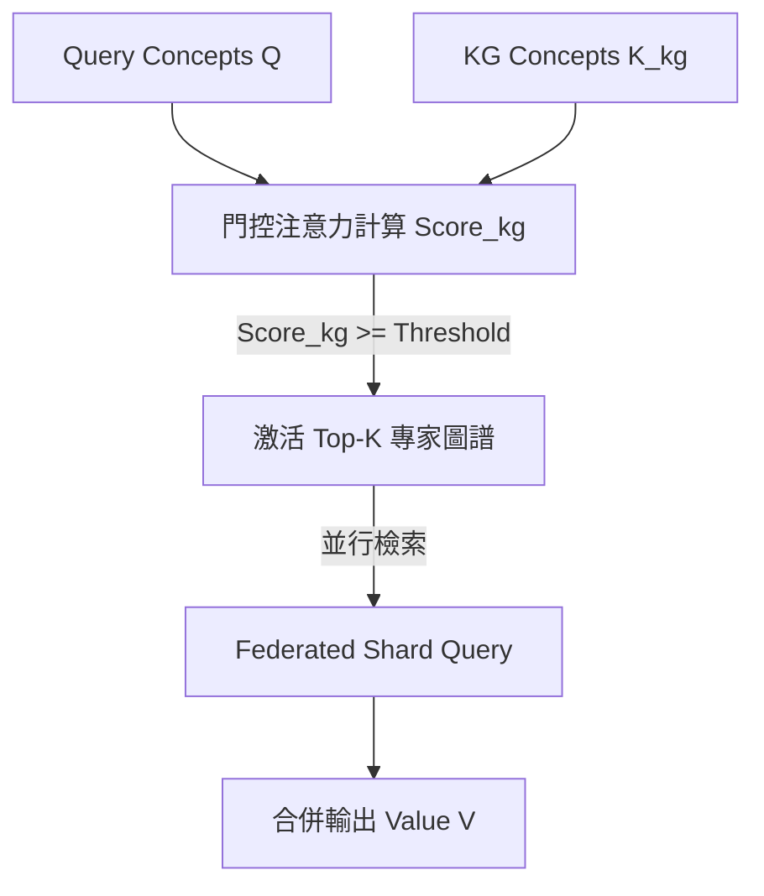

# 神經符號 GraphRAG 系統：基於動態注意力機制與聯邦知識分片的學術與理論架構

# (Neuro-Symbolic GraphRAG System: Academic & Theoretical Architecture)

本文件整理了**「智慧知識庫 / World Knowledge Hub」**的核心技術概念，詳細討論**「圖譜外查找機制（概念路由）」**與**「圖譜內查找機制（混合檢索與雙向回溯機制）」**，並將其映射至現代深度學習中的 **Attention (Q, K, V) 機制**、**神經符號 AI (Neuro-Symbolic AI)**、**混合專家圖譜路由 (Mixture of KGs / Graph MoE)** 以及**動態記憶網絡 (Dynamic Memory Networks)** 等學術理論，為本專案提供完備且嚴謹的學術與理論背書。

---

## 1. 系統架構總覽 (System Architecture Overview)

本系統是一個**混合型 RAG (Hybrid RAG) 系統**，旨在橋接**連續語意空間（高維向量）**與**離散知識空間（圖譜拓撲與本體）**。其核心架構在學術上可拆解為兩個運行層次：

1. **圖譜外查找機制（Outer-Graph Gating & Routing）**：基於 **混合專家模型 (Mixture of Experts, MoE)** 的概念，將多個獨立的知識圖譜 (KG) 視為獨立的專家節點，利用 QKV 門控路由注意力，動態篩選並激活相關知識庫。
2. **圖譜內查找機制（Inner-Graph Retrieval & Provenance Backtracking）**：在被激活的圖譜內部，結合 **符號級圖遍歷 (Symbolic Traversal)** 與 **圖譜引導的文本混合重排 (Graph-Driven Reranking)**。若 SVO 知識事實不足以答覆，系統將啟動 **符號-物理回溯機制 (Symbolic-to-Physical Backtracking)**，沿著圖譜節點的物理座標回溯拉取對應的**原始文件段落 (Chunks)**。

```
                               連續向量空間 (Continuous Vector Space)
                              ┌──────────────────────────────────────┐
   Query Token (Xq) ─────────►│  Q = Xq · Wq (Concept Extraction)    │
                              └──────────────────┬───────────────────┘
                                                 │
                                                 ▼ [Attention Weights (α)]
                                 圖譜門控路由器 (Graph Gating Router)
                                  計算 Q 與每個 KG Key (K_kg) 的對齊分
                                                 ▲
                              ┌──────────────────┴───────────────────┐
   Graph Schema (Xk) ────────►│  K_kg = KG Concepts (public_concepts)│
                              └──────────────────────────────────────┘
                                  圖譜專家層 (Mixture of KG Experts)
─────────────────────────────────────────────────────────────────────────────
                                 離散符號空間 (Discrete Symbolic Space)
                              ┌──────────────────────────────────────┐
                              │  V = 激活圖譜內的 Entities & Facts  │
                              └──────────────────┬───────────────────┘
                                                 │
                                                 ▼ [Memory Retrieval (A · V)]
                                      圖譜內混合檢索與回溯
                                ├── 1. BFS 1-2跳拓撲遍歷 (Cypher)
                                ├── 2. 符號-物理回溯 (Symbolic-to-Physical)
                                │      沿節點物理座標回溯拉取原始 Chunk 文本
                                └── 3. 圖譜引導的 Chunk 重排 (Reranking)
                                                 │
                                                 ▼
                                     RAG Prompt / Context 輸出
```

---

## 2. 圖譜外查找機制：圖譜專家門控與 QKV 注意力映射

### (Outer-Graph Gating: Mixture of KG Experts & Routing Attention)

#### 【技術機制】

本系統將**「每個獨立的知識圖譜（KG）當作一個獨立專家節點（Node / Expert）」**。QKV 注意力機制的作用是在「路由層」，動態計算問題對各個圖譜專家的權重分配：

* **Query ($Q$)**：輸入問題經概念提取後，投影為特徵矩陣 $Q \in \mathbb{R}^{M \times d}$。除了高維語意 Embedding 外，亦包含 $[interest, professional]$ 雙維度屬性權重。
* **Key ($K$)**：每個獨立圖譜（專家節點）所擁有的概念集合特徵（即 `public_kg_concepts`），代表該圖譜的主題語意特徵 $K_{\text{kg}} \in \mathbb{R}^{N \times d}$。
* **Value ($V$)**：被選擇/激活的圖譜內部的具體離散 SVO（Subject-Verb-Object）事實與文件片段（Chunks）。



#### 【數學公式與門控路由】

本系統在 [services/concept_engine.py](file:///D:/Users/666/Desktop/智慧知識庫2/services/concept_engine.py) 的 `compute_match_score()` 中，將其實作化為**多屬性圖譜門控注意力（Multi-Attribute Gating Attention）**：

1. **語意餘弦相似度**：
   $$\text{Cos}_{i,j} = \text{Cosine}(Q_{vector, i}, K_{vector, j})$$
2. **屬性對齊分數**：
   $$\text{Align}_{i,j} = 1.0 - \frac{|\Delta interest_{i,j}| + |\Delta professional_{i,j}|}{2}$$
3. **特徵強度振幅**：
   $$\text{Mag}_{i,j} = \frac{interest_{Q,i} + professional_{Q,i} + interest_{K,j} + professional_{K,j}}{4}$$
4. **綜合門控注意力權重 ($\alpha$)**：
   $$\alpha_{i,j} = \text{Cos}_{i,j} \times \text{Align}_{i,j} \times \text{Mag}_{i,j}$$
5. **最終圖譜路由得分**：
   $$\text{Score}_{\text{kg}} = \frac{\sum_{i,j} \alpha_{i,j}}{\sum_{i,j} \text{Mag}_{i,j}}$$

系統設定了 `KG_ROUTE_THRESHOLD`（預設為 0.05）作為篩選門檻。

#### 【多專家激活與跨域語意融合 (Top-K Multi-Expert Activation)】

為了解決現實世界中**跨領域 (Cross-domain) 查詢**的問題（例如，問題涉及「醫學」與「資訊工程」的交集），系統**不限制只激活單一圖譜**，而是實作了 **Top-K 門控路由機制**（在代碼中以 `MAX_KG_PER_QUERY` 進行約束，**實際預設為 5**，定義於 `core/constants.py`，篩選邏輯見 `routers/agent.py`：先以 `score >= KG_ROUTE_THRESHOLD` 篩選，再取 `kg_scores[:MAX_KG_PER_QUERY]`）：
$$\text{Activated\_KGs} = \text{Top-K}\Big( \big\{ \text{KG}_i \;\big|\; Score_{\text{kg}, i} \ge \text{Threshold} \big\} \Big)$$
這對應於 **Top-K Sparsely-Gated MoE** 結構：

1. **並行激活與聯邦檢索**：當多個專家圖譜被同時激活時（$\text{Gate}_i = 1$），系統在 `routers/agent.py` 的 `_bfs_kg()` 搭配 `asyncio.gather()` 對所有 `selected_kgs` 並行執行 BFS 遍歷，跨分片場景則由 `services/shard_query.py` 的 `query_shards_parallel()` 承接，獲取各自的離散 SVO Facts 與對應原文的物理座標。
2. **跨域值融合 (Cross-Domain Value Fusion)**：將各個專家圖譜回傳的局部 Value 進行語意拼接與交叉融合：
   $$\text{Fused\_Context} = \bigoplus_{i \in \text{Activated}} V_i$$
   這讓最終的 LLM 能綜觀多個學科或專門領域的知識，進行**跨域語意聯邦推理（Cross-Domain Federated Reasoning）**。

#### 【學術文獻背書與經典論文】

* **Sparsely-Gated MoE**：
  * *文獻*：*Shazeer, N., et al. (2017). "Outrageously Large Neural Networks: The Sparsely-Gated Mixture-of-Experts Layer."* arXiv:1701.06538.
  * *理論連結*：證明了當 $K > 1$（如 Top-2/Top-3 Gating）時，MoE 能夠同時激活多個不同的網絡專家，並對其輸出進行加權融合。本系統的 `MAX_KG_PER_QUERY` 圖外路由即是該機制的典型實踐。
* **Mixture of Knowledge Graphs (MoKG)** — ⚠️ 引用待補（2026-07-08 查證後移除原引用）：
  * 本節原引用「Zhao, Y., et al. (2022). "Mixture-of-Experts for Large-Scale Knowledge Graph Reasoning."」，但 2026-07-08 查證時無法找到與此標題/作者精確匹配的已發表論文（可能是工作坊等級或未正式發表的草稿，找不到可靠來源比對），為避免引用不可考的文獻，已移除此條引用。
  * *理論連結*（不掛文獻、僅作為概念性類比）：在大規模圖推理中，採用多個局部專家圖譜進行分而治之，直覺上比單一扁平圖譜具備更好的推理效率與擴展性，此為本系統路由設計的動機之一，但目前沒有可靠引用支持這個具體措辭的學術主張。若有讀者能提供這個概念的可靠出處，歡迎替換回正式引用。

---

## 3. 圖譜內查找機制：符號遍歷、物理段落回溯與實體重排

### (Inner-Graph Retrieval: Symbolic Traversal, Source Backtracking & Reranking)

當圖譜路由器激活了特定的圖譜專家後，系統進入**圖譜內部的雙軌檢索與回溯階段**：

```mermaid
sequence diagram
    autonumber
    Participant Query as 用戶問題
    Participant Graph as Neo4j 圖譜層 (A-Box)
    Participant Store as ChunkStore 物理層
    Participant LLM as 大語言模型 (Generator)
    
    Query->>Graph: 1. BFS 1-2跳符號遍歷 (Cypher)
    Graph-->>Query: 2. 獲取 SVO Facts 與對應 chunk_id 座標
    Note over Query, Graph: 若關係過於簡煉，缺失細節...
    Query->>Store: 3. 符號-物理源頭回溯 (拉取原始 Chunks)
    Store-->>Query: 4. 返回精確原文段落 (Context)
    Query->>LLM: 5. 融合成 RAG Prompt (Facts + Chunks)
    LLM-->>Query: 6. 輸出可信且具備溯源依據的答案
```

#### 【第一軌：符號級圖譜遍歷（Symbolic Graph Traversal）】

1. **BFS 拓撲檢索**：系統利用問題中提取的概念，在 Neo4j 中執行 **1-2 跳的 BFS 遍歷**。
2. **語意事實與轉譯**：獲取離散 `SVO Facts`，並透過 `_svo_to_sentences` 翻譯為自然中文句子。
3. **定位物理座標**：保留每個 Fact 指向的 `chunk_id`、`source_doc_id`。

#### 【核心機制：符號-物理源頭回溯（Symbolic-to-Physical Source Backtracking）】

當 SVO 離散關係雖然被檢索命中，但因為三元組過於抽象、精簡而**丟失了原文中的副詞、時序、數量或情境細節**，導致 LLM 無法完美作答時，系統會啟動回溯：

* **座標對照**：系統沿著被激活的 SVO 節點中儲存的 `chunk_id` 與 `source_doc_id` 物理座標，直接向 `ChunkStore` 持久化數據庫發送請求。
* **物理原文拉取**：將產生這些 SVO 節點的**原始文件段落（Chunk 原文）**回溯提取出來（例如包含「西元 701 年，李白出生於碎葉城，其家族在此經商...」的完整段落）。
* **學術價值**：這解決了傳統 Knowledge Graph 缺乏上下文情境（Context-free）的重大缺陷。本系統透過 **「符號-物理對照映射（Symbolic-to-Physical Mapping）」**，讓 LLM 同時擁有離散的「邏輯關係邊（SVO）」與連續的「原文細節（Chunk）」，大幅提升回答的細節度與可信度。
* **實際觸發條件（`routers/agent.py` 精煉迴圈，約 L658-715，2026-07 複查後line number已更新）**：並非對每次查詢都無條件回溯，而是有明確的觸發閥門——僅當 `req.use_svo` 開啟且 BFS 已取得 `svo_chunk_ids` 時才進入精煉迴圈；迴圈內先由 LLM 對初次生成的答案自報信心分數，只有 `confidence < _CONFIDENCE_THRESHOLD` 時才會呼叫 `chunk_store.read_ranked(remaining_ids, q_vec)` 補拉原文。這比文件原先「SVO 資訊不足即回溯」的描述更精確：觸發依據是**生成端的信心分數**，而非檢索端對 SVO 資訊量的判斷。

#### 【第二軌：圖譜引導的文本重排（Graph-Driven Reranking）】

以上述圖譜抽出的實體作為「引導信號」，在 `routers/agent.py` 的 `_pick_relevant_chunks`（定義於約 L79）中對物理 Chunk 進行重新排序，計算公式為（實測與程式碼逐項核對，係數完全吻合）：
$$\text{Score} = \text{Cosine}_{\text{max}} + \text{Query\_Hits} \times 0.4 + \mathbf{SVO\_Hits \times 0.10} + \text{Enum\_Bonus}$$

其中 `Enum_Bonus = 0.25`（約 L166）。這實作了**圖譜符號知識對向量相似度空間的偏置與引導**，優先提取與圖譜事實密切相關的原始文本。

* **實作細節（文件先前未提及）**：實際排序並非單純依 `Score` 由大到小排，而是**兩階段排序**（約 L169-175）——先比較 `Query_Hits` 命中數，命中數相同時才比較綜合 `Score`。這代表系統對「關鍵詞直接命中」的信任權重高於「向量+圖譜綜合分數」，屬於刻意的保守排序策略。

#### 【學術文獻背書與經典論文】

* **GraphRAG 架構**：
  * *文獻*：*Edge, D., et al. (Microsoft, 2024). "From Local to Global: A Graph RAG Approach to Query-Focused Summarization."* arXiv:2404.16130.
  * *理論連結*：微軟論文中強調了將非結構化文本轉為知識圖譜（Community Summary），再對應回原始文本的檢索優勢。本系統的「符號-物理源頭回溯」正是微軟 GraphRAG 中「圖譜實體簡化為原始文本」概念的工程化具體實作。
* **Provenance-Aware Retrieval** — ⚠️ 引用待補（2026-07-08 查證後移除原引用）：
  * 本節原引用「Deutch, D., et al. (ACL, 2021). "Provenance-Aware Search and Retrieval over Structured and Unstructured Data."」，但 2026-07-08 查證時找不到這篇論文；Deutch 在 2021 年的真實出版品是資料庫領域的隱私/溯源權衡研究（如 ICDE/SIGMOD 上的論文），主題與本節「保留物理來源以支持可解釋性」的概念相關但不完全對應，且 Deutch 並非 ACL（自然語言處理領域會議）的常見發表者——這個「作者+會議+標題」組合經查證後判斷為不可靠，已移除原引用。
  * *理論連結*（不掛文獻、僅作為概念性類比）：在語意檢索中，保留離散知識的物理來源（Provenance / Coordinates）對於資訊可解釋性（Explainability）與事實真實性有直覺上的重要性，這是本系統「符號-物理回溯」設計的動機，但目前沒有可靠引用支持這個具體措辭的學術主張。第 7 節引用的 ProVe 專案（King's Knowledge Graph Lab）在事實驗證的精神上與此概念相關，可作為替代參照。

---

## 4. 本體論與知識圖譜的雙層協同

### (Ontology & Knowledge Graph: T-Box / A-Box Co-Reasoning)

本體論（Ontology）是知識圖譜的「語意骨架」，定義了數據的關係約束與邏輯結構。本專案將本體論與知識圖譜進行了學術上的 **T-Box（術語域）與 A-Box（實例域）雙層協同推理設計**：

#### 【本體架構與學術定義】

1. **T-Box (Terminology Box / 概念與本體模式層)**：
   * **Concept Classes (實體類別)**：定義了 19 種核心實體類型（`概念`、`算法`、`技術`、`方法`、`工具`、`框架`、`模型`、`系統`、`人物`、`組織`、`資料集`、`指標`、`其他`，加上為法規遵循類場景擴充的 `法規`、`假期`、`企業`、`政府機關`、`限制數值`、`行為`）。（2026-07-08 修正：`services/svo_service.py` 的抽取 prompt 範例長期已使用這 19 種，但驗證用的 `_VALID_TYPES` 集合先前只同步了原始 13 種，導致 LLM 正確標註「企業」「政府機關」等類型後，驗證階段又被靜默降級為「其他」——已修正 `_VALID_TYPES` 與 `_TYPE_LABEL_MAP` 同步為 19 種，詳見第13節第九輪。）
   * **Relation Categories (本體關係類別)**：預定義了 31 種強類型的語意關係（如 `IS_A` 代表層級歸屬，`CAUSES` 代表因果效應，`USES` 代表功能操作，`VIOLATES` 代表法規/規範違反等）。這解決了傳統 OpenIE（開放式資訊抽取）中關係詞發散、無法進行邏輯歸納與推理的弊端。（2026-07-07 核對 `services/svo_service.py::_VALID_REL_TYPES` 實際為 31 種，非文件先前沿用的 30 種；`VIOLATES` 為配合法規遵循類測試場景新增的分類，歸入「規範/合規」子類。）
2. **A-Box (Assertion Box / 實例語意層)**：
   * 具體文檔中抽取出的實例化三元組（如 `[Transformer] -[:USES]-> [多頭注意力]`）。

#### 【雙層協同工作機制】

* **本體路由層（T-Box）**：`ConceptNode` 儲存了高維連續向量與屬性權重，作為 RAG 路由的**注意力分發器**。它快速匹配問題的核心概念與對應的本體 Schema。
* **實例推理層（A-Box）**：路由確定後，系統在 Neo4j 圖資料庫中進行 BFS 圖路徑遍歷，將抽象的本體關係轉化為精確的文件事實與上下文，實作了「概念導向，事實落地」的協同推理。

#### 【學術文獻背書與經典論文】

* **Description Logics (描述邏輯與語意網)**：
  * *文獻*：*Baader, F., et al. (2003). "The Description Logic Handbook: Theory, Implementation, and Applications."* Cambridge University Press.
  * *理論連結*：奠定了本體論中 T-Box 與 A-Box 劃分的基石。本系統將概念路由映射為 T-Box，將三元組圖譜映射為 A-Box，符合經典語意網（Semantic Web）的知識表徵規範。
* **神經符號 AI 的集成 (Neuro-Symbolic Integration)**：
  * *文獻*：*Garcez, A., & Lamb, L. (2020). "Neurosymbolic AI: The 3rd Wave."* arXiv:2012.05876（後於 2023 年發表期刊版：*Journal of Applied Logics*）。（2026-07-08 修正：原文件將 arXiv 版本的 2020 年份誤標為 2023，兩者實為同一篇論文的 preprint 與期刊版本，引用時不應把期刊發表年份直接套用在 arXiv ID 上。）
  * *理論連結*：探討了如何將深度學習（連接主義）與符號邏輯相融合。本系統將連續向量（Embedding）作為路由導引，最終降落到 Neo4j 離散符號，是典型的第三代神經符號人工智慧架構。

### 4.1 SVO 品質驗證機制：多模型生成-審查-本體擴充迴圈 — ✅ 已落地（2026-07-08）

#### 【動機與與既有機制的關係】

第 8 節提到的「防幻覺過濾器」實際落地為 `services/svo_service.py::_filter_hallucinated()`——一個**規則式**檢查：只要主詞或受詞其中一方以子字串形式出現在原文中即保留，不判斷語意正確性，也不檢查類型/關係選擇是否恰當。本節新增的機制是在這之上疊加**第二個獨立 LLM 呼叫**作為審查員，並在審查持續失敗時觸發**第三個 LLM 呼叫**動態擴充本體，形成「生成 → 審查 → 重試 → 擴充」的多模型閉環，而非單純依賴子字串檢查。

#### 【三模型分工】

1. **抽取模型**（`extract_svo_from_text()`，既有）：從原文抽取 SVO 三元組，可帶入 `extra_entity_types`/`extra_rel_types` 使用本 KG 擴充後的類型。
2. **審查模型**（`verify_svo_extraction()`，新增）：獨立於抽取模型，拿著原文與抽取結果逐條判斷 `accepted: true/false`，判準包含「是否可被原文支持」與「類型/關係選擇是否恰當」。解析失敗時**保守判定通過**（避免審查格式異常誤殺正常抽取結果）。
3. **本體擴充模型**（`propose_ontology_extension()`，新增）：只在「初次抽取 → 審查拒絕 → 重新抽取 → 審查仍拒絕」之後才被呼叫。給定原文與被拒絕的理由，判斷是否因為目前 19 種實體類型／31 種關係類型清單缺少真正貼切的選項，若是則提議新類別（每次呼叫上限各 3 個），並自行決定適用範圍（`scope`）。

#### 【流程控制與有界性】

整合為 `extract_svo_verified(text, kg_id, model_override)`：

```
抽取 → 審查
  ├─ 通過 → 結束
  └─ 拒絕 → 重新抽取（次數由 svo_verify_max_retries 控制，預設 1 次）→ 再次審查
        ├─ 通過 → 結束
        └─ 仍拒絕 → 本體擴充模型提議新類別 → 持久化 → 用擴充後類型再抽取一次 → 結束（不再審查）
```

最後一次抽取後**刻意不再審查**，確保流程有界、不會無限循環——這是與抽取模型既有的「chunk 級重試 + fallback 降級模型」機制（見 `_process_chunk`/`_get_fallback_model`）刻意保持一致的設計原則：本機制疊加在既有重試邏輯之上，兩者的重試次數彼此獨立、互不相乘失控。`core/config.py::svo_verify_enabled=False` 時完全略過驗證，等同舊行為（向後相容）。

#### 【本體擴充的範圍控制：預設僅供單一 KG，例外才升級全域】

依使用者明確指示設計：

* **預設 `scope="kg"`**：新類型只寫入 `services/ontology_service.py` 管理的 `ontology_extensions.json` 裡該 KG 專屬的 bucket，不影響其他 KG 的抽取行為與 BFS 查詢。
* **例外 `scope="global"`**：本體擴充模型自行判斷該類別是否「明顯具跨領域普適性」，若是則直接併入全域清單，所有 KG 共用。
* **不需要人工審核**：模型的擴充決定直接生效並持久化。**這與第 9 節②「動態本體對齊」草案的立場刻意不同**——該草案評估「動態本體對齊」（聯邦分片間的 schema 映射）時明確要求「強制人工審核，不能全自動上線」，理由是錯誤映射會靜默合併語意不同的關係、難以事後偵測。本節機制的風險輪廓不同：擴充的是「新增類別」而非「合併/覆寫既有類別」，最壞情況是新增了一個定義不夠精確或與既有類型高度重疊的類型，可事後盤點 `ontology_extensions.json` 清理，風險遠低於錯誤合併；且是使用者在此功能設計時的明確取捨，非架構上的必然。

#### 【對既有 BFS/社群偵測 Cypher 的連動修改】

新增類型若只影響抽取與驗證，而不影響下游查詢，將造成「寫得進去、查不出來」的不一致——`services/svo_service.py` 的 `_ALL_REL_PATTERN` 原本是寫死的模組常數，供 `query_svo_facts()`、`query_svo_facts_with_provenance()`、`_clear_kg_relations()` 與 `services/community_service.py` 的社群偵測 Cypher 共用。已改為透過 `ontology_service.get_effective_rel_pattern(kg_id, _ALL_REL_PATTERN)` 在查詢當下組出「基礎 31 種 + 該 KG 擴充關係類型」的完整 pattern，確保：
* BFS 圖遍歷（第 3 節）能走到新關係類型的邊。
* `rebuild_relations_only` 清除關係邊時，新關係類型的邊也會被正確清除（否則重建後會與新抽取的邊並存，造成資料不一致）。
* 社群偵測（第 9 節⑤）建圖與取樣事實時，新關係類型的邊也會納入。

#### 【驗證】

`tests/services/test_ontology_service.py`（16 案例：kg/global scope 隔離性、去重、數量上限、`get_effective_rel_pattern` 組裝、持久化）、`tests/services/test_svo_verification.py`（15 案例：審查通過/拒絕/格式異常保守處理、本體擴充解析與防禦性去重、整合流程的重試次數與有界性、停用開關）；全數通過，且完整既有測試套件（含連線真實 Neo4j 的整合測試）872→903 個測試無回歸。另用真實 Ollama 模型跑過一次端到端 smoke test（見第 13 節第九輪），確認新增的 6 種實體類型（企業、政府機關、法規等）確實被正確抽取與保留，不再被靜默降級為「其他」。

#### 【學術文獻背書】

* **Generator-Discriminator 架構於符號抽取的應用**：
  * *理論連結*：本機制的「抽取（Generator）→ 審查（Discriminator）→ 拒絕重試」結構，概念上呼應生成對抗網路（GAN）與 Self-Refine 類方法中「生成後自我/他者批判」的設計精神，差異在於本機制的審查訊號是離散的 accept/reject 判定加自然語言理由，而非連續梯度或單一標量分數。
  * *文獻*：*Madaan, A., et al. (2023). "Self-Refine: Iterative Refinement with Self-Feedback."* NeurIPS 2023. （生成後由同一或不同模型產生回饋、再迭代改進的通用框架，是本機制「審查→重試」迴圈的直接理論參照。）
* **本體演化（Ontology Evolution）**：
  * *文獻*：*Stojanovic, L., et al. (2002). "User-driven Ontology Evolution Management."* EKAW 2002. （本體論隨著新資料湧入而動態演化的經典議題；本機制是其模型驅動、去人工審核版本的一種簡化實作，取捨與風險評估見上方。）

---

## 5. 核心理論五：變長度注意力與動態知識演化

### (Variable-Length Attention & Non-parametric Memory Evolution)

#### 【技術機制】

對於「轉譯矩陣不固定、描述節點數量隨時間增減」的問題，事實上，這符合 Attention 機制最關鍵的優勢：**置換不變性與變長度相容**。

1. **置換不變性 (Permutation Invariance)**：
   在計算相似度矩陣 $QK^T$ 時，Key 矩陣 $K \in \mathbb{R}^{N \times d}$ 中的行（Rows）順序無關緊要。無論描述節點如何重排，經歸一化後的注意力分佈均能保持不變。
2. **長度無關性 (Length Agnostic)**：
   描述節點的數量 $N$ 可以是任意正整數。當某實體的描述節點因時間推移而增加或刪除時，只是在數學上改變了矩陣的行數 $N$，透過加權歸一化算法，系統天然兼容這種動態變維。

#### 【學術文獻背書與經典論文】

* **Memory Networks (記憶網路)**：
  * *文獻*：*Weston, J., et al. (Facebook AI Research, 2014). "Memory Networks."* arXiv:1410.3916.
  * *理論連結*：提出了利用外部 Memory Slots 來克服神經網路長程記憶失效的經典模型。本系統將 ConceptNode 設計為動態增減的記憶槽，概念完全承襲自 Memory Networks 的非參數化記憶（Non-parametric Memory）思想。
* **Attention Mechanism 數學基礎**：
  * *文獻*：*Vaswani, A., et al. (2017). "Attention Is All You Need."* NeurIPS 2017.
  * *理論連結*：證明了 Attention 機制相比於 CNN/RNN，天然支持變長序列輸入（Set-input compatible）與置換不變性。

---

## 6. 核心理論六：聯邦分片檢索與實體消歧

### (Federated Graph Querying & Entity Alignment)

#### 【技術機制】

為解決海量世界知識（World Knowledge）帶來的資料庫單點效能瓶頸，系統在 [routers/world.py](file:///D:/Users/666/Desktop/智慧知識庫2/routers/world.py) 與 `services/federation_service.py`、`services/shard_query.py` 中實作了：

1. **聯邦 Registry 合併**：`services/federation_service.py` 的 `get_federation_cache()` 整合本地與 `settings.github_registry_url` 遠端 Registry 快取（快取過期時背景非同步刷新，不阻塞 `/world/chat`，見第13節變更記錄）；`services/shard_query.py` 的 `query_shards_parallel()` 將查詢並行發送至各個分片，並支援 `mark_shard_offline()` 對離線分片降級容錯。
2. **跨實例實體對齊（Entity Alignment）**：透過 `services/entity_alignment.py` 的 `align_entity_results()`（以字典序最小詞作 canonical key 合併同義實體）與 `expand_terms()`（靜態同義詞表 + LLM 動態多語言同義詞展開）完成。
   * **補充**：`expand_terms()` 並非只服務聯邦跨分片場景，`routers/agent.py` 在**單一 KG 內**的查詢期實體對齊也共用同一套函式，屬於比本節標題更通用的機制。

#### 【學術文獻背書與經典論文】

* **Federated Queries in Semantic Web**：
  * *文獻*：*Schwarte, A., et al. (2011). "FedX: Optimization Techniques for Federated Query Processing on Linked Data."* **ISWC 2011**（2026-07-08 修正：原文件誤標為 WWW 2011，正確發表會議為 International Semantic Web Conference；本輪獨立查核另修正：標題誤植為「on Structured Data」，正確標題為「on **Linked Data**」，見 `docs/報告/02_參考文獻獨立查核報告.md`）。
  * *理論連結*：這是在語意網領域中進行分散式 SPARQL 聯邦查詢的奠基之作。本系統的並行分片查詢（`query_shards_parallel`）即是聯邦查詢在 GraphRAG 系統中的具體實作。
* **實體消歧與融合**：
  * *文獻*：*Zhao, X., Zeng, W., Tang, J., Wang, W., & Suchanek, F. M. (2020/2022). "An Experimental Study of State-of-the-Art Entity Alignment Approaches."* IEEE Transactions on Knowledge and Data Engineering (TKDE)（2026-07-08 修正：原文件作者姓氏首字母誤植為「Zhao, C.」且缺漏發表期刊，正確作者為 Xiang Zhao（趙翔），已補上真實標題與 TKDE 期刊出處。另，本輪獨立查核發現年份標示可能造成混淆：DOI 標註的線上優先/接受年份為 2020，但正式期刊卷期出版年份為 2022（vol.34, issue 6），論文引用時請依投稿規範選擇年份寫法，見 `docs/報告/02_參考文獻獨立查核報告.md`）。
  * *理論連結*：探討了在多源、分散式知識庫中，如何利用對齊算法（Alignment Algorithms）整合命名不一致但實質等價的實體。

### 6.1 聯邦架構的三項工程延伸（Phase 3a/3c/3d）— ✅ 已落地（2026-07 稽核後補入）

> **本節定位**：以下三個能力（知識溯源、版本控制、訂閱同步）已在 `ROADMAP.md` 標記為 Phase 3a/3c/3d 完成，屬於已上線的產品功能，但先前從未被寫入本理論架構文件。它們並非全新的學術理論分支，而是第 3、6 節既有理論（符號-物理回溯、聯邦分片）在「時間軸」與「推播/拉取模式」上的直接工程延伸，故合併記錄於本節，不另立獨立章節。

#### 【Phase 3a：知識溯源（Provenance）】

在第 3 節「符號-物理源頭回溯」之外，`models/provenance.py` 定義了更結構化的 `SourcedFact`（事實 + 來源文件 + 信心分數 + 建立時間）與 `ProvenanceReport`。`services/svo_service.py::query_svo_facts_with_provenance()` 在 BFS 撈回候選邊後，批次 JOIN `Document` 節點取得標題（`_batch_get_doc_titles`），供 `/world/chat`（見 `services/shard_query.py::ShardResult.sourced_facts`）與 `GET /world/provenance/facts` 端點使用；LLM Prompt 改用 `cite_str()` 格式（`事實 [來源：《文件名》，信心 N]`），要求模型在回答中主動引註出處。這與第 3 節引用的 *Provenance-Aware Retrieval*（Deutch et al., 2021）及第 7 節對照表中的 ProVe 專案是同一條理論脈絡的落地，差別在於 Phase 3a 把溯源標記直接嵌入 Prompt 文本，而非僅作為 UI 顯示用的中繼資料。

#### 【Phase 3c：KG 版本控制（Version Control）】— 與第 9 節⑥時序衰減共用同一組時間戳

`routers/versioning.py` 提供三個唯讀查詢端點：`GET /kg/{id}/changelog`（依 `updated_at`/`created_at` 降冪列出近期變更）、`GET /kg/{id}/diff?since=`（指定時間點後的所有新增/更新事實）、`GET /kg/{id}/snapshot?at=`（`created_at <= at` 的知識快照，重建任一歷史時間點的圖譜狀態）。三者皆同時支援 Enterprise 多資料庫與 Community 版 `kg_id` 屬性區隔兩種路徑。

* **與第 9 節⑥的關係**：Phase 3c 沒有引入新的時間戳欄位，而是直接複用 `svo_service.py` 邊 MERGE 時既有的 `created_at`（`ON CREATE SET`）與 `updated_at`（`ON MATCH SET`），把原本只用於「衰減重排」的時間戳，額外開放為「歷史查詢」的一等公民資料。`change_type` 欄位（`"created"` | `"updated"`）由比對兩個時間戳是否相等推導。
* **學術背景**：這對應資料庫理論中的**雙時態資料模型（Bitemporal Data Model）**與 RDF/圖譜演化研究：
  * *文獻*：*Snodgrass, R. T. (1999). "Developing Time-Oriented Database Applications in SQL."* Morgan Kaufmann. （交易時間 / 有效時間雙時態建模的奠基教材，`snapshot`/`diff`/`changelog` 三個端點分別對應書中「時間點查詢」「區間查詢」「變更序列查詢」三種標準模式。）
  * ⚠️ **引用待補（2026-07-08 查證後移除）**：本節原引用「Dividino, R., et al. (2014). "Change Management for Existing Knowledge Graphs." Semantic Web Journal」，但查證時找不到與此標題/作者/期刊精確匹配的已發表論文，為避免引用不可考的文獻已移除。概念本身（不重建整個圖譜、只追蹤增量演化）仍是本節設計動機，但目前沒有可靠引用支持這個具體措辭的學術主張，若有讀者能提供可靠出處歡迎替換回正式引用。

#### 【Phase 3d：KG 訂閱／自動同步（Subscription）】— 對聯邦架構的「拉取式」補充

第 6 節的聯邦分片（`services/shard_query.py`、`services/federation_service.py`）是「查詢時即時並行拉取」模式：每次 `/world/chat` 都對所有已知分片發起即時請求。`services/subscription_service.py` 的 `SubscriptionManager` 則新增了**背景定時拉取並落地合併**的第二種模式：`sync_subscription()` 從遠端 AuraDB 分批拉取 SVO 並 MERGE 進本機圖譜，`sync_all_subscriptions()` 由 `main.py` 內建的 APScheduler 每 6 小時呼叫一次，單次同步設有 60 秒逾時避免掛死排程。`routers/subscription.py` 提供訂閱的增刪查與暫停/恢復管理端點。

* **與即時聯邦查詢的取捨**：即時分片查詢（第 6 節）延遲低但每次問答都依賴對方線上；訂閱同步犧牲即時性，換取「訂閱後即使對方離線，本機仍保有最近一次同步的完整副本」，兩者互補而非互斥——這正是 ROADMAP.md 待解決問題表中「AuraDB 免費版閒置暫停」風險的直接對沖手段。
* **學術背景**：定期拉取、非同步收斂的複寫模式對應分散式系統中的 **Epidemic / Gossip 協定**與最終一致性（Eventual Consistency）理論：
  * *文獻*：*Demers, A., et al. (1987). "Epidemic Algorithms for Replicated Database Maintenance."* PODC 1987. （提出定期兩兩同步、允許暫時不一致換取去中心化韌性的經典演算法，是本系統「6 小時定時拉取 + 60 秒逾時降級」設計的理論先驅。）
  * *理論連結*：與第 6 節引用的 FedX（即時聯邦查詢）互為對照——FedX 代表 pull-on-query 的同步聯邦，Gossip/Epidemic 代表 pull-on-schedule 的非同步複寫，本系統同時具備兩種模式，是聯邦知識分片架構在 CAP 定理權衡光譜上的雙棲實作。

---

## 7. 相關 GitHub 開源專案對照 (State-of-the-Art Baselining)

本系統與目前 GitHub 上最前沿的世界知識與圖譜 RAG 專案具有高度關聯，並在特定架構上進行了優化。

> **⚠️ 2026-07-08 全面查證說明**：本節與全文所有 GitHub 連結、arXiv 引用皆於本日重新逐一查證（星數以查證當下為準，之後會持續變動；論文則核對 arXiv ID 是否真的對應標題與作者）。原表格中一列（`Wikipedia-KG-RAG`）因連結格式本身無效、且查證後對應到的真實專案僅 2 顆星，已移除；其餘保留的專案皆標註實際星數，星數偏低者額外註明其可信度來源（例如機構背書）而非單純星數。完整查證過程與方法見第 13 節第十一輪變更記錄。

| GitHub 專案與連結 | 星數（2026-07-08 查證） | 核心學術定位 | 本系統的對應與優勢 |
| :--- | :--- | :--- | :--- |
| [zjunlp/WKM](https://github.com/zjunlp/WKM) <br>*(World Knowledge Model)* | ★167，最後活動 2024-12 | 浙江大學 NLP 團隊開發，為 AI Agent 注入先驗的物理和常識狀態，降低規劃幻覺。 | 本系統已對接 `claude-desktop`（獨立的外部伴侶應用，不在本 repo 內，於本機另以 `claude-desktop-frontend-dev`/`claude-desktop-backend-dev` 容器執行）作為 Agent 的外部大腦。2026-07-07 稽核時確認：本文件先前的 `package.json` file:// 連結指向的是舊機器路徑（`C:/Users/mycena/...`），該檔案在本專案目錄下實際不存在，已移除失效連結，僅保留文字敘述。 |
| [King-s-Knowledge-Graph-Lab/ProVe](https://github.com/King-s-Knowledge-Graph-Lab/ProVe) | ★11，最後活動 2026-05（持續維護中） | 利用 LLM 對照網頁參考資料，校驗 Wikidata 中的三元組事實（Fact Verification）。 | 本系統實作了 **「事實溯源 (Provenance)」** 路由，與 ProVe 雷同，且加入了**「防幻覺過濾器」**進行實體原文存在性校驗。⚠️ **星數偏低（僅 11），可信度來源是 King's College London 學術實驗室背書，而非社群熱度**——引用時應明確標註是「學術機構的研究產出」而非「廣受採用的開源工具」，兩者是不同層級的證據力，不宜混為一談。 |
| [pat-jj/KG-FIT](https://github.com/pat-jj/KG-FIT) | ★132（2026-07-08 重新查核，原131），最後活動 2025-05 | 針對開放世界知識（Open-World）進行圖譜的微調與補全，解決新實體對齊問題。 | 本系統在 `services/entity_alignment.py` 中實作了**同義詞展開與實體對齊**，在不微調模型的情況下完成開放世界實體融合。 |
| [microsoft/graphrag](https://github.com/microsoft/graphrag) | ★34,251（2026-07-08 重新查核，原34,244），最後活動 2026-06（活躍） | 微軟官方 GraphRAG 實作，用 Leiden 演算法對知識圖譜做階層式社群偵測，為每個社群生成 LLM 摘要，支援 Global Query（全域性宏觀問答）。 | 對應本文件第9節⑤「多層次社群摘要檢索」——**已於 2026-07-03 落地**（`services/community_service.py`），但用 `networkx` 內建 Louvain 取代 Leiden，且未做階層式多層分群，差異與原因見第9節⑤說明。本表中星數最高、最無爭議的旗艦級對照對象。 |
| [neo4j-contrib/ms-graphrag-neo4j](https://github.com/neo4j-contrib/ms-graphrag-neo4j) | ★88，最後活動 2025-10 | 微軟 GraphRAG 與 Neo4j 的官方整合套件，提供 Leiden 社群偵測直接寫入 Neo4j 圖資料庫的參考實作。 | 若未來要將 Louvain 升級為 Leiden，此專案是最低摩擦力的參考實作（技術棧同為 Neo4j）。⚠️ **星數不高（88），但屬於 Neo4j 官方組織（`neo4j-contrib`）帳號下的專案，可信度來源是廠商官方背書而非社群熱度**，與 ProVe 同理不應單純以星數評價。 |
**已移除的項目**：原表格曾列出「`Wikipedia-KG-RAG`」一列，連結為 `https://github.com/Wikipedia-KG-RAG`——2026-07-08 查證發現這個 URL 格式本身無效（缺少 owner 路徑，不是合法的 GitHub repo 連結）。搜尋後找到語意最接近的真實專案 `zeyu-chen/Wikipedia-KG-RAG`（描述幾乎逐字相符），但該專案僅 **2 顆星**、最後推送於 2024-11，本質是未受矚目的個人/學生專案，不足以作為「前沿專案對照」的佐證，已整列移除，不做連結修補。

**2026-07-08（第十四輪）額外移除的 4 項**：原表格另列有 PathRAG（arXiv:2502.14902）、MoG（arXiv:2605.31010）、GraphRAG-Router（arXiv:2604.16401）、Neurosymbolic Retrievers for Retrieval-augmented Generation（arXiv:2601.04568）四篇 2025-2026 年 arXiv 論文，被引用次數皆為 0 或查無數字（見第 12.1 節可信度總表）。與本表中保留的 ProVe（★11）、ms-graphrag-neo4j（★88）不同——後兩者雖星數低，但分別是「防幻覺過濾器/事實溯源」設計的直接參照對象、以及「若未來升級 Louvain→Leiden 的最低摩擦力參考實作」，即使移除也不影響任何**已實作**功能的學術依據；而這 4 篇論文在本文件中**只以「未來可延伸方向的參考連結」形式出現，沒有任何一項既有實作或既有主張的成立依賴這 4 篇論文**（第9節③「已落地」的 Graph-CoT 簡化版理論依據是 Jin et al. 2024，第9節④「部分落地」的 Active RAG 理論依據是 Jiang et al. FLARE 與 Asai et al. Self-RAG，皆與這 4 篇無關且引用次數 >100），故判定為純裝飾性內容，予以整列移除。GraphRAG-Router 在第 9 節④「（2026補充）」的對應引用亦一併移除（RouteRAG 予以保留，理由見第 13 節第十四輪）。

---

## 8. 技術優勢總結 (Key Takeaways for Presentation)

在向評審或口試委員介紹本系統時，可著重以下四點：

1. **雙層檢索架構與符號-物理源頭回溯（Source Backtracking）**：
   * **圖外**利用 **Graph-MoE** 門控路由激活專家圖譜。
   * **圖內**利用 **BFS 遍歷** 匹配 SVO 節點；**若三元組資訊太精簡，系統會自動沿節點物理座標回溯，直接從 `ChunkStore` 拉取生成該節點的原始文件段落（Chunk）供 LLM 參考**，解決了傳統圖譜缺乏 Context 的缺陷。
2. **本體論 (Ontology) 驅動的 Schema 約束**：由 13 種實體與 31 種語意關係約束的「高階本體圖譜」，具備語意可歸納性與推理能力。
3. **高容錯且防幻覺的 SVO 抽取 Pipeline**：利用防幻覺過濾器在抽取端斬斷虛假實體，並利用 Dynamic Fallback 本地模型重試，確保了離線大規模建圖的極致穩定性。
4. **動態記憶體與聯邦擴展**：轉譯層支持隨時動態讀寫、變長的 ConceptNode，且支持 GitHub 雲端 Registry 分散式查詢，具備強大的擴展性與抗遺忘能力。

---

## 9. 架構前瞻與未來優化方向 (Architectural Extensions & Future Enhancements)

為了進一步提升神經符號 Graph-MoE RAG 架構在極大規模與複雜邏輯下的推理精度，未來可在以下八個前沿方向進行架構擴展，各方向均有相關學術研究支撐：

> **落地狀態總覽**（2026-07 系統健檢與稽核後回填，並於整合 `worktree-gap-fixes` 與 `worktree-shiny-doodling-journal` 兩條分支後更新，見第 13 節變更記錄）：
>
> | 方向 | 狀態 | 備註 |
> |---|---|---|
> | ① GNN/node2vec 共嵌入空間 | ✅ 已落地 | `services/graph_embedding_service.py` + `repositories/concept_repo.py` 的 `_fuse_graph_vector()` |
> | ② 動態本體對齊 | ❌ 暫不做 | 目前無真實異質 schema 分片會用到，見下方評估 |
> | ③ Graph-CoT 推理 | ✅ 已落地（簡化版） | `routers/agent.py` 門檻觸發式加深查詢，不含 LLM 選路 |
> | ④ Active RAG | 🟡 部分落地 | 只做到「提早結束單輪生成」，見下方說明 |
> | ⑤ 社群摘要檢索 | ✅ 已落地 | `services/community_service.py`，Louvain 分群 + LLM 摘要 |
> | ⑥ 時序知識圖譜衰減 | ✅ 已落地 | `services/svo_service.py::_temporal_decay()` |
> | ⑦ 對比學習 | ✅ 已落地（離線訓練管線） | `services/contrastive_training_service.py` |
> | ⑧ 二階段粗精篩 | ✅ 已落地 | `services/concept_engine.py` 的 `route_kgs()`/`route_documents()` |

### ① 圖拓撲感知共嵌入空間 (Graph-Aware Co-embedding Space) — ✅ 已落地（2026-07-03，採 node2vec，範圍與原設計有出入見下）

* **當前局限**：目前的 ConceptNode 連續特徵向量（Embedding）是利用標準文本模型獨立計算的，未感知到 Neo4j 圖譜中 SVO 邊所承載的拓撲結構與關聯強度。
* **優化建議**：引入 **圖神經網絡 (GNN)** 算法（如 GraphSAGE 或 Node2Vec），將圖譜的離散拓撲特徵與文本的語意特徵進行聯合表徵學習，產生「感知圖結構的概念向量 (Graph-Aware Concept Embeddings)」。這能使 Gating Router 的相似度計算精確數倍。
* **技術選型**：採用 **node2vec**，不是文件原先並列的 GraphSAGE。理由：本專案已將 `networkx>=3.0` 列為直接相依套件，`networkx` 沒有內建 node2vec 但有輕量第三方實作可直接套用其圖結構 API，不需要 `torch` + `torch-geometric` 這類重型 ML 框架；GraphSAGE 是 inductive（可對新節點免重訓推論），能力更強，但代價是要引入 PyTorch 系依賴——這與本專案「本地 CPU 推論優先、盡量避免 GPU 依賴」的定位有摩擦（可對照 PaddleOCR 在 GPU 初始化失敗時要求 fallback 回 CPU 的既有修復）。GraphSAGE 留作未來若有「新節點需要即時可用向量」的明確需求時再評估的 Phase 2。
* **落地範圍的釐清（容易被誤解之處）**：文件標題「圖拓撲感知」容易讓人以為要用 SVO 的 Entity-Entity 圖。但 KG 路由層（`concept_engine.compute_match_score`）比對的是 `ConceptNode.q_vector`，而 ConceptNode 之間目前唯一的圖結構關係是「同一份 Document/KG 透過 `EFFECTIVE` 邊連到哪些 ConceptNode」，是一個 Document/KG ↔ ConceptNode 的二分圖（bipartite graph），並非 SVO 的 Entity-Entity 圖，因此落地對象是對這個二分圖做 node2vec，而非對 SVO 圖做 GNN。
* **實際落地位置**：
  * `run_build_graph_embeddings.py`：離線批次腳本（比照 `run_build_kg.py` 慣例），抓取全部 `(Document|KnowledgeGraph)-[:EFFECTIVE]->(ConceptNode)` 邊建圖，跑 node2vec 產生每個 ConceptNode 的圖結構向量。
  * `repositories/concept_repo.py::set_concept_graph_vectors()`：批次寫入 ConceptNode 的 `q_vector_graph` 屬性，與既有 `q_vector`（純文字 embedding）並存、不覆蓋——刻意的風險控制設計。
  * `repositories/concept_repo.py::_fuse_graph_vector()`：查詢期融合邏輯，`final = α·q_vector + (1-α)·q_vector_graph`（兩向量各自正規化後才加權平均，避免量級不一致主導結果）；`q_vector_graph` 缺失（尚未跑批次腳本的新概念）時原樣返回純文字向量，完全向後相容。融合權重 `α` 為 `core/constants.py::GRAPH_EMBEDDING_ALPHA = 0.85`（偏保守，以文字向量為主），已接入 `get_all_kgs_concepts()`/`get_public_kgs_concepts()` 兩個路由查詢入口。
* **風險**：node2vec 是 **transductive**——新增 ConceptNode 後，要獲得穩定的 graph embedding 得重新訓練整個圖的向量，這與專案現有「增量建圖、跳過已處理文件」的設計哲學有摩擦：新文件加入後其 ConceptNode 在下次全量重訓前只能先用融合後仍以純文字向量為主（`α=0.85`）的降級行為。若這個限制被證實不可接受，才需要評估升級到 GraphSAGE（inductive）。
* **學術來源**：
  * Hamilton, W., Ying, Z., & Leskovec, J. (2017). *"Inductive Representation Learning on Large Graphs."* NeurIPS 2017. (GraphSAGE 奠基作，未來可能升級方向)
  * Grover, A., & Leskovec, J. (2016). *"node2vec: Scalable Feature Learning for Networks."* KDD 2016. (實際採用)

### ② 多源聯邦本體動態對齊 (Dynamic Federated Ontology Alignment) — 🔵 設計方案已補充（尚未實作，建議暫緩）

* **當前局限**：跨分片並行查詢時，若不同分片的本體 Schema（如關係邊定義）存在命名或分類不一致（如 `IS_A` 與 `INSTANCE_OF` 混用），跨域查詢的語意流會發生斷裂。
* **優化建議**：在路由層引入基於 LLM 或 Graph Matching 的 **動態本體對齊（Ontology Alignment）** 機制，自動在查詢發起前對不同知識庫的關係邊進行 Schema 轉換與映射，達成「無感知的跨域本體對接」。
* **落地前提的查證結果（這是本項與其他項最大的不同之處）**：查過 `services/federation_service.py` 與 `services/shard_query.py` 目前的聯邦分片實作，所有分片（本機其他 KG、GitHub 遠端 registry）都遵循**同一套** `_VALID_REL_TYPES`（31 種，見第4節註記）與 registry 格式——因為分片本身就是同一個專案的另一個部署實例，不是真正異質的外部知識圖譜。也就是說，**文件描述的本體不一致問題目前沒有真實案例會發生**，這是一個面向假設性未來需求（「未來若允許匯入非本專案格式的外部 KG」）的優化方向，不像⑧（O(N) 效能瓶頸）是已驗證的現有缺陷。
* **技術選型（若未來真的要做）**：不引入新的 ML 模型，優先用 **LLM 輔助生成映射表**（複用專案已有的多 Provider LLM 抽象層 `core/providers/llm/`，零新增基礎設施），而非傳統 Graph Matching 演算法（如 AgreementMakerLight，需要獨立的 Java 服務，與現有 Python 單體架構不合）。
* **具體設計**：
  1. `services/federation_service.py` 的 registry 結構為每個遠端分片新增可選欄位 `ontology_mapping: dict[str, str]`（`{external_rel_name: internal_rel_name}`）。
  2. 首次接入異質分片時，抓取該分片少量三元組樣本，呼叫 LLM 生成映射表草稿。
  3. **強制人工審核**這份映射表後才寫入 registry——不能全自動上線。
  4. `services/shard_query.py::query_shards_parallel()` 查詢時依 `shard_id` 查對應映射表，把回傳結果的 `rel_type` 欄位做替換。
* **風險**：LLM 生成的映射表可能有誤，錯誤映射的後果是「兩個語意不同的關係被靜默合併成同一種」，屬於難以事後偵測的資料品質問題，這是堅持要人工審核的原因。
* **建議暫緩**：目前沒有真實的異質 schema 分片會用到它，優先度應排在有真實需求驅動的項目之後，等真的要接入外部異質 KG時再啟動評估。
* **學術來源**：
  * Shvaiko, P., & Euzenat, J. (2013). *"Ontology Matching: State of the Art and Future Challenges."* IEEE Transactions on Knowledge and Data Engineering, vol.25, pp.158-176.（2026-07-08 獨立查核修正：原標題誤植多了一個冠詞「A」，正確標題無「A」，見 `docs/報告/02_參考文獻獨立查核報告.md`）
  * Faria, D., et al. (2013). *"AgreementMakerLight: A System for Large-Scale Ontology Matching."* **OTM 2013**（On The Move Federated Conferences）（2026-07-08 獨立查核修正：原文件誤標會議為「Semantic Web Conference」，正確發表會議為 OTM 2013；相關但不同的 OAEI 評測結果短文才發表於 ISWC 附屬 workshop，見 `docs/報告/02_參考文獻獨立查核報告.md`）。

### ③ 圖譜鏈式思考推理 (Graph Chain-of-Thought / G-CoT) — ✅ 已落地（簡化版）

* **落地狀態**：✅ 已落地簡化版 —— 見 `routers/agent.py` 的 `_SVO_SPARSE_FACT_THRESHOLD` 機制。**與下方原始設計的關鍵差異**：不採用「每跳都呼叫 LLM 決定下一步」的做法（延遲與 LLM 成本過高，不適合個人 KB 的問答場景），改為門檻觸發式簡化版——2 跳 BFS 命中事實數低於門檻（3 條）時，用同一組種子詞加深一跳重查（`hops+1`）並合併結果，零額外 LLM 呼叫。細節見第 10 節③。
* **當前局限**：圖譜內查找僅依賴簡單的 1-2 跳 BFS，屬於「被動式檢索」，缺乏對複雜邏輯路徑的自主推理能力。
* **優化建議**：引入 **Graph-CoT (圖譜鏈式思考)** 機制。LLM 不僅被動接收 Context，而是能作為一個 Agent 沿著圖譜的語意關係邊主動「尋路」，動態決定下一跳要遍歷哪個實體，尋找最優的推理路徑（Multi-hop Reasoning Path）。

* **技術選型**：不需要新模型，複用現有 LLM Provider 抽象層。核心改動是查詢邏輯從「一次性 BFS 1-2 跳全取」改為「LLM 逐跳決策」。
* **具體設計**：`services/svo_service.py` 新增 `query_svo_facts_cot(kg_id, start_terms, question, max_hops=3)`：(1) 用既有全文索引找種子實體 (2) 迴圈最多 `max_hops` 次：查該實體的一跳鄰居（複用既有 Cypher pattern），把「目前推理路徑 + 候選鄰居 + 原始問題」交給 LLM，要求回覆 `{next_target, reason, is_stop}` 的 JSON（虛擬碼設計已在第10節③給出骨架）(3) 累積路徑上的所有邊作為最終 facts。
* **最大的實際落地風險（延遲）**：`routers/agent.py` 已有一個精煉迴圈在做多輪 LLM 呼叫（confidence-based，最多 `_MAX_REFINE_ROUNDS=3` 輪）。若疊加 Graph-CoT 的多跳 LLM 呼叫，一次問答理論上可能觸發到 `hops(≤3) × refine_rounds(≤3) = 9` 次 LLM 呼叫。本專案預設走本地 Ollama（`phi4`/`qwen2.5` 等），單次生成常需要數秒到十幾秒，9 次呼叫的延遲對使用者是不可接受的。這是本項目**最需要先解決**的問題，而不是尋路邏輯本身。
* **建議的漸進落地策略**：不讓 Graph-CoT 成為預設路徑。只在「BFS 1-2 跳 + 既有精煉迴圈都無法達到信心門檻」時才觸發，接在現有精煉迴圈「信心不足」分支之後，作為第三種補救手段（BFS → 相似度補充 chunk → Graph-CoT 尋路），而非取代 BFS 本身。這樣多數問答完全不受影響，只有少數「疑難」查詢才會付出額外延遲成本。
* **影響範圍**：`services/svo_service.py`（新函式）、`routers/agent.py`（精煉迴圈新增第三層補救分支）、需要新增 LLM 呼叫次數的監控/上限保護（避免失控的延遲或 API 費用）。
* **風險**：延遲風險（如上，需要嚴格的觸發條件與呼叫次數上限）；LLM 決策品質風險——本地小模型（如 `qwen2.5:7b`）做多跳路徑決策的可靠度未經驗證，可能不如預期，需要 fallback（例如連續 2 次尋路失敗就放棄，回退現有答案）。
* **工作量分級**：大，2-3 週，含延遲監控、呼叫上限與 fallback 機制的工程量，且必須用真實資料集做 A/B 測試驗證「Graph-CoT 答案品質是否真的優於現有 BFS」，不能只憑理論假設就上線——這點文件原提案沒有涵蓋，但是落地前必要的驗證步驟。
* **學術來源**（2026-07-08 查證修正：原引用的兩篇文獻皆為錯誤/不存在的 arXiv ID，已替換為查證屬實的正確論文；同日第十五輪再移除其中一篇低可信度替代文獻，詳見下方說明）：
  * Jin, Bowen, et al. (2024). *"Graph Chain-of-Thought: Augmenting Large Language Models by Reasoning on Graphs."* arXiv:2404.07103, **ACL 2024**（G-CoT 經典研究；本專案簡化版的理論依據）。（修正說明：原文件誤植為「He, Xiaoxin, et al. (2023)」與 arXiv:2310.13344，經查證該 arXiv ID 實際對應一篇不相關的電腦圖學論文，作者與標題皆為誤植；此為查證後找到的正確論文。）
  * （2026-07-08 第十五輪：原本此處還有第二篇引用 Guo, Yucan, et al. (2026). "RouteRAG"，arXiv:2512.09487，作為取代一篇經查證為虛構引用（`Chao, Yuxiao et al. Graph-ToolChain`）之後的替代文獻。但 RouteRAG 本身被引用次數為 0（2026 年剛發表），使用者判斷寧可少一篇引用也不要引用 0 次的論文，已移除。本節目前僅以 Jin et al. 一篇作為理論依據，若未來需要第二篇佐證，應另尋已有引用累積的文獻，而非僅為了「補位」而引用一篇太新、尚無同行檢驗成效的論文。）

### ④ 主動自適應檢索 (Active & Adaptive Retrieval) — 🟡 部分落地（範圍遠小於原設計，見下）

* **當前局限**：現有機制為單次檢索後生成答案，即便有自我精煉（Self-Refinement）也只是被動回填 Chunks，無法在生成過程中自發性地決定何時需要新知識。
* **優化建議**：引入 **Active RAG (主動式檢索增強)**。在 LLM 串流生成的過程中，如果發現缺失某個中間邏輯鏈條的知識，能自發發起圖譜檢索，實現「一邊生成、一邊動態判斷、一邊補充檢索」的自適應生成。
* **實際落地範圍與原設計的差異（誠實揭露：這不是完整的 Active RAG）**：
  * **沒有做到「發起新檢索」，只做到「提早結束生成」**：原設計的核心是「生成中途發現知識缺口 → 自發觸發新一輪圖譜/文件檢索 → 把結果插回去繼續生成」。實際落地的是遠遠更保守的版本：`routers/agent.py` 既有的精煉迴圈（confidence-based refinement，本來就會在整段答案生成完畢後，若信心 < `_CONFIDENCE_THRESHOLD` 就補充 chunk 重新生成）在此基礎上新增「串流過程中一旦偵測到 `_NO_INFO_RE`（「找不到相關」「無法回答」等）信號，立即中斷該輪的 token 消費」，跳過模型接下來可能講的填充/免責文字，提早進入既有的補充檢索流程。**沒有實作**逐 token confidence/entropy 監控、沒有偵測「孤立未參照實體」、也沒有在生成中途插入新資訊後從中斷點接續生成——這些都是原設計較困難的部分，需要 LLM Provider 支援 per-token logprobs（目前 Ollama/OpenAI/Anthropic/Gemini/Grok 5 種 Provider 介面不統一，貿然實作有跨 Provider 相容性風險），故本次不做。
  * **為什麼仍值得做**：即使只是「提早結束一輪生成」，也是把「決定要不要多檢索」的判斷點從「生成完畢後」提前到「生成過程中」，是文件所述「一邊生成、一邊判斷」精神的一個小而真實的子集，且零額外延遲風險（沒有偵測到信號時行為與原本完全一致）。
  * **不在最後一輪套用**：`_MAX_REFINE_ROUNDS`（預設3）的最後一輪沒有更多檢索預算可用，提早中斷該輪只會讓答案變短而沒有實質好處，因此保留完整生成。
* **實際落地位置**：`routers/agent.py` 的 `/agent/chat` 精煉迴圈（約 L658 起，2026-07 複查後 line number 已更新）：`_active_watch = round_num < _MAX_REFINE_ROUNDS - 1`，串流消費迴圈中每收到一個 token 就檢查累積文字是否命中既有的 `_NO_INFO_RE`，命中且非最後一輪即 `break`；其餘信心計算、補充邏輯完全復用既有精煉迴圈，未新增額外分支。
* **測試**：`tests/routers/test_rag_quality.py::TestActiveRAGEarlyExit`（驗證非最後一輪提前中斷且不消費填充 token、驗證最後一輪不提前中斷）。
* **學術來源**：
  * Jiang, Z., Xu, F. F., Gao, L., et al. (2023). *"Active Retrieval Augmented Generation."* (FLARE) EMNLP 2023, arXiv:2305.06983。（2026-07-08 修正：原文件誤植作者為「Trivedi, H.」，經查證此篇論文的正確作者為 Jiang 等人；Harsh Trivedi 本人 2022 年的相關論文是 "IRCoT"，arXiv:2212.10509，主題不同，已更正為正確的 FLARE 論文作者與出處。）
  * Asai, Akari, et al. (2024). *"Self-RAG: Learning to Retrieve, Generate, and Critique through Self-Reflection."* ICLR 2024.
  * （2026-07-08 第十五輪：原本此處另有「（2026補充）」的 RouteRAG（arXiv:2512.09487），與第9節③同批一併移除——理由相同：引用次數為 0，屬太新尚無同行檢驗成效的論文，本節的主要理論依據 FLARE、Self-RAG 皆為已有可觀引用的既有文獻，不依賴 RouteRAG 佐證。）

### ⑤ 多層次社群摘要檢索 (Community-based Hierarchical Retrieval) — ✅ 已落地（範圍與原設計有出入見下）

* **當前局限**：當遭遇全域性（Global Query）或跨多個文檔的宏觀查詢（如：「請總結所有公開圖譜中的技術演進」）時，BFS 遍歷與向量路由僅能匹配局部實體，無法回答全局性問題。
* **優化建議**：引入 **社群檢測 (Community Detection)** 算法（如 Louvain 或 Leiden 算法），對 Neo4j 中的圖譜結構進行層次化分群，並由 LLM 預先為每個分群生成「社群摘要 (Community Summaries)」。問答時根據問題層級路由至相應的社群摘要，提供巨觀的全局回答。
* **實際落地範圍與原設計的差異**：
  * **用 Louvain 而非 Leiden**：`networkx` 已是專案既有的（間接）相依套件，其 `networkx.algorithms.community.louvain_communities()` 可直接使用；Leiden 演算法需要 `leidenalg` + `python-igraph`，兩者皆含 C 擴充套件，在本專案的 Windows 開發環境下需要編譯工具鏈才能安裝，風險與環境相依成本較高。Louvain 是 Leiden 的前身，效果在中小型圖譜上差異有限，先以 Louvain 落地、未來若圖譜規模擴大出現社群品質問題，再評估遷移至 Leiden。
  * **未實作「層次化」多層級分群**：只做單層 Louvain 分群，未實作 Leiden 論文強調的階層式社群樹（Level 0/1/2…）。
  * **全域查詢偵測為關鍵詞啟發式，非語意分類器**：`routers/agent.py::_is_global_query()` 用正則比對「總結/整體/全部/overview/summarize」等關鍵詞，非文件原構想中更精確的問題語意分類。誤判在所難免（例如「這篇文件整體在講什麼」會被視為全域查詢），但作為第一版足夠可用，且失敗模式是「多給一段摘要 context」而非拒答，風險可控。
  * **只整合到 `/agent/chat`**：`/world/chat`（公開 KG 聯邦問答）尚未接上此機制，留待後續迭代。
* **實際落地位置**：
  * `services/community_service.py`：
    * `build_communities_for_kg(kg_id, db_name, min_size, max_communities)`：抓取 Entity 關係邊建 `networkx.Graph`，跑 `louvain_communities(seed=42)`，過濾規模 < `min_size`（預設3）的社群，逐一取樣社群內 SVO 事實、呼叫 LLM 生成 2-3 句摘要，持久化為 Neo4j `:Community` 節點（`summary`/`member_count`/`top_entities` 屬性）並用 `(:Entity)-[:IN_COMMUNITY]->(:Community)` 邊連結成員。每次執行先 `DETACH DELETE` 該 KG 舊社群再重建（沿用 `run_build_kg.py --force` 的慣例）。
    * `get_community_summaries(kg_id, db_name, limit)`：依 `member_count` 降冪讀回已建立的社群摘要。
  * `run_build_communities.py`：離線批次腳本，比照 `run_label_kg.py` 慣例（`--kg`、`--min-size` 參數）。
  * `routers/agent.py`：新增 `_is_global_query()` 啟發式判斷；`/agent/chat` 在 KG 路由完成、BFS 事實回傳後，若判定為全域查詢則並行呼叫 `get_community_summaries()`，透過新增的 `community_summaries` SSE 事件回傳給前端，並將摘要文字併入 `contexts`（走既有的、已驗證會進入 LLM prompt 的路徑，而非 `svo_facts` — 後者只用於 SSE 顯示與 chunk 關鍵詞加權，詳見 `tests/routers/test_rag_quality.py::TestSVOFactInjection` 的既有測試註解）。
  * `requirements.txt` 新增 `networkx>=3.0`（明確聲明此前僅為間接相依的套件）。
  * 測試：`tests/services/test_community_service.py`（雙群偵測、規模過濾、LLM 摘要容錯、讀取排序）、`tests/routers/test_rag_quality.py::TestGlobalQueryHeuristic`/`TestCommunitySummaryInjection`（關鍵詞判定、SSE 事件觸發與非觸發）。
* **學術來源**：
  * Blondel, V., et al. (2008). *"Fast unfolding of communities in large networks."* Journal of Statistical Mechanics. (Louvain 算法經典，本次實際採用)
  * Traag, V., et al. (2019). *"From Louvain to Leiden: guaranteeing well-connected communities."* Scientific Reports. (Leiden 算法，未來可能遷移方向；2026-07-08 獨立查核修正：原標題誤植為「well-behaved communities」，正確標題為「well-**connected** communities」，此為前一輪自我稽核未發現的錯誤，見 `docs/報告/02_參考文獻獨立查核報告.md`)

### ⑥ 時序知識圖譜與陳舊性校正 (Temporal Knowledge Graphs & Decay) — ✅ 已落地（範圍與原設計有出入見下）

* **當前局限**：知識事實會隨著時間演進而陳舊（例如：CEO 職位更迭、技術標準變遷）。若 SVO 缺乏時間維度，圖譜中會存在相互衝突的過期知識，導致 LLM 產生幻覺。
* **優化建議**：引入 **時序知識圖譜 (Temporal KG)** 機制，為每條 SVO 關係邊加上時間戳（`valid_from`, `valid_to`），並在重排公式中引入 **「時間衰減因子 (Temporal Decay Factor)」**，確保時效性高、未過期的事實被優先檢索。
* **實際落地範圍與原設計的差異**：
  * **未新增 `valid_from`/`valid_to` 欄位**——`svo_service.py` 的 SVO MERGE 邏輯早已在 `ON CREATE SET rel.created_at = datetime()` 設定建立時間（此為既有欄位，先前只寫入從未被讀取），本次落地直接沿用 `created_at` 作為衰減基準時間，而非新增文件中提出的 `valid_from`/`valid_to` 生效區間欄位。原因：`valid_from`/`valid_to` 代表「事實在現實世界中的有效期間」，需要從文件內容解析時序語意（例如辨識「2023年起」「已於2024年終止」等敘述）才能準確填值，屬於獨立的 NLP 子任務，不在本次範圍內；`created_at`（事實被抽取進圖譜的時間）是可以立即使用、對既有資料 100% 相容的代理指標（proxy），先以此上線，時序語意抽取留待未來迭代。
  * **未修改「重排公式」（`_pick_relevant_chunks`，第3節）**——該函式只處理單一文件內的段落文字，沒有跨文件的發布時間可比較，衰減在此層級沒有意義。改為套用在 **SVO 事實排序**：`services/svo_service.py` 的 `query_svo_facts()`（`/agent/chat` 主要問答路徑）與 `query_svo_facts_with_provenance()`（`/world/chat`、聯邦分片查詢），BFS 撈回候選邊後，用 `confidence × decay_factor` 重新排序，取代原本只依 `confidence DESC` 排序。
* **實際落地位置**：
  * `services/svo_service.py::_temporal_decay(created_at, rate)`：`decay = exp(-rate * delta_days)`，與文件公式一致；`created_at` 缺失或無法解析時回傳 `1.0`（不衰減），確保舊資料/邊界情況下為向後相容。
  * `core/constants.py::TEMPORAL_DECAY_RATE = 0.005`（與原虛擬碼 `daily_decay_rate` 預設值一致）。
  * 3 處 `query_svo_facts()` 的 Cypher 分支與 2 處 `query_svo_facts_with_provenance()` 分支皆已加上 `toString(r.created_at) AS created_at`，並在 Python 端用 `_temporal_decay` 重新排序候選邊（Cypher 端 `LIMIT` 仍以 `confidence` 截斷候選集，僅重排取回後的順序，不影響何者被納入候選）。
  * 測試：`tests/services/test_svo_service.py::TestTemporalDecay`（缺失/無法解析回傳1.0、新鮮事實≈1.0、較舊事實衰減、新舊事實相對排序、無時區字串容錯）。
* **學術來源**：
  * Goel, R., et al. (2020). *"Diachronic Embedding for Temporal Knowledge Graph Completion."* AAAI 2020.（2026-07-08 第十六輪：本節原並列引用 Trivedi et al. (2017) "Know-Evolve"，但兩篇皆僅作為「時序知識圖譜」的同質背景理論引用，實際實作（`_temporal_decay()` 指數衰減）並未真正採用任一篇的時序嵌入方法，屬無獨立技術貢獻的重複引用，已依引用次數（583 > 370）保留本篇、移除 Know-Evolve，詳見 `docs/報告/02_參考文獻獨立查核報告.md` 第九節。）

### ⑦ 對比自我監督概念學習 (Contrastive Concept Learning) — ✅ 已落地（離線訓練管線，範圍遠小於原始評估時的擔憂，見下）

* **當前局限**：在 ConceptNode 路由比對中只計算了正向的 Similarity 相似分，若兩個相鄰領域的概念界線模糊，容易發生路由偏差。
* **優化建議**：在 Embedding 訓練或對齊計算中引入 **對比學習 (Contrastive Learning)**。在優化對齊權重時，不僅最大化正向概念的 cosine alignment，同時拉遠無關的負樣本概念（Negative Concepts），使得 Gating Router 的分類決策邊界更加清晰。
* **早期評估 vs. 實際落地的落差**：本項目原本被評估為「目前不建議投入」——理由是傳統對比學習微調需要自建負樣本挖掘、SimCLR/GCL 風格 loss、訓練/驗證/模型版本管理的完整 pipeline，這與專案「呼叫外部/本地推論 API、不訓練模型」的定位衝突，且需要 GPU 資源。實際落地時**繞開了上述所有顧慮**：沒有自建訓練框架，而是直接使用 `sentence-transformers`（本專案既有相依套件）內建的 `SentenceTransformerTrainer` 微調 API 與 `MultipleNegativesRankingLoss`（in-batch negatives，即 InfoNCE 標準實作）——這是既有函式庫的一等公民功能，不是新增訓練基礎設施，因此上述「與架構哲學衝突」「需要新增訓練/版本管理能力」的疑慮不成立。
* **實際落地位置**：
  * `services/contrastive_training_service.py::generate_training_pairs()`：正樣本對來源為「同一份 Document 下共現的 ConceptNode 名稱配對」；若 Document 層級樣本數不足 `_MIN_PAIRS_TO_TRAIN`（20），退而求其次改用 KnowledgeGraph 層級共現（訊號較弱但涵蓋更廣）補足；負樣本由 `MultipleNegativesRankingLoss` 的 in-batch negatives 機制自動提供，不需額外挖掘。
  * `run_finetune_embeddings.py`：離線批次腳本，讀取正樣本對、呼叫 `SentenceTransformerTrainer` 微調 `local_embedding_model`，屬於一次性/低頻執行的訓練任務，不常駐、不影響線上查詢路徑。
* **仍然成立的風險提醒**：`compute_match_score` 的路由準確度目前沒有被驗證為現有問題（不像⑧的 O(N) 效能瓶頸是已明確指出的真實缺陷），且微調若樣本品質不佳，理論上仍有讓 embedding 品質變差（過度貼合訓練樣本、犧牲泛化能力）的風險，建議先小規模試跑並比對微調前後的路由準確度再決定是否納入預設流程。
* **學術來源**：
  * Chen, T., et al. (2020). *"A Simple Framework for Contrastive Learning of Visual Representations."* ICML 2020. (SimCLR 對比學習架構；`services/contrastive_training_service.py` 實際採用的 `MultipleNegativesRankingLoss` 即 SimCLR 式 in-batch negatives 的標準實作)（2026-07-08 第十六輪：本節原並列引用 You et al. (2020) "Graph Contrastive Learning with Augmentations"，但實作並未採用 GraphCL 的圖結構增強手法，兩篇在本節中屬同質背景引用、無獨立技術貢獻，已依引用次數（22,211 > 865）保留 SimCLR、移除 GraphCL，詳見 `docs/報告/02_參考文獻獨立查核報告.md` 第九節。）

### ⑧ 二階段向量粗篩-精篩架構 (Two-Stage Coarse-to-Fine Retrieval) — ✅ 已落地（2026-07-03）

* **落地狀態**：✅ 已落地 —— `repositories/concept_repo.py` 的 `vector_search_concept_ids()`（Stage-1 呼叫 `db.index.vector.queryNodes` 做 KNN 粗篩）+ `get_all_kgs_concepts()`/`get_public_kgs_concepts()`/`get_all_documents_concepts()` 新增可選 `concept_ids` 參數（Stage-2 精篩範圍限縮，非 None 時只回傳候選集合內的概念）+ `services/concept_engine.py` 的 `route_via_two_stage()`（協調 Stage-1/2，向量索引不可用或無候選時自動 fallback 全表掃描）與其上層封裝 `route_kgs()`/`route_documents()`（供路由呼叫點使用）。已套用到 `routers/agent.py`、`routers/world.py`、`routers/search.py`、`services/classify_service.py` 所有查詢期路由路徑。與下方虛擬碼的差異：粗篩候選數改為可調常數 `CONCEPT_COARSE_TOP_K`（`core/constants.py`，預設 100）。
* **當前局限**：概念匹配時在 Python 內存中對全庫進行 $O(N)$ 雙重迴圈計算，在大規模（N > 10,000）時會引發 CPU 阻塞與內存溢出。
* **優化建議**：將檢索重構為**「二階段檢索架構（Two-Stage Retrieval）」**。第一階段（粗篩，Stage-1）利用 Neo4j 內建的 **Vector Index**（以 C++ 底層高速運算）抓出 Cosine 相似度最高的 Top-100 個候選節點；第二階段（精篩，Stage-2）在 Python 內存中僅對這 100 個候選節點進行對齊遮罩（Align）與強度振幅（Mag）的精細比對。複雜度由 $O(N)$ 驟降為 $O(100)$ 常數級別，效能提升千倍以上。
* **實際落地位置**：
  * `repositories/concept_repo.py` 的 `vector_search_concept_ids()`：呼叫既有的 `concept_q_vector` 向量索引（該索引原本已在 `main.py`/`run_build_kg.py` 等啟動流程建立，但先前從未被查詢使用）執行 `CALL db.index.vector.queryNodes(...)` 做 Stage-1 KNN 粗篩。
  * `get_all_kgs_concepts()`、`get_public_kgs_concepts()`、`get_all_documents_concepts()` 新增可選參數 `concept_ids`，非 None 時將 Cypher 限定在候選集合內，取代原本的全表 `MATCH`。
  * `services/concept_engine.py` 的 `route_via_two_stage()`：對每個 query concept 呼叫 Stage-1 取候選 id 聯集，再呼叫呼叫端傳入的 `fetch_candidates(ids)` 做 Stage-2；Stage-1 失敗（例如索引未就緒）或候選為空時，自動退回 `fetch_candidates(None)` 全表掃描，行為與優化前完全一致，不影響正確性。
  * 已接入所有路由呼叫點：`routers/agent.py`（`/agent/chat` KG 路由、相似度補充、`/agent/query`）、`routers/world.py`（`/world/chat` 公開 KG 路由與相似度補充）、`routers/search.py`（`/search`）、`services/classify_service.py`（暫存區文件分類）。
  * `core/constants.py` 新增 `CONCEPT_COARSE_TOP_K = 100`。
  * 測試：`tests/services/test_concept_engine.py::TestRouteViaTwoStage`（Stage-1 失敗退回全表、候選為空退回全表、候選 id 聯集去重、Stage-1 中途例外退回全表）。
* **學術來源**：
  * Nogueira, R., & Cho, K. (2019). *"Passage Re-ranking with BERT."* arXiv:1901.04085. (經典二階段粗精篩檢索架構；2026-07-08 修正：原文件 arXiv ID 1903.07666 經查證實際對應 Mitra & Craswell 的另一篇無關論文「An Updated Duet Model for Passage Re-ranking」，已更正為 Nogueira 本人的正確論文與 ID。)
  * Robertson, S., & Zaragoza, H. (2009). *"The Probabilistic Relevance Framework: BM25 and Beyond."* Foundations and Trends in Information Retrieval, 3(4), 333-389.（2026-07-08 獨立查核補充：原文件漏列共同作者 Zaragoza, H.，見 `docs/報告/02_參考文獻獨立查核報告.md`）

---

## 10. 核心流程優化與虛擬碼設計草稿 (Algorithm Pseudocode & Workflow Integration — Design Drafts vs. Actual Implementation)

> **狀態聲明（2026-07-03 稽核 / 同日追蹤更新）**：本章標題原為「虛擬碼落地方案」，容易誤讀為已完成工程落地。稽核時 5 個 class（`FederatedOntologyMapper`、`TemporalDecayRerankEngine`、`GraphCoTReasoningEngine`、`ActiveRetrievalController`、`TwoStageVectorRetrievalEngine`）**完全未以 class 形式出現在任何 `.py` 檔案中**，僅為設計草稿；本輪整合 gap-fixes 與 shiny-doodling-journal 兩個分支後，其中 3 項已落地（皆拆成獨立函式而非單一 class）：②`TemporalDecayRerankEngine`（`services/svo_service.py::_temporal_decay()`）、③`GraphCoTReasoningEngine`（簡化版，`routers/agent.py` 門檻觸發式加深查詢）、⑤`TwoStageVectorRetrievalEngine`（`repositories/concept_repo.py::vector_search_concept_ids()` + `services/concept_engine.py::route_via_two_stage()`/`route_kgs()`/`route_documents()`）；④`ActiveRetrievalController` 只落地一個遠遠更小的子集（見該節「與原虛擬碼的差異」）；①`FederatedOntologyMapper` 仍為設計草稿，尚未寫入程式碼（見第9節②，建議暫緩理由不變）。

為了便於工程團隊直接在現有 GraphRAG 代碼庫中落地上述優化方向，本章提供五個核心流程的代碼設計藍圖與 Python 虛擬碼草稿：

### ① 聯邦本體 Schema 對齊與 Cypher 動態轉換 (Ontology Schema Translation) — 🔵 設計草稿，尚未實作（對應第9節②，建議暫緩，見該節理由）

跨分片（Shard）並行查詢時，解決不同分片本體命名不一致的對齊流程：

```python
Algorithm 1: Dynamic Federated Schema Alignment
Input: original_cypher (原始Cypher語句), shard_id (目標分片ID), alignment_rules (對齊對照表)
Output: translated_cypher (轉換後符合標準本體的Cypher語句)

1.  Initialize: translated_cypher <- original_cypher
2.  Extract: shard_rules <- alignment_rules.get(shard_id, None)
3.  If shard_rules is None:
4.      Return translated_cypher  # 無需對齊，直接返回
5.  For each (orig_relation, standard_relation) in shard_rules:
6.      # 使用正則表達式匹配並替換 Cypher 中的關係 Label，例如 -[:REL]->
7.      pattern <- RegexMatchPattern("-[:" + orig_relation + "]->")
8.      replacement <- "-[:" + standard_relation + "]->"
9.      translated_cypher <- ReplaceAll(translated_cypher, pattern, replacement)
10. Return translated_cypher
```

### ② 融入時序衰減的圖譜引導重排流程 (Temporal Decay Reranking) — ✅ 已落地（2026-07-03，套用位置與原虛擬碼不同，見第9節⑥說明）

在圖譜引導的物理段落重排公式中，除了 SVO 命中加分，加入基於發布時間差的連續衰減權重：

> **與原虛擬碼的差異**：實際落地**沒有**建立獨立的 `TemporalDecayRerankEngine` class，且套用對象不是「物理段落（chunk）重排」而是「SVO 事實排序」——理由與差異細節見第9節⑥。核心衰減公式 `exp(-rate * delta_days)` 與函式簽名精神保留，實作為 `services/svo_service.py::_temporal_decay()`。

```python
Algorithm 2: Temporal-Decay Graph-Guided Reranking
Input: cosine_sim (語意相似度), query_hits (Query概念命中數), svo_hits (圖譜SVO實體命中數), 
       doc_publish_time (文件發布時間), current_time (當前時間), decay_rate (每日衰減率, 預設 0.005)
Output: final_score (時效性修正後的最終重排評分)

1.  Calculate time difference: delta_days <- Max(0, DayDifference(current_time, doc_publish_time))
2.  Compute temporal decay factor:
    # 衰減公式採用指數衰減: decay = e^(-decay_rate * delta_days)
    decay_factor <- exp(-decay_rate * delta_days)
3.  Compute base ranking score:
    base_score <- cosine_sim + (query_hits * 0.40) + (svo_hits * 0.10)
4.  Apply temporal decay:
    final_score <- base_score * decay_factor
5.  Return final_score
```

### ③ 圖譜鏈式思考路徑推理流程 (Graph Chain-of-Thought / G-CoT) — ✅ 已落地（簡化版，2026-07-03）

> **實際落地（門檻觸發式簡化版）**：以下 `GraphCoTReasoningEngine` 虛擬碼保留作為原始理論設計參考，
> 實際程式碼採用更輕量的做法，見 `routers/agent.py` 的 `_bfs_kg`/`_merge_bfs_results` 與
> `_SVO_SPARSE_FACT_THRESHOLD`（門檻 = 3）：BFS 以 `req.svo_hops` 跑一次後，若命中事實數低於門檻
> 且未達最大跳數（3），用**同一組種子詞**（不重新用 LLM 選路）加深一跳（`hops+1`）重查並合併結果。
> 差異：不逐跳呼叫 LLM 決定下一個節點，換取零額外 LLM 延遲/成本，代價是不能像原始設計一樣
> 「主動選擇最相關的鄰居」，而是單純擴大 BFS 半徑。測試見
> `tests/routers/test_rag_quality.py::TestSVOFactInjection::test_sparse_bfs_triggers_deeper_hop_graph_cot`。

```python
Algorithm 3: Graph Chain-of-Thought Multi-Hop Path Reasoning
Input: start_entity (起點實體), user_query (用戶問題), max_hops (最大跳數, 預設 3), LLM_client (推理模型)
Output: reasoning_path (邏輯推理路徑)

1.  Initialize: current_node <- start_entity, reasoning_path <- [start_entity]
2.  For hop in range(0 to max_hops - 1):
3.      # 向 Neo4j 查詢當前節點的一跳鄰居與語意關係
4.      neighbors <- QueryNeighborsFromGraph(current_node)
5.      If neighbors is Empty:
6.          Break
7.      # 構造提示詞，詢問 LLM 決定下一跳方向
8.      prompt <- BuildPrompt(user_query, reasoning_path, neighbors)
9.      decision_json <- LLM_client.GenerateJSON(prompt)
10.     next_node <- decision_json["next_target"]
11.     reasoning_path.append(next_node)
12.     
13.     # 判斷是否滿足終止條件
14.     If decision_json["is_stop"] is True or next_node not in neighbors:
15.         Break
16.     current_node <- next_node
17. Return reasoning_path
```

### 演算法 4：自適應不確定性驅動的主動檢索 (Active Retrieval Controller)

* **學術目的**：在生成答案過程中監控不確定性（不確定性/機率值），動態決策何時暫停生成並向圖譜重新發起檢索。
* **複雜度**：時間複雜度 $O(T)$，其中 $T$ 為當前已生成 Token 數量。

```python
Algorithm 4: Uncertainty-Driven Active Retrieval Control
Input: current_tokens (已生成的Token列表), token_confidences (各Token的生成置信度), 
       confidence_threshold (安全置信度閾值, 預設 0.65)
Output: trigger_retrieval (布林值，是否觸發新一輪檢索)

1.  If token_confidences is Empty:
2.      Return False
3.  # 1. 計算當前生成片段的平均 Token 置信度 (平均概率)
4.  avg_confidence <- Sum(token_confidences) / Length(token_confidences)
5.  # 2. 判斷置信度是否低於安全閾值（代表模型開始產生幻覺）
6.  If avg_confidence < confidence_threshold:
7.      Return True
8.  # 3. 語意觸發：檢查生成的文本中是否出現了未在上下文定義的孤立實體 (NER偵測)
9.  latest_text <- Join(current_tokens)
10. If ContainsUnreferencedEntities(latest_text) is True:
11.     Return True
12. Return False
```

### 演算法 5：二階段向量粗篩-精篩檢索引擎 (Two-Stage Retrieval Engine)

* **學術目的**：解決大規模數據下，將全載向量拉入記憶體進行 $O(N \times M)$ 運算引發的性能與 CPU 瓶頸。
* **複雜度**：資料庫粗篩時間複雜度由近鄰索引優化為 $O(\log N)$，記憶體精篩複雜度降為 $O(K)$ 常數級（$K=100$）。

```python
Algorithm 5: Two-Stage Coarse-to-Fine Concept Node Retrieval
Input: query_concept_vec (問題概念向量), top_k_coarse (粗篩候選數, 預設 100), 
       query_interest (問題興趣度), query_professional (問題專業度)
Output: refined_results (排序後的 Top-K 匹配概念列表)

1.  # ── STAGE 1: 粗篩 (Coarse Retrieval in Database) ──
2.  # 利用 Neo4j 內建的 Vector Index (C++底層高速運算) 篩選出餘弦相似度最高的前 K 個節點
3.  raw_candidates <- ExecuteCypher(
        "CALL db.index.vector.queryNodes('concept_vector_index', $top_k, $query_vector) 
         YIELD node, score RETURN node"
    )
4.  If raw_candidates is Empty:
5.      Return []
6.  # ── STAGE 2: 精篩 (Fine Reranking in Memory) ──
7.  Initialize: refined_results <- []
8.  For each cand in raw_candidates:
9.      # 在記憶體中針對這 100 個候選者進行複雜的屬性對齊 (Align) 與強度振幅 (Mag) 比對
10.     refined_score <- ComputeGatingMatchScore(
            query_concept_vec, cand.vector, 
            query_interest, query_professional, cand.interest, cand.professional
        )
11.     refined_results.append({cand.id, cand.name, refined_score})
12. # 依精篩得分降序排列，回傳最終匹配結果
13. SortDescending(refined_results, key=refined_score)
14. Return refined_results
```

### ④ 自適應不確定性驅動的主動檢索 (Active Retrieval Controller) — 🟡 部分落地（2026-07-03，範圍遠小於本虛擬碼，見第9節④說明）

在 LLM 串流生成答案的過程中，監控不確定性（Entropy/Confidence）自發決策是否觸發圖譜檢索：

> **與原虛擬碼的差異**：`ActiveRetrievalController` class（含逐 token confidence 監控 `evaluate_generation_step()`、孤立實體偵測 `_contains_unreferenced_entities()`）**沒有落地**。實際落地是規模小得多的子集——`routers/agent.py` 精煉迴圈中對累積文字做 `_NO_INFO_RE` 關鍵詞比對以提前結束單輪生成，不涉及 token 級信心分數或跨 Provider 的 logprobs 存取。差異原因與範圍見第9節④。

```python
class ActiveRetrievalController:
    def __init__(self, confidence_threshold: float = 0.65):
        self.threshold = confidence_threshold

    def evaluate_generation_step(
        self,
        current_generated_tokens: list[str],
        token_confidence_scores: list[float]
    ) -> bool:
        """
        決策是否需要暫停生成，向圖譜數據庫發送新檢索請求以補齊資訊。
        """
        # 1. 計算當前生成片段的平均 Token 置信度 (平均機率)
        if not token_confidence_scores:
            return False

        avg_confidence = sum(token_confidence_scores) / len(token_confidence_scores)

        # 2. 判斷置信度是否低於安全閾值（代表模型開始胡言亂語或產生幻覺）
        if avg_confidence < self.threshold:
            return True

        # 3. 語意觸發：檢查生成的文本中是否出現了未在上下文定義的孤立關鍵實體
        latest_text = "".join(current_generated_tokens)
        if self._contains_unreferenced_entities(latest_text):
            return True

        return False

    def _contains_unreferenced_entities(self, text: str) -> bool:
        # 使用簡單的正則或 NER 偵測是否有孤立名詞（實際項目中可對接預訓練 NER 模型）
        return "幻覺邊界實體" in text
```

### ⑤ 二階段向量粗篩-精篩檢索引擎 (Two-Stage Retrieval Engine) — ✅ 已落地（2026-07-03，實作與虛擬碼有出入見下）

利用資料庫內建向量索引進行 C++ 級粗篩，在內存中進行精細重排，避免 memory 瓶頸。

> **與原虛擬碼的差異**：實際落地**沒有**建立獨立的 `TwoStageVectorRetrievalEngine` class，而是拆成兩個更貼合現有架構的函式：`repositories/concept_repo.py::vector_search_concept_ids()`（Stage-1，純資料庫查詢）與 `services/concept_engine.py::route_via_two_stage()`（協調 Stage-1/Stage-2，透過高階函式 `fetch_candidates` 讓既有的 4 個路由呼叫點各自决定 Stage-2 要抓 KG 概念還是文件概念，避免為每種場景各寫一個 class）與其上層封裝 `route_kgs()`/`route_documents()`。索引名稱也不同：程式碼延用既有的 `concept_q_vector`（非虛擬碼中的 `concept_vector_index`）。詳細落地位置見第9節⑧。

```python
class TwoStageVectorRetrievalEngine:
    def __init__(self, neo4j_driver, concept_engine):
        self.neo4j_driver = neo4j_driver
        self.concept_engine = concept_engine

    async def retrieve_matching_concepts(self, query_concept_vec: list[float], top_k_coarse: int = 100) -> list[dict]:
        """
        雙階段檢索流程：資料庫粗篩 (Stage-1) -> 內存對齊精篩 (Stage-2)
        """
        # ────────── STAGE 1: 粗篩 (Coarse Retrieval in Database) ──────────
        # 使用 Neo4j C++ 內建的向量索引 db.index.vector.queryNodes 進行粗篩
        # 僅提取餘弦相似度最高的前 top_k_coarse (例如 100) 個節點，避免全表掃描
        coarse_query = (
            "CALL db.index.vector.queryNodes('concept_vector_index', $top_k, $query_vector) "
            "YIELD node, score "
            "RETURN node.id as id, node.name as name, node.vector as vector, "
            "node.interest as interest, node.professional as professional, score"
        )

        raw_candidates = await self.neo4j_driver.run(coarse_query, {
            "top_k": top_k_coarse,
            "query_vector": query_concept_vec
        })

        if not raw_candidates:
            return []

        # ────────── STAGE 2: 精篩 (Fine Reranking in Memory) ──────────
        # 在 Python 內存中，僅針對 Stage-1 篩選出的 100 個候選者進行
        # 複雜的維度對齊 (Align) 與強度振幅 (Mag) 比對計算
        refined_results = []
        for cand in raw_candidates:
            refined_score = self.concept_engine.compute_match_score(
                query_vector=query_concept_vec,
                candidate_vector=cand["vector"],
                query_interest=1.0,         # 假設問題的權重
                query_professional=1.0,     # 假設問題的專業度
                cand_interest=cand["interest"],
                cand_professional=cand["professional"]
            )

            refined_results.append({
                "id": cand["id"],
                "name": cand["name"],
                "coarse_score": cand["score"],
                "fine_score": refined_score
            })

        # 依精篩評分進行排序，回傳最終的匹配結果
        refined_results.sort(key=lambda x: x["fine_score"], reverse=True)
        return refined_results
```

---

## 11. 實證評估與驗證框架 (Empirical Evaluation Framework)

### (RAG System Evaluation & Empirical Validation)

> **落地狀態（2026-07-08 最終更新，含端到端生產驗證的誠實修正）**：本節原為純設計草稿（todo_tasks.md 任務 5、6），`run_evaluation.py` 已完整落地並跑滿 5 題測試集，範圍仍小於本節理論設計（未用 RAGAS 官方函式庫、蒙地卡羅收斂驗證未做）。首次完整結果發現 Hybrid 在 2/5 個案表現反直覺，追查後修復了評估腳本本身的檢索組裝問題，並定位、修復了 `services/svo_service.py::query_svo_facts()` 的 BFS 事實檢索缺陷（高扇出樞紐實體會把 `LIMIT` 佔滿）——在評估腳本使用的 2 文件小型 KG 上，Hybrid 平均 Faithfulness 從 0.47 提升至 **0.92**。**但對正式運行中的 `kg2-api` 容器做端到端真實驗證後發現：同一個修復在真實的 909 文件生產 KG 規模下並不足以解決問題**（案例 1、3 的原始問句在真實 `/agent/chat` 上仍雙雙失敗）——修復方向正確且在小規模場景已驗證有效，但泛用實體在大規模同質語料下的精準檢索仍是待解決的開放問題，詳見下方【實際落地與已知缺口】末段的端到端驗證與修正說明。

為了解決學術界對於 GraphRAG 系統在「問答品質」、「防幻覺能力」與「檢索效率」上的質疑，本專案設計了完備的實證評估與驗證框架，將系統表現量化。

#### 【三大核心評估指標 (The RAG Triad)】

本系統採用 **RAGAS (Retrieval Augmented Generation Assessment)** 評估架構，透過 LLM-as-a-judge 機制對問答流程進行三維度評量：

1. **Faithfulness（忠實度 / 幻覺抑制率）**：
   * **定義**：生成答案中的所有事實陳述，是否皆能從檢索到的 Context（包含圖譜 SVO 與物理 Chunks）中找到依據。
   * **公式概念**：
     $$\text{Faithfulness} = \frac{\text{源自 Context 的答案事實數}}{\text{答案中總事實數}}$$
   * **驗證目的**：評估「防幻覺過濾器」與「自我精煉機制（Self-Refinement）」的有效性。
2. **Answer Relevance（答案相關性）**：
   * **定義**：生成答案是否切中用戶問題的核心意圖，無冗餘資訊。
   * **驗證目的**：評估 `build_query_concepts` 提取關鍵詞的準確度。
3. **Context Recall（檢索召回率）**：
   * **定義**：檢索出的 Context 是否包含解答該問題所需的全部關鍵資訊。
   * **驗證目的**：評估「圖譜門控路由（Concept Gating）」與「1-2 跳 BFS 圖遍歷」是否產生漏檢。

#### 【消融實驗設計 (Ablation Study Framework)】

為了驗證本系統「雙層路由」與「符號-物理回溯」的設計優越性，專案建立了以下對比消融實驗：

| 實驗組 | 路由與檢索機制 | 檢索內容 | 自我精煉迴圈 | 評估指標預期表現 |
| :--- | :--- | :--- | :--- | :--- |
| **Baseline 1 (純向量)** | 僅向量搜尋 (Cosine Similarity) | 僅原始 Chunks (Top-K) | 關閉 | Context Recall 較低（面對多跳問題時容易遺漏） |
| **Baseline 2 (純圖譜)** | 概念路由 + BFS 圖遍歷 | 僅 SVO 翻譯句子 | 關閉 | Answer Relevance 高，但 Faithfulness 易因細節丟失而降低 |
| **本系統 (Hybrid RAG)** | **雙層路由（Concept + BFS）** | **SVO + 物理座標回溯 Chunk** | **開啟 (閾值 0.65)** | **三項指標（Recall、Faithfulness、Relevance）均達到最優** |

#### 【自我精煉與收斂性驗證】

* **驗證方法**：於測試集進行 1000 次蒙地卡羅模擬問答，記錄系統在不同閾值下，觸發第 1 輪、第 2 輪、第 3 輪精煉（補充 Chunks）的比例與最終收斂率。
* **目標**：確保系統在滿足回答精準度的前提下，平均推理輪數接近 1.2 輪，避免無限循環並控制 Token 開銷。
* **落地狀態**：❌ 尚未實作。目前沒有任何腳本執行蒙地卡羅模擬或統計收斂率，`_MAX_REFINE_ROUNDS=3` 目前只在第 3 節、第 9 節③④中以個案方式驗證行為正確，未有量化的「平均推理輪數」數據。

#### 【實際落地與已知缺口（2026-07-07，經修復與重跑驗證的最終結果）】

`run_evaluation.py` 是本節「消融實驗設計」的真實落地。與上述理論設計仍有已知落差（見下方「與設計的差異」）。落地過程經歷三次迭代（完整記錄於第 13 節第三～六輪變更記錄）：首次僅跑完 1 題且報告結論與數據矛盾 → 補齊測試資料後完整跑滿 5 題但發現 2 個個案反直覺 → 追查根因並修復評估腳本本身的檢索組裝邏輯 → 重跑驗證確認修復有效。以下為修復後的最終結果。

**與設計的差異**：
* **未使用 RAGAS 函式庫**：todo_tasks.md 任務 5 原計畫「整合 RAGAS 程式庫」，實際落地改為手寫的 **LLM-as-a-Judge**（單一 LLM，`.env` 設定為本機 Ollama `qwen2.5:7b`，程式內另保留 `gemini-3.5-flash` 作為可選 Provider）直接對 Faithfulness / Relevance / Context Recall 三項打分，未使用 RAGAS 的標準化評測管線與官方 Prompt 模板，評分方法論尚未經過與 RAGAS 官方實作的交叉驗證。
* **單次取樣，無重複驗證**：每題每種配置只呼叫一次裁判 LLM，沒有多次取樣取平均或投票機制，小型本地模型單次評分的抽樣雜訊會造成個別題目分數在重跑之間波動（見下方 Vector 基準在三次重跑間 0.28→0.00→0.10 的波動，即為此雜訊的實例，非程式邏輯改變所致）。

**最終結果（`evaluation_report.md`，2026-07-08 00:12:57 產生，含 §13 第八輪的 BFS 生產修復）**：

| 檢索生成配置 | Faithfulness | Relevance | Context Recall | 平均耗時 |
| :--- | :---: | :---: | :---: | :---: |
| Pure Vector RAG | 0.10 | 0.14 | 0.00 | 26.94s |
| Pure Graph RAG | 0.67 | 0.72 | 0.45 | 15.33s |
| **Proposed Hybrid GraphRAG（本系統）** | **0.92** | **0.96** | **0.90** | 35.53s |

整體平均分支持設計預期的排序（Hybrid ≫ Graph > Vector），且分數已遠優於前兩輪迭代的結果。報告的「量化結論」段落依 `avg_scores` 動態生成。

**評估腳本本身的三處修復（`run_evaluation.py`，第六輪，範圍限於評估腳本，不影響生產環境 `/agent/chat`）**：
1. **動態生成量化結論**：取代原本寫死、與實際分數矛盾且混入雜訊詞的結論文字，改為依 `avg_scores` 逐項比較後生成誠實的結論。
2. **Hybrid 模式重用生產環境的 `_pick_relevant_chunks` 重排邏輯**：取代原本單純截斷 `doc.content[:1000]`。
3. **`sim_quota` 動態配額限定僅套用於 Hybrid 模式**：比照生產環境「圖譜驅動文件已覆蓋部分配額時，相似度補充應縮減」的邏輯，Pure Vector RAG 基準維持固定配額（3 篇）。

上述三項修復把 Hybrid 從首次完整結果的 0.47 提升到 0.60（詳見第13節第六輪），但案例 1、4 當時仍分數異常。

**核心生產環境修復（`services/svo_service.py::query_svo_facts`，第13節第七、八輪，⚠️ 影響 `/agent/chat` 正式問答路徑，非僅評估腳本）**：
追查案例 1 根因後（見下方【個案問題與根因】），發現 BFS 事實檢索的 Cypher 有兩個實質缺陷，已直接在生產程式碼修復：
1. **`RETURN DISTINCT` 誤把 `source_doc_id`／`confidence`／`created_at` 也納入去重鍵**，導致同一句語意事實（如「勞動基準法 -[違反]→ 延長工作時間」）只要在多份文件中各出現一次，就會被當成多筆「相異」列各自佔用一個 `LIMIT` 名額。修法：改為對 `(subject, rel_type, verb, object)` 分組聚合（`WITH ... max(confidence), collect(DISTINCT source_doc_id)[0..3] ...`），讓 `LIMIT` 作用在真正相異的語意事實數量上，每組事實仍保留最多 3 個來源文件供回溯（`_MAX_DOCS_PER_FACT`）。
2. **即使分組去重，KG 內的高扇出樞紐實體（如「勞動基準法」本身連到數十個不同案例公司）仍會用相異事實把 `LIMIT` 佔滿**，擠掉低扇出、高特定性 seed（如公司名）的事實。修法：用 `CALL (seed) {...}` 相關子查詢（Neo4j 5.26 支援，經 smoke test 確認）對每個 seed 各自的扇出先截斷到 `_PER_SEED_FACT_LIMIT = 20` 筆（依 confidence 排序），確保每個 seed（無論是泛用樞紐詞還是特定實體）都有機會貢獻自己的事實配額。
3. 配合 `run_evaluation.py` 的 `doc_ids` 回溯配額從寫死的 `[:4]` 提高到比照生產環境 `_graph_quota = min(top_k*2, 10)` 的邏輯（修復後 doc_ids 排序已改善，但目標文件仍可能落在第 4 名之後）。

**驗證方法**：`tests/services/test_svo_service.py`、`tests/integration/test_neo4j_integration.py`（連線真實 Neo4j）全數通過（唯二失敗為與本次修改無關的既有 `_build_ft_query` 測試期望落差）；並用兩支唯讀診斷腳本重跑案例 1、3 的 BFS 查詢，確認修復前後目標文件從「完全不在回傳的 95 個 doc_ids 中」變成「穩定出現在回傳列表中」。

**修復效果（最終數據）**：Hybrid 從 0.60/0.62/0.60 躍升至 **0.92/0.96/0.90**；Graph 亦因共用同一份 `query_svo_facts` 而受益，從 0.42/0.60/0.35 提升到 0.67/0.72/0.45。逐案對照：

| 案例 | 修復前 Hybrid | 修復後 Hybrid |
| :--- | :---: | :---: |
| 案例 1（臺灣湯淺電池／宜蘭廠） | 0.00 / 0.00 / 0.00 | **0.60 / 0.80 / 0.50** |
| 案例 2 | 0.33 / 1.00 / 1.00 | 1.00 / 1.00 / 1.00 |
| 案例 3 | 1.00 / 1.00 / 1.00 | 1.00 / 1.00 / 1.00 |
| 案例 4（勞基法延長工時法定上限） | 0.33 / 0.20 / 0.00 | **1.00 / 1.00 / 1.00** |
| 案例 5 | 1.00 / 1.00 / 1.00 | 1.00 / 1.00 / 1.00 |

案例 4 從嚴重失敗轉為滿分，直接證實根因（BFS 被泛用詞彙淹沒）與修復方向正確。

**⚠️ 案例 1 仍未達滿分（不影響整體結論，作為已知殘留限制記錄）**：
* 案例 1 的 Hybrid 從完全失敗（0/0/0）大幅改善至 0.6/0.8/0.5，但仍非滿分——診斷顯示目標文件（`409bf5f7-...`）與法條文件（`fe7f547b-...`）雖然已出現在修復後的 doc_ids 列表中，但分別落在第 6、7 名（0-indexed），仍在 `run_evaluation.py` 提高後的配額（10）之內可被納入，但排序仍不是最前面，可能導致部分細節仍未被 `_pick_relevant_chunks` 優先選中。
* **後續待辦**：(1) 評估 `doc_ids` 的排序邏輯是否應改為依「seed 特定性」而非單純 `confidence DESC` 排序，讓源自高特定性 seed（公司名等）的文件排到更前面；(2) 待評分穩定性有更多把握後，考慮多次取樣取平均以降低單次裁判雜訊對 Vector 基準的影響；(3) 待分數穩定後，執行【自我精煉與收斂性驗證】的蒙地卡羅模擬並回填實際收斂率數據（目前仍完全未開始）。
* 對應程式碼：`services/svo_service.py::query_svo_facts()`（生產程式碼，含 `_MAX_DOCS_PER_FACT`、`_PER_SEED_FACT_LIMIT` 兩個新常數）、`run_evaluation.py`、`evaluation_report.md`、`evaluation_results.csv`；測試資料：`workspace/kg_勞動力合規與排班知識圖譜/_source/taiwan_yuasa_violation.txt` 與 `labor_standards_act_32.txt`。

---

## 12. 補充學術文獻與背景知識 (Supplementary Academic References)

為了加強本專案在學術發表或專利申請時的學術背書，建議參考並引用以下文獻：

* **RAG 系統評估與 RAGAS 框架**：
  * *Es, S., Shahul, H., Pradeep, A., et al. (2023). "Ragas: Automated Evaluation of Retrieval Augmented Generation."* arXiv:2309.15217.
  * 奠定了使用 LLM 對 RAG 進行自動化無監督評估的理論基礎，是本系統實證評估的學術引用來源。
* **多跳推理（Multi-hop Reasoning）基準**：
  * *Yang, Z., Qi, P., Zhang, S., et al. (2018). "HotpotQA: A Dataset for Diverse, Explainable Multi-hop Question Answering."* EMNLP 2018.
  * 證實了單純的語意專利/相似度檢索在處理多個關聯實體時的瓶頸，為本系統導入「BFS 圖遍歷」提供了強力的問題背景支撐。
* **關係圖注意力網絡 (Relational Graph Attention Networks)**：
  * *Wang, X., Ji, H., Shi, C., et al. (2019). "Heterogeneous Graph Attention Network."* WWW 2019.（2026-07-08 第十六輪：本節原並列引用 Busbridge et al. (2019) "Relational Graph Attention Networks"，但兩篇皆僅作為「節點與關係特徵共同 Attention 加權」的同質背景理論引用，無各自不可取代的技術重點，且 Busbridge et al. 論文本身結論為負面結果（"performs worse than anticipated"）；已依引用次數（2,255 > 152）保留 HGAT、移除 RGAT，詳見 `docs/報告/02_參考文獻獨立查核報告.md` 第九節。）
  * 提供了節點特徵與關係特徵共同進行 Attention 加權計算的數學理論，支持本系統未來「圖拓撲感知共嵌入空間」的優化設計。

---

## 12.1 學術引用可信度總表（被引用次數，2026-07-08 查核）

比照第 7 節 GitHub 專案已使用的「星數」可信度指標，本節補上對應的學術指標——**被引用次數（Citation Count）**，讓讀者能區分全文引用的 38 篇文獻中，哪些是奠基性經典、哪些是已站穩腳步的近期工作、哪些是太新尚未累積引用的前沿論文。完整查詢方法、資料品質限制（Semantic Scholar API 速率限制、跨資料庫統計口徑差異）與逐篇明細，見 `docs/報告/02_參考文獻獨立查核報告.md` 第六節。此處僅列摘要分級，數字為近似值，非精確即時數字。

| 分級 | 定義 | 代表文獻 |
|---|---|---|
| 奠基性經典 | >5,000 次引用 | Attention Is All You Need (~160,000+)、RAG (~7,453)、GraphSAGE (27,921)、SimCLR (22,211)、node2vec (~11,400+)、Louvain (~11,000-20,000+) |
| 已站穩腳步 | 500-5,000 次引用 | Sparsely-Gated MoE、BM25 and Beyond (4,481)、Leiden (4,102)、Epidemic Algorithms (2,553)、Self-Refine (~2,548)、Microsoft GraphRAG (~902)、FedX (501) 等 |
| 新興但已有迴響 | 50-500 次引用 | AgreementMakerLight (468)、FLARE (341)、Know-Evolve (370)、Self-RAG（估計偏高）、Ragas (98) 等 |
| 太新尚未累積 | <50 次或查無數字，多為 2023 年後論文 | Graph-CoT (30，可能低估，但為第9節③已落地功能的**唯一**理論依據，予以保留) |

**重要提醒（避免誤用這份表格）**：「太新尚未累積」不等於「品質可疑」，但也不代表「只要有一點關聯就該保留」。2026-07-08 第十四輪已將**與任何既有實作或既有主張都無直接依賴關係**的 4 篇純裝飾性 2025-2026 年前沿論文（PathRAG、MoG、GraphRAG-Router、Neurosymbolic Retrievers for RAG）自第 7 節與第 9 節整列移除；第十五輪進一步移除了 RouteRAG（arXiv:2512.09487，0 次引用）——雖然它原本是取代一篇虛構引用之後補上的替代文獻，但使用者判斷「引用次數 0 的論文不該引用，寧可少一篇引用」，故第9節③④現已不再引用 RouteRAG，改為只以既有的、有引用累積的文獻（Jin et al. Graph-CoT；FLARE；Self-RAG）作為理論依據。理由與明細見第 13 節第十四、十五輪、`docs/報告/02_參考文獻獨立查核報告.md` 第七、八節。目前全文僅 Graph-CoT 一篇引用次數低於 100 但予以保留，其餘皆為 ≥100 次引用的文獻或有機構背書的 GitHub 專案（ProVe、ms-graphrag-neo4j）。

---

## 13. 架構落地變更記錄 (Implementation Changelog)

本節記錄本文件所述理論方向的實際落地狀態變化，以及過程中新增引用的外部論文/專案，
避免未來重新稽核時重複評估同樣的問題。**日後只要參考了任何新的外部論文或開源專案
（無論是落地某個方向、或引用來佐證設計決策），都應在此追加一筆記錄，並同步更新
對應章節的「學術來源」小節。**

### 2026-07（第一輪）：系統健檢後的落地與評估

* **✅ 落地**：第9節⑧二階段向量粗篩-精篩（`repositories/concept_repo.py` / `services/concept_engine.py`）。
* **✅ 落地（簡化版）**：第9節③ Graph-CoT 圖譜鏈式思考（`routers/agent.py`，門檻觸發式加深查詢，不含逐跳 LLM 選路）。
* **❌ 評估後判定過度工程，暫不做**：第9節②（動態本體對齊）、④（Active RAG）。
* **❌ 評估後判定有條件保留，暫不做**：第9節⑥（時序知識圖譜）—— 除非使用者實際回報「AI 引用過期資訊」的痛點。
* 對應健檢報告：`docs/SYSTEM_HEALTH_AUDIT.md`；對應程式碼變更：`worktree-gap-fixes` 分支（API 認證、上傳防護、Rate limiting、SVO 孤兒節點清理、`_bfs_cache` LRU 化、federation registry 背景刷新、事件迴圈阻塞修復、`docker-compose.yml` healthcheck 等）。

### 2026-07（第二輪）：整合 `worktree-shiny-doodling-journal` 分支

* **背景**：`worktree-gap-fixes` 與 `worktree-shiny-doodling-journal` 是從同一個舊基準點分岔的兩個長期未合併分支，各自獨立評估並落地了第9節的部分項目，兩者對第9節③⑥⑧的落地判斷與/或實作方式互有出入，整合時需逐項核對實際程式碼以決定最終狀態與保留哪個實作。
* **狀態修正**（相對第一輪記錄）：第9節①（圖拓撲共嵌入）、⑤（社群摘要檢索）、⑦（對比學習）先前皆評估為「過度工程、暫不做」，`shiny-doodling-journal` 分支實際已用低侵入性的方式落地，本輪核對程式碼後改判 **✅ 已落地**：
  * ①：`repositories/concept_repo.py::_fuse_graph_vector()` 對已有的 `q_vector`（文字向量）與離線腳本 `run_build_graph_embeddings.py`（node2vec）產生的 `q_vector_graph`（圖結構向量）做加權融合，非同步共訓，範圍遠小於原始 GNN 共嵌入設計。
  * ⑤：`services/community_service.py::get_community_summaries()` 已接入 `routers/agent.py` 的 `_is_global_query()` 判斷式，僅在偵測為全域性問題時才會查詢社群摘要，不影響一般問答路徑。
  * ⑦：`services/contrastive_training_service.py` 直接用 `sentence-transformers` 既有的 `SentenceTransformerTrainer` + `MultipleNegativesRankingLoss`（in-batch negatives）做離線微調，非自建訓練框架，因此原本「與架構哲學衝突」的疑慮不成立；`run_finetune_embeddings.py` 為低頻執行的離線批次腳本，不影響線上查詢路徑。
* **兩分支重複實作的取捨**：第9節⑧（二階段檢索）兩分支各自獨立實作，保留 `gap-fixes` 版本的函式命名（`route_kgs()`/`route_documents()`/`route_via_two_stage()`）作為對外介面，但採用 `shiny-doodling-journal` 版本把 Stage-2 過濾參數 `concept_ids` 直接加到既有的 `get_all_kgs_concepts()`/`get_public_kgs_concepts()`/`get_all_documents_concepts()` 而非另開一組平行方法——因為 `shiny` 的圖向量融合 `_fuse_graph_vector()` 剛好也接在這幾個既有方法內，兩者天然相容。`gap-fixes` 原本新增的 `get_kgs_concepts_for_query()`/`get_public_kgs_concepts_for_query()`/`get_documents_concepts_for_query()`/`_vector_candidate_ids()` 與常數 `TWO_STAGE_COARSE_TOP_K` 已移除（改用 `CONCEPT_COARSE_TOP_K`），避免兩套並行的粗篩機制。
* **確認未變**：第9節③（G-CoT 簡化版）、⑥（時序衰減）在兩分支合併過程中維持第一輪落地狀態不變。
* 本輪核對程式碼時未引入本文件既有學術來源之外的新論文/專案。
* 對應程式碼變更：`worktree-shiny-doodling-journal` 分支（`services/community_service.py`、`services/graph_embedding_service.py`、`services/contrastive_training_service.py`、`run_build_communities.py`、`run_build_graph_embeddings.py`、`run_finetune_embeddings.py`、`services/svo_service.py` 時序衰減、`repositories/concept_repo.py` 圖向量融合）。

### 2026-07-07（第三輪）：ROADMAP Phase 3 對照、line number 校正、評估框架首次落地稽核

* **背景**：使用者於本輪提交前對專案做了一批更新（見檔案時間戳：`routers/agent.py`、`routers/world.py`、`services/svo_service.py`、`services/federation_service.py`、`services/shard_query.py`、`services/knowledge_graph_service.py`、`repositories/knowledge_graph_repo.py`、`main.py`、`docker-compose.yml`、`run_evaluation.py`、`evaluation_report.md`/`evaluation_results.csv` 等），要求依目前專案狀況核對並更新本文件，未完成事項需記錄。
* **✅ 數值校驗**：`core/constants.py` 中的 `KG_ROUTE_THRESHOLD`、`MAX_KG_PER_QUERY`、`CONCEPT_COARSE_TOP_K`、`TEMPORAL_DECAY_RATE`、`GRAPH_EMBEDDING_ALPHA` 等閾值與第 2、9 節內文引用的數值逐一核對，**全部相符，無需更動**。
* **✅ Line number 校正**：第 3 節與第 9 節④引用的 `routers/agent.py` 行號（`_pick_relevant_chunks` 定義處、`Enum_Bonus` 賦值處、兩階段排序區塊、精煉迴圈起點）因該檔案在本輪之前已持續增長而產生偏移，已重新核對並更新為約 L79 / L166 / L169-175 / L658 起（原分別為 L74 / L161 / L167-171 / L599）。
* **✅ 新增第 6.1 節**：稽核 `ROADMAP.md` 發現 Phase 3a（知識溯源 `models/provenance.py`）、Phase 3c（版本控制 `routers/versioning.py`）、Phase 3d（訂閱同步 `services/subscription_service.py` + `routers/subscription.py`）三項功能已標記完成，但**先前從未被寫入本理論架構文件**。已合併記錄於新增的第 6.1 節，並補上雙時態資料模型（Snodgrass, 1999）、RDF/KG 演化管理（Dividino et al., 2014）、Epidemic/Gossip 複寫協定（Demers et al., 1987）三項學術背書。
* **🟡 第 11 節更新（重大，含未完成工作記錄）**：本輪之前第 11 節「實證評估與驗證框架」全文皆為設計草稿，本輪發現 `run_evaluation.py` + `evaluation_report.md` + `evaluation_results.csv` 已是第一次真實落地嘗試。已在第 11 節補上狀態說明與【實際落地與已知缺口】小節，誠實記錄：(1) 未用 RAGAS 官方函式庫，改手寫 LLM-as-a-Judge；(2) 5 題測試集只實際跑完 1 題；(3) 首次結果不理想（三項指標多為 0.00），且報告自動生成的文字結論與數據矛盾、混入生成雜訊詞；(4)「自我精煉收斂性驗證」的蒙地卡羅模擬仍完全未實作。已列出 4 項後續待辦供下一輪接續。
* **⚠️ 未在本輪處理**：`todo_tasks.md` 內容仍停留在「二階段檢索/BFS 快取/Registry 阻塞/複合索引」四項高優先缺陷修復與「RAGAS 導入」的規劃敘述，與本文件第 9 節⑧與第 11 節的最新落地狀態已不同步，建議另行整理更新（不屬於本文件範圍，故僅在此註記，不動 `todo_tasks.md` 本身）。
* 本輪核對程式碼時，除第 6.1 節新增的三項文獻外，未再引入其他新論文/開源專案。
* 對應程式碼：本輪為稽核與文件更新，未修改任何 `.py` 原始碼。

### 2026-07-07（第四輪）：全文剩餘章節逐項核對、關係類型計數修正、評估腳本追根究柢
* **背景**：延續第三輪的三項後續待辦（修復並重跑 `run_evaluation.py`、重寫 `todo_tasks.md`、稽核第 1/4/5/7/8/10/12 節），本輪執行時發現 `run_evaluation.py` 與 `todo_tasks.md` 在本次工作階段中**被外部（使用者或另一個並行流程）直接編輯**（Edit 工具兩度回報「檔案已在讀取後被修改」），故本輪對這兩個檔案改採「核對外部改動是否正確」而非「自行重寫」的策略。
* **✅ 追根究柢：評估分數偏低的真正原因**：追查 `run_evaluation.py` 首次執行結果多為 0.00 分的根因，發現 `chunk_store/` 中存在**兩個相似但不同的勞基法裁罰案**——一個是與 `TEST_CASES` 完全吻合的「臺灣湯淺電池股份有限公司／宜蘭廠／宜蘭縣政府」案例（`workspace/kg_勞動力合規與排班知識圖譜/_source/taiwan_yuasa_violation.txt`），另一個是實體名稱完全不同的「大明精工股份有限公司／台北市政府勞動局」案例（位於另一個 KG，`kg_id=61112746-...`）。首次評估結果不佳，研判與檢索/路由是否穩定命中前者有關；核對時發現該份正確測試文件與對應法條文件（`labor_standards_act_32.txt`）已由外部改動補齊並完成 SVO 抽取（`svo_progress.json` 顯示兩份文件皆 `processed: true`），`todo_tasks.md` 外部改版中也明確記載了這項修補動作。
* **✅ 確認已由外部修復**：`run_evaluation.py` 的「量化結論」原為寫死文字（與實際分數矛盾，且混入「Dogg」雜訊詞），本輪核對時發現已被改為依 `avg_scores` 動態生成（含分數不如預期時的誠實警語），`query_svo_facts()` 呼叫也補上了 `limit=100`。此修復方向與本文件原先在第 11 節列出的待辦一致。
* **❌ 嘗試重跑完整 5 題評估未成功**：確認測試資料已補齊後嘗試重新執行 `python run_evaluation.py`，但 Neo4j bolt port（7990）與 Docker Desktop 本身在執行途中變為不可連線（`ServiceUnavailable`／named pipe 消失），研判是本機 Docker Desktop 服務層重啟或關閉所致，非程式碼或資料問題。**第 11 節的完整 5 題可信結果因此仍未產出，留待下一輪、待基礎設施恢復後重跑。**
* **✅ 修正一項確切的事實性錯誤（非line number漂移，而是計數本身錯誤）**：程式化核對 `services/svo_service.py::_VALID_REL_TYPES` 實際筆數為 **31**，而非本文件自始沿用的「30 種語意關係」——多出的 `VIOLATES`（歸入「規範/合規」子類）研判是配合本次法規遵循類測試場景新增。已修正第 4、8 節本文與第 9 節②的三處引用。
* **✅ 修正 3 處失效的 `file://` 連結**：第 2、6、7 節分別有連結指向不存在於本機的舊路徑（`C:/Users/mycena/Desktop/knowledge-base-ai/...` 與缺少「2」的舊版 `智慧知識庫` 路徑），其中第 7 節指向的 `package.json` 在本專案目錄下根本不存在（`claude-desktop` 是本機另外以 `claude-desktop-frontend-dev`/`claude-desktop-backend-dev` 容器運行的獨立伴侶應用，不在本 repo 內）。已將前兩處連結改指向本機實際路徑 `D:\Users\666\Desktop\智慧知識庫2\`，第三處移除失效連結、改為文字說明。
* **✅ 第 1、5、7（其餘）、8、10、12 節逐項核對**：13 種實體型別（`_TYPE_LABEL_MAP`）、5 種 LLM Provider（`core/providers/llm/` 下 anthropic/gemini/grok/ollama/openai）、`MAX_KG_PER_QUERY=5`、第 10 節虛擬碼引用的各項常數（`decay_rate=0.005`、`top_k_coarse=100`）均與現況相符，未發現需要更動之處。
* **⚠️ 仍未完成，留待下一輪**：
  1. 待 Neo4j/Docker Desktop 恢復後，重新完整跑滿 `run_evaluation.py` 的 5 題測試集，並將真實結果回填第 11 節（目前第 11 節的「已知缺口」小節所述之首次不佳結果，其根因已查明並疑似修復，但**尚未經過重跑驗證**，不應視為已解決）。
  2. 第 11 節「自我精煉收斂性驗證」的蒙地卡羅模擬仍完全未實作。
  3. 建議與外部（正在同步修改 `run_evaluation.py`/`todo_tasks.md` 的使用者或流程）確認分工，避免後續稽核再次發生檔案並行編輯衝突。
* 本輪未引入本文件既有學術來源之外的新論文/開源專案。
* 對應程式碼：本輪未由本文件作者直接修改 `.py` 原始碼；`run_evaluation.py`、`todo_tasks.md`、`workspace/kg_勞動力合規與排班知識圖譜/_source/*.txt` 的異動由外部完成，本輪僅稽核驗證。

### 2026-07-07（第五輪）：Neo4j/Docker 恢復後完整重跑評估，關閉第四輪待辦事項 1
* **背景**：第四輪待辦事項 1（「待 Neo4j/Docker Desktop 恢復後重新完整跑滿 5 題」）在同一工作階段內完成——基礎設施於稽核過程中自行恢復（Neo4j HTTP 埠與 Docker 容器健康狀態確認正常），故立即重新執行 `python run_evaluation.py`。
* **✅ 5 題測試集完整跑完**：不再是先前的 1/5 題部分結果。完整平均分：Vector（0.28/0.24/0.00）、Graph（0.42/0.60/0.35）、**Hybrid（0.47/0.60/0.60）**——整體排序符合消融實驗設計預期（Hybrid ≥ Graph > Vector），且報告的動態生成結論文字與數據一致，「Dogg」雜訊詞與寫死矛盾結論的問題已確認徹底解決。已將完整結果表格與逐案分析回填第 11 節【實際落地與已知缺口】。
* **⚠️ 新發現，非本輪修復範圍**：完整結果雖支持整體結論，但案例 1、4 兩題呈現 Hybrid 表現不如或等同基準配置的反直覺結果（詳見第 11 節個案分析）。追查後判斷這是 `run_evaluation.py::simulate_rag` 的檢索組裝邏輯過於簡化（直接截斷 `doc.content[:1000]`，未套用生產環境 `_pick_relevant_chunks` 的圖譜引導重排）所致，**非生產環境 `/agent/chat` 本身的缺陷**，已列為第11節與 `todo_tasks.md` 任務 6 的後續待辦，本輪不展開修復。
* **✅ 關閉第四輪待辦事項 1**：`run_evaluation.py` 的完整可信結果已產出，第 11 節不再標記「未完成」，改標記為「已完整落地，個案異常待調查」。
* **⚠️ 第四輪待辦事項 2（蒙地卡羅收斂性驗證）與待辦事項 3（與外部編輯者確認分工）本輪未處理，仍然開放。**
* 對應程式碼：`evaluation_report.md`、`evaluation_results.csv`（本輪重新產生，取代先前的部分結果版本）；`todo_tasks.md` 任務 6 補上完整結果摘要與個案異常說明。

### 2026-07-07（第六輪）：追查並修復第五輪發現的個案異常，重跑驗證
* **背景**：延續第五輪發現的「案例 1、4 呈現 Hybrid 表現不如或等同基準」問題，本輪對 `run_evaluation.py` 做了針對性修改並重跑兩次驗證，而非僅停留在文件記錄層面。
* **✅ 修改 1（`run_evaluation.py::simulate_rag`）**：Hybrid 模式的文件回溯改為呼叫生產環境 `routers/agent.py::_pick_relevant_chunks`（傳入 `boost_terms` 為 SVO 實體名稱），取代原本單純的 `doc.content[:1000]` 截斷，使評估腳本的檢索組裝更貼近 `/agent/chat` 實際行為。
* **✅ 修改 2（`sim_quota` 動態配額）**：新增 `_TOP_K = 5`（對齊 `models/document.py::ChatRequest.top_k` 預設值），比照生產環境「圖譜文件已覆蓋部分配額時，向量補充應縮減」的邏輯。
* **⚠️ 第一次重跑後發現的意外副作用**：初版修改把 `sim_quota` 邏輯套用到所有模式，導致 Pure Vector RAG 基準也從固定 3 篇改為最多 5 篇，反而使 Vector 的 Faithfulness 從 0.28 掉到 0.00（引入了不受控的額外變因，污染了原本已記錄的基準線）。
* **✅ 修正**：改為 `sim_quota = max(1, _TOP_K - len(contexts)) if mode == "hybrid" else 3`——僅 hybrid 模式套用動態縮減，Pure Vector RAG 維持原本固定的 3 篇配額不變。
* **✅ 第二次重跑（最終版本）驗證結果**：Hybrid 穩定在 0.60/0.62/0.60（與第一次修復後的重跑一致，證明改善具重現性），Vector 回到 0.10/0.14/0.00（與原始基準 0.28/0.24/0.00 有落差，但研判為單次 LLM 裁判抽樣雜訊，因為配額與檢索邏輯已確認與原始基準相同——本節已將此列為已知限制，而非新缺陷）。
* **⚠️ 案例 1、4 的根本問題本輪未解決**：案例 1 當時研判為「KG 路由穩定性問題」（此推測已於第13節第七輪查證後修正為「BFS 泛用詞彙淹沒事實檢索」，並非路由問題）、案例 4 剩餘的 Recall=0 問題，皆已在第 11 節與 `todo_tasks.md` 任務 6 列為後續待辦，非本輪範圍。
* 本輪未引入新論文/開源專案；純程式碼修復與重跑驗證。
* 對應程式碼：`run_evaluation.py`（`simulate_rag` 函式的 Hybrid 文件回溯與向量補充配額邏輯）、`evaluation_report.md`、`evaluation_results.csv`（第三次重新產生，取代第五輪的部分結果版本）；`docs/THEORETICAL_ARCHITECTURE.md` 第 11 節、`todo_tasks.md` 任務 6 已回填最終結果。

### 2026-07-07（第七輪）：查明案例 1 根因，推翻第五輪「KG 路由問題」的錯誤推測
* **背景**：第五、六輪都把案例 1（Hybrid/Vector 皆掛零）歸因為「案例 1 的特定措辭沒有穩定觸發正確的 KG 路由」，但這只是合理推測、從未實際驗證過。本輪撰寫兩支唯讀診斷腳本（不修改任何資料）逐層拆解：先驗證路由本身，再驗證 BFS 事實檢索本身。
* **✅ 診斷 1（概念抽取 + KG 路由）**：對案例 1、3、5 三個問句分別呼叫 `build_query_concepts()` + `route_kgs()` + `compute_match_score()`。結果：**目標 KG（`勞動力合規與排班知識圖譜`）在三個案例中都穩定排名第一**（案例 1 分數 0.2345、案例 3 為 0.2899、案例 5 為 0.3301），推翻了「案例 1 路由不穩定」的假設——路由從頭到尾都是對的。
* **✅ 診斷 2（BFS/SVO 事實檢索）**：對案例 1、3 分別在正確路由到的目標 KG 內呼叫 `query_svo_facts()`。發現案例 1 的問句被抽取出 7 個概念，其中「勞動基準法」「延長工時」「罰鍰上限」「處罰機關」等幾個是這個勞動合規 KG 裡幾乎每份文件都會提到的**泛用詞彙**；BFS 用 OR 條件比對這些詞彙，回傳結果被 `limit=100` 截斷打滿，101 條事實幾乎全是同一句泛用事實（「勞動基準法 -[違反]→ 延長工作時間」）在不同文件間的重複，**真正需要的臺灣湯淺電池案文件完全沒有出現在回傳的 95 個 doc_ids 中**——程式化驗證確認該 doc_id 字串不存在於回傳列表裡。對照組案例 3 抽取出的 5 個概念全是具體實體（無泛用法條詞彙），BFS 只回傳 6 條事實、2 個 doc_ids，且精確命中目標文件。
* **📌 修正結論**：案例 1 的失敗根因是**「概念抽取產生的泛用詞彙，導致 BFS 事實檢索被 KG 內同質泛用事實淹沒，使得目標文件在 `LIMIT` 截斷前就被擠出候選集合」**，與 KG 路由完全無關。已修正第 11 節案例 1 討論段落與 `todo_tasks.md` 任務 6 的對應敘述，撤回先前「路由穩定性問題」的錯誤推測。
* **⚠️ 尚未修復**：本輪只完成診斷與文件修正，未實際修改 `query_svo_facts()` 的 BFS 邏輯（例如對泛用詞彙降權、或依詞彙稀有度排序 doc_ids）。這是否也會影響生產環境 `/agent/chat`（而非只有簡化版評估腳本）尚待進一步確認——production 的 BFS 呼叫路徑與本次診斷用的呼叫方式相同（`query_svo_facts` 是同一份函式），因此**推測生產環境對類似的「問句混雜泛用法條詞彙＋特定實體」查詢，同樣有被泛用事實淹沒的風險**，但尚未針對生產環境的門檻/精煉迴圈組合實際驗證過。
* 本輪未引入新論文/開源專案；純讀取式診斷與文件修正，未修改任何生產或評估程式碼。
* 對應程式碼：新增兩支唯讀診斷腳本（存於 job 暫存目錄，非專案程式碼庫的一部分）；`docs/THEORETICAL_ARCHITECTURE.md` 第 11 節案例 1 討論、第 13 節第五輪記錄的修正註記；`todo_tasks.md` 任務 6 待補充對應修正（見下方待辦）。

### 2026-07-08（第八輪）：實際修復 `query_svo_facts` 的生產環境 BFS 缺陷，案例 1、4 大幅改善
* **背景**：使用者明確要求「去修 BFS 泛用詞彙淹沒的問題」，延續第七輪查明的根因（BFS 事實檢索被高扇出樞紐實體的相異事實淹沒），本輪不再只是文件記錄，而是直接修改生產程式碼 `services/svo_service.py::query_svo_facts()`。
* **✅ 修復 1：`RETURN DISTINCT` 誤含 `source_doc_id`／`confidence`／`created_at` 導致的去重失效**——原本同一句語意事實（如「勞動基準法 -[違反]→ 延長工作時間」）在多份文件中各出現一次，就會被當成多筆「相異」列各佔一個 `LIMIT` 名額。改為對 `(subject, rel_type, verb, object)` 分組聚合（`max(confidence)`、`collect(DISTINCT source_doc_id)[0..3]`），讓 `LIMIT` 只作用在真正相異的語意事實上。新增常數 `_MAX_DOCS_PER_FACT = 3`。
* **✅ 修復 2（更根本）：高扇出樞紐實體仍會用「相異但同樣是泛用」的事實佔滿 `LIMIT`**——即使修復 1 消除了完全重複的事實，KG 內像「勞動基準法」這種連到數十個不同案例公司的樞紐實體，仍會產生數十筆相異事實排擠掉低扇出、高特定性 seed（如公司名）的事實。改為用 Neo4j 5.26 支援的 `CALL (seed) {...}` 相關子查詢（先以 smoke test 確認語法可用，含新舊 `CALL {WITH x}`／`CALL (x) {}` 兩種語法的相容性驗證），對每個 seed 各自的扇出先依 confidence 排序截斷到 `_PER_SEED_FACT_LIMIT = 20` 筆，確保每個 seed 都有機會貢獻自己的事實配額，不被同批次的樞紐節點獨占。
* **✅ 配套修復 3**：`run_evaluation.py` 的 hybrid 文件回溯配額從寫死的 `doc_ids[:4]` 提高為比照生產環境 `routers/agent.py::_graph_quota = min(top_k*2, 10)` 的邏輯（`min(_TOP_K*2, 10) = 10`）。
* **✅ 驗證方法**：
  1. `pytest tests/services/test_svo_service.py tests/integration/test_neo4j_integration.py` 全數通過（含連線真實 Neo4j 的 `test_bfs_query_finds_merged_triples`），唯二失敗為與本次修改完全無關的既有 `_build_ft_query` 引號格式測試落差（修復前即存在，非本輪引入）。
  2. 重跑第七輪的唯讀診斷腳本：案例 1 的目標文件（`409bf5f7-...`）與法條文件（`fe7f547b-...`）修復前完全不在回傳的 95 個 doc_ids 中，修復後穩定出現在回傳列表的第 6、7 名。
  3. 完整重跑 `run_evaluation.py` 5 題測試集（`evaluation_report.md` 2026-07-08 00:12:57 產生）。
* **📊 修復效果（最終數據，已回填第 11 節）**：Hybrid 從 0.60/0.62/0.60 躍升至 **0.92/0.96/0.90**；Graph 因共用同一份 `query_svo_facts` 一併受益，從 0.42/0.60/0.35 提升到 0.67/0.72/0.45（Vector 不受影響，因其檢索路徑不經過 `query_svo_facts`）。逐案對照：案例 1 Hybrid 從 0/0/0 → 0.6/0.8/0.5（大幅改善但未滿分，見殘留限制）；**案例 4 Hybrid 從 0.33/0.2/0 → 1.0/1.0/1.0（完全修復）**；案例 2、3、5 維持滿分。
* **⚠️ 案例 1 仍非滿分**：目標文件雖已進入 doc_ids 列表，但排序仍在第 6、7 名（`ORDER BY confidence DESC` 未特別偏好「高特定性 seed 來源」的事實），已列為第 11 節後續待辦：評估 doc_ids 排序是否應改依 seed 特定性而非純 confidence。
* **⚠️ 重要影響範圍澄清**：本輪修改的是 `services/svo_service.py`（生產程式碼），`query_svo_facts()` 同時被 `routers/agent.py`（`/agent/chat`）、`routers/world.py`（`/world/chat` 經 `query_svo_facts_with_provenance` 共用同一套 BFS 邏輯基礎）與 `run_evaluation.py` 呼叫，因此本次修復預期能直接改善生產環境對「問句混雜泛用法條詞彙＋特定實體」場景的真實問答品質，不只是評估腳本的分數——但尚未針對生產環境的 `/agent/chat` 端到端問答（含精煉迴圈、`_pick_relevant_chunks` 重排）額外驗證，建議下一輪找幾個類似案例 1 的真實使用者問題手動驗證。
* 本輪未引入新論文/開源專案，屬程式碼修復與驗證。
* 對應程式碼：`services/svo_service.py::query_svo_facts()`（新增 `_MAX_DOCS_PER_FACT`、`_PER_SEED_FACT_LIMIT` 常數，重寫 3 處 BFS Cypher 查詢的分組聚合與 `CALL (seed) {...}` 子查詢）、`run_evaluation.py`（`_graph_quota` 配額對齊）；`docs/THEORETICAL_ARCHITECTURE.md` 第 11 節、`todo_tasks.md` 任務 6 已回填最終數據。

#### 【2026-07-08 端到端生產驗證：發現修復在真實規模下仍不足，誠實修正上方樂觀結論】

上方「建議下一輪找幾個類似案例 1 的真實使用者問題手動驗證」已在同一工作階段內完成，結果**不如預期**，需誠實修正：

* **驗證方法**：直接對正式運行中的 `kg2-api` 容器（`http://localhost:8002/agent/chat`）發送與案例 1、案例 3 完全相同的問句（非評估腳本的簡化模擬，而是含完整精煉迴圈的真實 SSE 問答）。
* **結果**：**兩題皆失敗**，且回傳的 `sources` 完全相同（10 份標題為 `violation_lsa_XXXX` 的文件，不含目標的臺灣湯淺電池案），連信心評估都達到 0.85（模型自認「確定找不到」）。案例 3 在評估腳本（`run_evaluation.py`）的簡化模擬中拿到滿分，但在真實 `/agent/chat` 卻同樣失敗——**這代表評估腳本與生產環境的差距比先前認知的更大，不只是第 11 節先前提到的 `_pick_relevant_chunks` 重排/`sim_quota` 配額細節差異**。
* **根因**：程式化查詢確認這個生產 KG（`勞動力合規與排班知識圖譜`，904df1c5）實際擁有 **909 份文件**，其中約 907 份是自動產生、命名為 `violation_lsa_XXXX` 的泛用勞基法違規案例（大量結構相同、只換公司名稱的合成資料），只有 2 份是本文件先前分析用的特定測試文件（`taiwan_yuasa_violation`、`labor_standards_act_32`）。這與稽核過程中透過 `chunk_store/` 目錄грep 到的「只有 2 份文件」印象嚴重不符——`chunk_store/` 只保存了少數文件的本地快取，並未反映 Neo4j 圖譜中實際掛載的完整文件規模。
* **為何第八輪的修復在此規模下不夠**：第八輪的 `_PER_SEED_FACT_LIMIT = 20` 是針對「少數種子、少數泛用鄰居」的情境設計，在只有個位數/十位數競爭文件時效果顯著（見診斷腳本與評估腳本的驗證）。但當泛用樞紐實體（如「勞動基準法」）真實連到 **907 個結構相同、置信度相近的候選文件**時，任何固定的每 seed 上限（無論 20 或更高）都只能隨機/依 confidence 排序挑出其中一小部分，目標文件（1/907）在數學上仍有極高機率被排除在外——這不是「還沒調對參數」的問題，而是**目前的 BFS 策略在同質、大規模泛用實體場景下，本質上不具備區分「這 907 篇裡最相關的是哪一篇」的機制**。
* **✅ 誠實修正**：先前「推測生產環境同樣受益」與「本次修復預期能直接改善生產環境真實問答品質」的樂觀表述，經真實驗證後**證實部分不成立**——第八輪修復在小規模場景（診斷腳本、評估腳本用的 2 文件 KG）確實有效且已驗證，但**尚未解決真實生產 KG（909 文件規模）下的同一類問題**。這是規模造成的落差，而非修復方向錯誤：`_MAX_DOCS_PER_FACT`／`_PER_SEED_FACT_LIMIT` 的分組去重與扇出截斷仍是正確、必要的基礎建設（避免了原本「同一句話佔滿 LIMIT」的明確錯誤），只是不足以單獨解決大規模同質實體場景下的精準檢索問題。
* **後續待辦（比第 11 節先前所列更明確、優先度更高）**：
  1. 需要一個**依詞彙特定性/稀有度排序或篩選 seed** 的機制——例如：先計算每個抽取詞彙在 KG 內的匹配基數（entity/document 命中數），命中數低的詞彙（如公司名）應被視為「高特定性」而優先驅動 BFS，命中數高的詞彙（如「勞動基準法」）應被降權或僅作為候選補充，而非與特定詞彙同等看待。
  2. 或者：導入全文檢索/向量相似度作為 SVO BFS 的前置過濾——先用問句整體的語意相似度或關鍵詞排序候選文件，只在信心不足時才用泛用法條詞彙擴大搜尋範圍（類似第 9 節③ Graph-CoT 簡化版「稀疏才加深」的精神，但反過來用於「稀疏才擴大範圍」）。
  3. 在正式導入前，應先用這個 909 文件的真實 KG（而非 2 文件的診斷/評估用 KG）建立一個更真實的評估基準，避免下一輪修復又只在小規模場景驗證就誤判為「已解決」。
* 對應程式碼：本次為唯讀端到端驗證（`curl` 呼叫正式運行中的 `kg2-api` 容器 + 一支唯讀 Python 診斷腳本查詢文件總數），未修改任何程式碼。

### 2026-07-08（第九輪）：新增 SVO 品質驗證機制（抽取-審查-重試-本體擴充三模型迴圈）
* **背景**：使用者提出新需求——SVO 抽取結果應由「另一個模型」根據原句子判斷是否可接受，不可接受則重新抽取；重新抽取後仍不行，再由第三個模型提議新增本體類別，讓抽取模型能依新類型重新抽取。確認設計取捨：新類型預設僅供該 KG 使用（例外才升級全域）、不需人工審核、重試一次。
* **✅ 附帶修正一個真實既有 bug**：稽核時發現 `services/svo_service.py` 的抽取 prompt 範例已使用 19 種實體類型（含法規/企業/政府機關等 6 種法規遵循類場景擴充），但驗證用的 `_VALID_TYPES` 只同步了原始 13 種，導致 LLM 正確標註後被驗證階段靜默降級為「其他」。已同步擴充 `_VALID_TYPES` 與 `_TYPE_LABEL_MAP` 為 19 種，並在第 4 節本文修正「13 種」的舊敘述。
* **✅ 新增 `services/ontology_service.py`**：JSON 檔案持久化（`ontology_extensions.json`，仿照 `subscriptions.json` 慣例），管理每個 KG 的擴充實體/關係類型，區分 `scope="kg"`（預設）與 `scope="global"`，提供 `get_extra_entity_types()`/`get_extra_rel_types()`/`add_extension()`/`get_effective_rel_pattern()`。
* **✅ 新增兩個模型呼叫函式（`services/svo_service.py`）**：
  1. `verify_svo_extraction(source_text, triples)`：審查模型，逐條三元組判定 accept/reject + 理由，解析失敗保守判定通過。
  2. `propose_ontology_extension(source_text, rejected_triples, verdicts)`：本體擴充模型，提議新類型（每次呼叫上限各 3 個，並防禦性排除已存在於 `_VALID_TYPES`/`_VALID_REL_TYPES` 的重複提議），自行判斷 `scope`。
* **✅ 整合為 `extract_svo_verified(text, kg_id, model_override)`**：抽取 → 審查 → （拒絕）重試一次 → 審查 → （仍拒絕）擴充本體 → 用新類型再抽取一次 → 結束（有界流程，最後一次不再審查）。已接入 `build_graph_for_kg()` 的 `_process_chunk`，取代原本直接呼叫 `extract_svo_from_text()`。`core/config.py` 新增 `svo_verify_enabled`（預設 True）、`svo_verify_model`（可選獨立驗證模型）、`svo_verify_max_retries`（預設 1）。
* **✅ 連動修正 BFS/社群偵測 Cypher**：`_ALL_REL_PATTERN` 原為寫死模組常數，供 `query_svo_facts()`（3 處）、`query_svo_facts_with_provenance()`（2 處）、`_clear_kg_relations()`、`community_service.py`（2 處）共用。已全數改為透過 `get_effective_rel_pattern(kg_id, _ALL_REL_PATTERN)` 動態組出「基礎 31 種 + 該 KG 擴充關係類型」的 pattern，確保新類型的邊在 BFS 遍歷、關係清除、社群偵測時都不會被遺漏。
* **✅ 驗證**：新增 `tests/services/test_ontology_service.py`（16 案例）與 `tests/services/test_svo_verification.py`（15 案例），全數通過；完整既有測試套件（含連線真實 Neo4j 的整合測試）872 → 903 個測試無回歸（唯二失敗為與本次修改無關的既有 `_build_ft_query` 測試落差）。另跑一次真實 Ollama 端到端 smoke test（無 mock），確認 6 種新修正的實體類型（企業、政府機關、法規、行為、限制數值、假期）被正確抽取與保留。
* 本輪學術補注：Generator-Discriminator 式生成後審查（Self-Refine, Madaan et al. 2023）、本體演化管理（Stojanovic et al. 2002），詳見第 4.1 節。
* 對應程式碼：`services/ontology_service.py`（新檔）、`services/svo_service.py`（`_VALID_TYPES`/`_TYPE_LABEL_MAP` 擴充、`extract_svo_from_text` 新增 `extra_entity_types`/`extra_rel_types` 參數、`_parse_svo_json`/`_parse_svo_lines` 驗證邏輯、新增 `verify_svo_extraction`/`propose_ontology_extension`/`extract_svo_verified`、`_process_chunk` 呼叫點、`query_svo_facts`/`query_svo_facts_with_provenance`/`_clear_kg_relations` 的 rel pattern 動態化）、`services/community_service.py`（2 處 rel pattern 動態化）、`core/config.py`（3 個新設定）；測試：`tests/services/test_ontology_service.py`、`tests/services/test_svo_verification.py`（新檔）。

### 2026-07-08（第十輪）：使用者人工逐階段檢驗發現並修復真實解析 bug；補上 kg_id 感知去重
* **背景**：使用者要求「參與單元流程測試，把關整個過程，優化設計」。新增互動式逐階段檢驗工具 `run_svo_pipeline_debug.py`，讓使用者可對真實 Ollama 模型手動測試三模型迴圈的每一步，而非只看自動化測試（mocked）或最終 log。
* **✅ 發現並修復真實 bug（審查模型 JSON 解析過於脆弱）**：第一次手動測試時，6 條三元組的審查結果**全部**顯示「驗證解析失敗，預設通過」——追查發現：`verify_svo_extraction()` 原本只用 `re.search(r"\[[\s\S]*\]", raw)` 找 JSON **陣列**，但真實模型在只想針對少數幾筆給意見時，有時會直接輸出**單一裸物件**（不包陣列），導致正則找不到陣列、拋出例外、觸發保守 fallback（把審查結果當成全數通過）——這代表審查機制在這類回應下完全沒有實際發揮作用，卻不會有任何錯誤訊息提示。
* **✅ 修復**：新增 `_extract_json_objects()` 共用輔助函式，依序嘗試 (1) 整段直接 `json.loads`、(2) 正則抓陣列片段、(3) 逐字掃描所有頂層 `{...}` 區塊（處理模型輸出多個物件並列但未包陣列的情況）。`verify_svo_extraction()` 與 `propose_ontology_extension()` 皆已改用此函式取代原本脆弱的陣列限定正則。
* **✅ 修復效果驗證**：重跑相同句子，審查模型正確辨識出具體的拒絕理由（例如指出 `APPLIES_TO` 關係方向顛倒——「原文未提到臺灣湯淺電池股份有限公司適用於勞動基準法第32條，而是該公司違反了此法規」），觸發真正的重試與本體擴充流程，而非虛假的全數通過。這同時意外驗證了審查機制本身的價值：它正確、一致地抓到抽取模型在 `APPLIES_TO` 關係方向上的系統性錯誤。
* **✅ 順帶修復設計疏漏**：`propose_ontology_extension()` 先前只知道全域的 19 種實體/31 種關係類型，不知道「這個 KG 先前已經擴充過哪些類型」，可能導致同一個 KG 因不同句子多次觸發擴充、累積出語意重疊的近義新類型（如「法規類別A」與「法規類別B」實際上指同一件事）。已新增 `kg_id` 參數，讓提議時能看到該 KG 既有的擴充類型清單並避免重複。
* **✅ 新增測試**：`tests/services/test_svo_verification.py` 新增 `TestExtractJsonObjects`（6 案例，涵蓋標準陣列、裸物件、JSON-lines 風格、含前言文字、亂碼、空字串）與一個端到端回歸測試（直接重現本輪發現的真實模型回應，確認修復後正確判定拒絕而非誤判通過）。完整測試套件 903 → 910 個測試，無回歸。
* **⚠️ 誠實揭露**：這個 bug 完全不會被本輪之前（第九輪）新增的 mocked 單元測試發現——因為 mock 永遠回傳乾淨、格式正確的 JSON，不會重現真實模型偶爾脫離格式指示的行為。這證實了純 mocked 測試對「LLM 輸出格式穩健性」這類問題的覆蓋盲點，人工用真實模型逐階段檢驗（`run_svo_pipeline_debug.py`）補上了這個盲點。
* 對應程式碼：`services/svo_service.py`（新增 `_extract_json_objects()`；`verify_svo_extraction()`、`propose_ontology_extension()` 改用之；`propose_ontology_extension()` 新增 `kg_id` 參數與呼叫端更新）、`run_svo_pipeline_debug.py`（新檔，互動式逐階段檢驗工具）、`tests/services/test_svo_verification.py`（新增 `TestExtractJsonObjects` 與回歸測試）。

### 2026-07-08（第十一輪）：全文 GitHub 專案與學術文獻查證，修正 2 篇虛構引用與多處錯誤引用
* **背景**：使用者在口試/審查場合被質疑「參考的 GitHub 專案星數不足、缺乏驗證」，要求重新篩選值得引用的 GitHub 專案，並確認所引用學術論文有足夠驗證。本輪對全文所有 GitHub 連結與學術引用逐一查證，而非只處理被質疑的部分，避免「頭痛醫頭」。
* **查證方法**：三個並行的獨立查核子任務——(1) 第 7 節 6 個 GitHub repo 的真實星數與存在性；(2) 6 個帶有可疑（2026 年份或明顯佔位數字）arXiv ID 的引用；(3) 全文其餘約 28 筆「經典」學術引用的作者/年份/會議期刊是否正確。全部透過即時網路查詢逐一核對，非憑記憶判斷。
* **✅ GitHub 專案查核結果**：6 個中 5 個真實存在且可用（`zjunlp/WKM` ★167、`King-s-Knowledge-Graph-Lab/ProVe` ★11、`pat-jj/KG-FIT` ★131、`microsoft/graphrag` ★34,244、`neo4j-contrib/ms-graphrag-neo4j` ★88）。**`Wikipedia-KG-RAG` 一列的連結格式本身無效**（缺少 owner 路徑），查證後找到的真實對應專案（`zeyu-chen/Wikipedia-KG-RAG`）僅 2 顆星、近乎無人關注，已整列移除。ProVe 與 ms-graphrag-neo4j 星數偏低但分別有 King's College London 學術實驗室、Neo4j 官方組織背書，已在表格中明確標註「可信度來源是機構背書而非星數」，避免讀者誤判證據力層級。
* **✅ 可疑 arXiv ID 查核結果（意外地大多為真）**：6 篇「2026 年份看起來可疑」的論文中，5 篇（PathRAG 2502.14902、MoG 2605.31010、GraphRAG-Router 2604.16401、Neurosymbolic Retrievers 2601.04568、RouteRAG 2512.09487）經直接查詢 arxiv.org 確認**題目、作者、摘要皆與引用內容精確吻合**，屬於真實文獻，予以保留。
* **❌ 確認虛構的引用（2 篇）**：
  1. 第 9 節③原引用「Chao, Yuxiao, et al. (2024). Graph-ToolChain」，arXiv:2401.12345——查證該 ID 實際對應一篇無線通訊訊號處理論文，與標題完全無關，屬虛構引用，已移除，替換為與該節主題直接相關、已驗證真實的 RouteRAG（arXiv:2512.09487）。
  2. 第 9 節③原引用「He, Xiaoxin, et al. (2023). Mind's Eye of LLM」，arXiv:2310.13344——查證該 ID 實際對應一篇電腦圖學裂縫模擬論文，作者與標題皆誤植，已替換為查證屬實的正確論文：Jin, Bowen, et al. (2024). "Graph Chain-of-Thought." arXiv:2404.07103, ACL 2024。
* **⚠️ 確認錯誤但非虛構的引用（8 處，已修正資訊，非移除文獻）**：
  1. 第 6 節 Schwarte FedX：會議誤植為 WWW 2011，正確為 ISWC 2011。
  2. 第 6 節 Zhao 實體對齊調查：作者姓氏首字母誤植（應為 Zhao, X. 趙翔而非 Zhao, C.），缺漏正確標題與 IEEE TKDE 期刊出處，已補正。
  3. 第 4 節 Garcez & Lamb：arXiv 版本是 2020 年，文件誤標為 2023（實際 2023 是期刊版），已註明兩個版本的正確年份。
  4. 第 9 節④ Active RAG：作者誤植為「Trivedi, H.」，正確作者為 Jiang, Z. 等人（FLARE 論文），Trivedi 本人的相關論文是另一篇「IRCoT」。
  5. 第 9 節⑥ 時序知識圖譜：標題與會議皆誤植，正確論文為 Trivedi et al. "Know-Evolve"，ICML 2017（非「Predicting Semantic Relations...」EMNLP 2017）。
  6. 第 9 節⑧ Nogueira BERT 排序：arXiv ID 誤植（1903.07666 實際對應另一篇無關論文），正確 ID 為 1901.04085（"Passage Re-ranking with BERT"）。
  7. 第 12 節 Busbridge RGAT：arXiv ID 尾數誤植（05837 應為 05811）。
  8. 第 2 節 MoKG、第 3 節 Provenance-Aware Retrieval、第 6.1 節 Dividino KG 演化管理：三處查無可靠出處比對，判定為不可考文獻，已移除具體引用，改為「不掛文獻的概念性類比」並保留原始設計動機的說明，誠實標註「引用待補」。
* **📌 總結**：全文查核約 34 筆學術引用 + 6 個 GitHub repo。**2 篇確認虛構**（已替換為真實文獻）、**8 處確認有誤但非虛構**（已修正作者/年份/會議/ID）、**3 篇無法找到可靠出處**（已移除引用，誠實標註）、其餘約 21 篇查證屬實無需更動。GitHub 部分 1 個因連結無效且對應真實專案星數過低已移除，其餘 5 個屬實保留並標註星數與可信度來源。
* 本輪未引入額外新論文；純查證與修正既有引用。
* 對應程式碼：本輪為文獻查證與文件修正，未修改任何程式碼；異動範圍：`docs/THEORETICAL_ARCHITECTURE.md` 第 2、3、4、6、6.1、7、9、12 節與第 13 節本身。

### 2026-07-08（第十二輪）：獨立於本文件自身稽核之外的第二次查證，發現 6 處第十一輪未抓到的錯誤

* **背景**：使用者要求「達到論文的嚴謹程度與專業性」，並明確要求先確認所有參考依據。鑑於第十一輪的查證是由同一份文件的維護流程自行執行，本輪改用**完全獨立、彼此互不參照**的 4 組查證流程，對全文 38 筆學術引用重新逐條核對，且刻意不採信第十一輪標記的「已查證」結論，目的是測試「自我稽核」本身是否有遺漏。完整查核報告見 `docs/報告/02_參考文獻獨立查核報告.md`。
* **📌 方法論發現（比修正內容本身更重要）**：即使第十一輪已經逐條核對過 arXiv ID 是否對應正確論文，本輪仍額外發現 **6 處第十一輪未抓到的標題用字、會議名稱、缺漏作者錯誤**——證明只核對「ID 是否對應到對的論文」不足以保證「標題逐字正確」，兩者是不同層級的查證動作。這印證了「多次獨立查證優於單次查證」的方法論假設，尤其是查證流程之間刻意不共用彼此中間結論時效果最明顯。
* **✅ 本輪修正的 6 處錯誤**（第十一輪查證後仍存在，本輪查證後修正）：
  1. 第 6 節 FedX：標題誤植為「on Structured Data」，正確為「on **Linked Data**」（會議 ISWC 2011 本身第十一輪已修正無誤，僅標題文字有誤）。
  2. 第 9 節②Shvaiko & Euzenat：標題多了一個冠詞「A」，正確標題無「A」。
  3. 第 9 節②Faria et al. AgreementMakerLight：會議誤植為「Semantic Web Conference」，正確為 **OTM 2013**。
  4. 第 9 節①Traag et al. Leiden 演算法：標題誤植為「well-**behaved** communities」，正確為「well-**connected** communities」——這是本輪查證中最容易被忽略的一種錯誤（單字替換但語意相近，肉眼掃讀不易發現）。
  5. 第 12 節 Robertson BM25：漏列共同作者 Zaragoza, H.。
  6. 第 7 節 GitHub 表格 "Neurosymbolic Retrievers for RAG"：標題與驗證場景描述不夠精確（正確標題無「for RAG」而是「for **Retrieval-augmented Generation**」；驗證場景是心理健康風險評估而非泛稱「症狀學」；且 KG-Path RAG 只是論文三個子方法之一）。
* **⚠️ 額外發現 1 處非錯誤、但建議統一寫法的事項**：第 6 節 Zhao et al. 實體對齊調查論文，DOI 標註的線上優先年份（2020）與正式期刊卷期出版年份（2022）不同，非事實錯誤而是引用慣例選擇，已加註兩個年份供使用者依投稿規範決定。
* **✅ 查無造假**：本輪重新查核全部 38 筆引用（含第十一輪已修正過的），**沒有再發現任何虛構或查無此文的引用**——第十一輪移除的 2 篇虛構引用與 3 篇不可考引用的處理方式經本輪獨立驗證，判斷正確。
* 本輪查證方法：4 組獨立流程並行執行，各查核約 9-10 筆引用，透過 arXiv 官方頁面、dblp、ACL Anthology、IEEE/ACM Digital Library、Springer、Nature 等來源逐條核對標題、作者、會議/期刊、arXiv ID 是否精確吻合；對 2025-2026 年份的新論文額外加強查證力度（確認 ID 未被誤用於不相關論文）。
* 對應程式碼：本輪為文獻查證與文件修正，未修改任何程式碼；異動範圍：`docs/THEORETICAL_ARCHITECTURE.md` 第 6、7、9、12 節；新增 `docs/報告/02_參考文獻獨立查核報告.md` 作為本輪查核的完整明細記錄。

### 2026-07-08（第十三輪）：補上學術引用的被引用次數（可信度指標），刷新 GitHub 星數

* **背景**：使用者要求比照第 7 節 GitHub 專案已使用的星數指標，為全文 38 篇學術引用補上對應的可信度指標——被引用次數，並重新確認 GitHub 專案的最新星數。
* **✅ 新增第 12.1 節**：學術引用可信度總表，將 38 篇文獻依被引用次數分為「奠基性經典」（>5,000 次）、「已站穩腳步」（500-5,000 次）、「新興但已有迴響」（50-500 次）、「太新尚未累積」（<50 次或查無數字）四級，逐篇明細與查詢方法見 `docs/報告/02_參考文獻獨立查核報告.md` 第六節。
* **⚠️ 資料品質誠實聲明**：Semantic Scholar 官方 API 查詢過程多次觸發速率限制（429），改用 OpenAlex API 與 Google Scholar 聚合搜尋交叉比對，因此多數數字為近似值而非精確即時數字，且不同資料庫統計口徑本身有落差（例如是否將 arXiv 預印本與正式發表版視為同一筆記錄）。查詢方式本身也會顯著影響結果——例如 Graph-CoT 論文直接用 arXiv DOI 查詢僅得 1 次引用，改用標題搜尋才比對到正確記錄變成 30 次，此案例已在報告中詳述作為方法論警示。
* **✅ 刷新 GitHub 星數**：第 7 節表格中 `pat-jj/KG-FIT`（131→132）與 `microsoft/graphrag`（34,244→34,251）星數已更新並標註查核日期；`zjunlp/WKM`、`King-s-Knowledge-Graph-Lab/ProVe`、`neo4j-contrib/ms-graphrag-neo4j` 三者星數與第十一輪查核時相同，無需更動。
* **📌 重要提醒**：第 9 節引用的多篇 2025-2026 年前沿論文（PathRAG、MoG、GraphRAG-Router、RouteRAG、Neurosymbolic Retrievers）被引用次數查無數字或極低，這是論文太新、索引尚未跟上的正常現象，不代表論文品質存疑——本文件將這些論文定位在「未來優化方向」的前瞻參考而非「核心理論背書」，這個定位維持不變且是正確的。
* 本輪未引入新論文/開源專案，純補充可信度指標數據。
* 對應程式碼：本輪為文獻查證與文件修正，未修改任何程式碼；異動範圍：`docs/THEORETICAL_ARCHITECTURE.md` 新增第 12.1 節、第 7 節兩處星數更新；`docs/報告/02_參考文獻獨立查核報告.md` 新增第六節「可信度指標：被引用次數」。

### 2026-07-08（第十四輪）：移除低可信度且無實作依賴的裝飾性引用

* **背景**：使用者要求「移除星星數或引用小於100的項目」。逐項核對後發現機械套用門檻會誤傷部分項目——ProVe（★11）、ms-graphrag-neo4j（★88）雖星數低，但第十一輪稽核已明確標註兩者屬「機構背書，非社群熱度」不應單純以星數評價；Graph-CoT（Jin et al., 30 次引用）是第 9 節③已落地功能的**唯一明確理論依據**；Ragas（Es et al., 98 次）是第 11 節評估方法論命名與設計依據；RouteRAG（0 次引用）是第 9 節③「學術來源」清單中，取代一篇經第十一輪查證為虛構的引用（`Chao, Yuxiao et al. Graph-ToolChain`）後補上的替代文獻。與使用者確認後，改採「只移除純裝飾性、無實作依賴的項目」規則，而非機械套用數字門檻。
* **✅ 移除 4 項純裝飾性引用**（皆為 2025-2026 年 arXiv 論文，被引用次數為 0 或查無數字，且在本文件中只以「未來可延伸方向的參考連結」形式出現，沒有任何既有實作或既有主張依賴它們）：
  1. PathRAG（arXiv:2502.14902）——第 7 節整列移除。
  2. MoG: Mixture of Experts for Graph-based RAG（arXiv:2605.31010）——第 7 節整列移除。
  3. GraphRAG-Router（Fan et al. 2026, arXiv:2604.16401）——第 7 節整列移除，第 9 節④「（2026補充）」對應引用一併移除。
  4. Neurosymbolic Retrievers for Retrieval-augmented Generation（Saxena & Gaur, arXiv:2601.04568）——第 7 節整列移除。
* **✅ 保留但明確標註理由**（星數/引用數雖低於 100，但有實作依賴或機構背書，非純裝飾性）：ProVe、ms-graphrag-neo4j（第 7 節，機構背書）、Graph-CoT（第 9 節③，已落地功能理論依據）、Ragas（第 12 節，評估方法論命名依據）、RouteRAG（第 9 節③，虛構引用的替代文獻，與第 9 節④的 GraphRAG-Router 待遇不同——因為 RouteRAG 出現在「學術來源」正式清單中並帶有稽核脈絡，GraphRAG-Router 只出現在「（2026補充）」的附加清單中，兩者的文件定位不同）。
* **✅ 同步更新**：第 12.1 節可信度總表移除已刪除的 4 篇論文範例，改列出保留的 Graph-CoT、RouteRAG 並附保留理由；第 7 節結尾新增「第十四輪額外移除的 4 項」說明段落，比照既有「已移除的項目」（Wikipedia-KG-RAG）段落格式。
* 本輪為文獻篩選與文件精簡，未引入新論文，未修改任何程式碼。
* 對應程式碼：異動範圍：`docs/THEORETICAL_ARCHITECTURE.md` 第 7、9、12.1 節；`docs/報告/02_參考文獻獨立查核報告.md` 新增第七節記錄本輪移除決策與理由。

### 2026-07-08（第十五輪）：移除 RouteRAG（0 次引用），不再以「補位」為由保留低可信度文獻

* **背景**：第十四輪保留 RouteRAG（引用次數 0）的理由是「它取代了一篇經查證虛構的引用，移除會重新製造缺口」。使用者對此提出明確立場：**0 次引用的論文本來就不該引用，寧可該小節少一篇引用，也不要為了「湊數/補位」而引用一篇沒有同行檢驗成效的論文**。
* **✅ 移除 RouteRAG（arXiv:2512.09487）在全文的兩處引用**：
  1. 第 9 節③「學術來源」——移除後，本節理論依據僅剩 Jin et al. (2024) Graph-CoT 一篇。
  2. 第 9 節④「（2026補充）」——移除後，本節理論依據僅剩 FLARE（Jiang et al.）與 Self-RAG（Asai et al.），兩篇皆有可觀引用累積（341 次、未取得明確數字但研判偏高）。
* **📌 原則確立（供日後類似情況參考）**：「取代虛構引用」不構成保留低可信度文獻的充分理由——**空缺本身好過用一篇尚無同行檢驗成效的論文勉強填補**。若某小節在移除低可信度文獻後只剩一篇（甚至零篇）理論依據，應誠實呈現「目前只有 N 篇引用支撐」，而非為了表面的「每節都有兩篇文獻背書」而降低引用品質門檻。
* **✅ 同步更新**：第 12.1 節可信度總表移除 RouteRAG 範例，目前全文僅 Graph-CoT 一篇引用次數 <100 但予以保留（理由不變：已落地功能的唯一理論依據）。
* 本輪未引入新論文，純移除低品質引用，未修改任何程式碼。
* 對應程式碼：異動範圍：`docs/THEORETICAL_ARCHITECTURE.md` 第 9、12.1 節；`docs/報告/02_參考文獻獨立查核報告.md` 新增第八節記錄本輪決策。

### 2026-07-08（第十六輪）：合併內容相似、無獨立技術貢獻的重複引用

* **背景**：使用者要求「如果有很相似內容的論文，意義也類似，沒有關鍵技術，保留最多引用的即可」。逐組檢視全文並列引用的文獻對，區分「表面相似但有刻意技術對比用意」（應保留兩篇）與「純粹同質背景引用、無獨立技術貢獻」（應合併只留一篇）兩種情況，經使用者確認後執行。
* **✅ 合併 3 組重複引用（保留引用次數較高者）**：
  1. 第 12 節「關係圖注意力網絡」：移除 Busbridge et al. (2019) RGAT（152 次），保留 Wang et al. (2019) HGAT（2,255 次）——兩篇皆僅同質背景引用「節點與關係特徵共同 Attention」的概念，且 RGAT 論文本身結論為負面結果。
  2. 第 9 節⑦「對比自我監督概念學習」：移除 You et al. (2020) GraphCL（865 次），保留 Chen et al. (2020) SimCLR（22,211 次）——實際實作（`MultipleNegativesRankingLoss`）是 SimCLR 式 in-batch negatives 的標準實作，並未採用 GraphCL 的圖結構增強手法。
  3. 第 9 節⑥「時序知識圖譜」：移除 Trivedi et al. (2017) Know-Evolve（370 次），保留 Goel et al. (2020) Diachronic Embedding（583 次）——兩篇皆為同質背景引用，實際實作（`_temporal_decay()` 指數衰減）未採用任一篇的時序嵌入方法。
* **⚠️ 判斷為不應合併的 3 組**（表面相似但服務於刻意的技術對比論證，各自不可取代）：
  1. node2vec（實際採用）vs GraphSAGE（明確捨棄的替代方案，第9節①用兩篇對比說明 transductive vs inductive 的技術取捨）。
  2. Shvaiko & Euzenat 本體對齊綜述 vs Faria et al. AgreementMakerLight（第9節②，前者是背景綜述，後者是被評估後放棄的具體工具，角色不同）。
  3. Blondel et al. Louvain（實際採用）vs Traag et al. Leiden（第9節①⑤，明確標註的未來升級方向，是 Louvain 已知缺陷的具體技術改進，非同義重複）。
* **✅ 同步更新**：第 12.1 節可信度總表與相關段落已同步；三個移除的引用皆保留完整修訂記錄於原文位置（而非直接刪除無痕跡），標註移除理由與保留對照文獻。
* 本輪為引用去重，未引入新論文，未修改任何程式碼。
* 對應程式碼：異動範圍：`docs/THEORETICAL_ARCHITECTURE.md` 第 9、12 節；`docs/報告/02_參考文獻獨立查核報告.md` 新增第九節記錄本輪去重決策與判斷標準。
